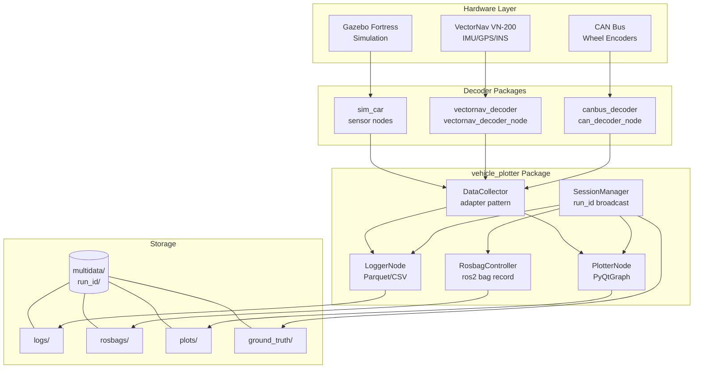
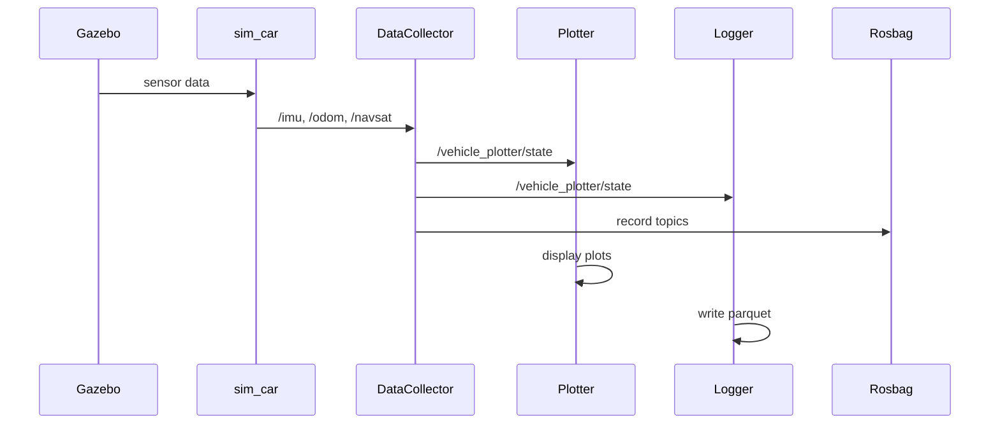
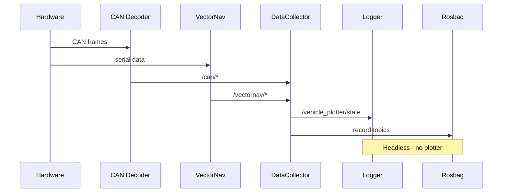
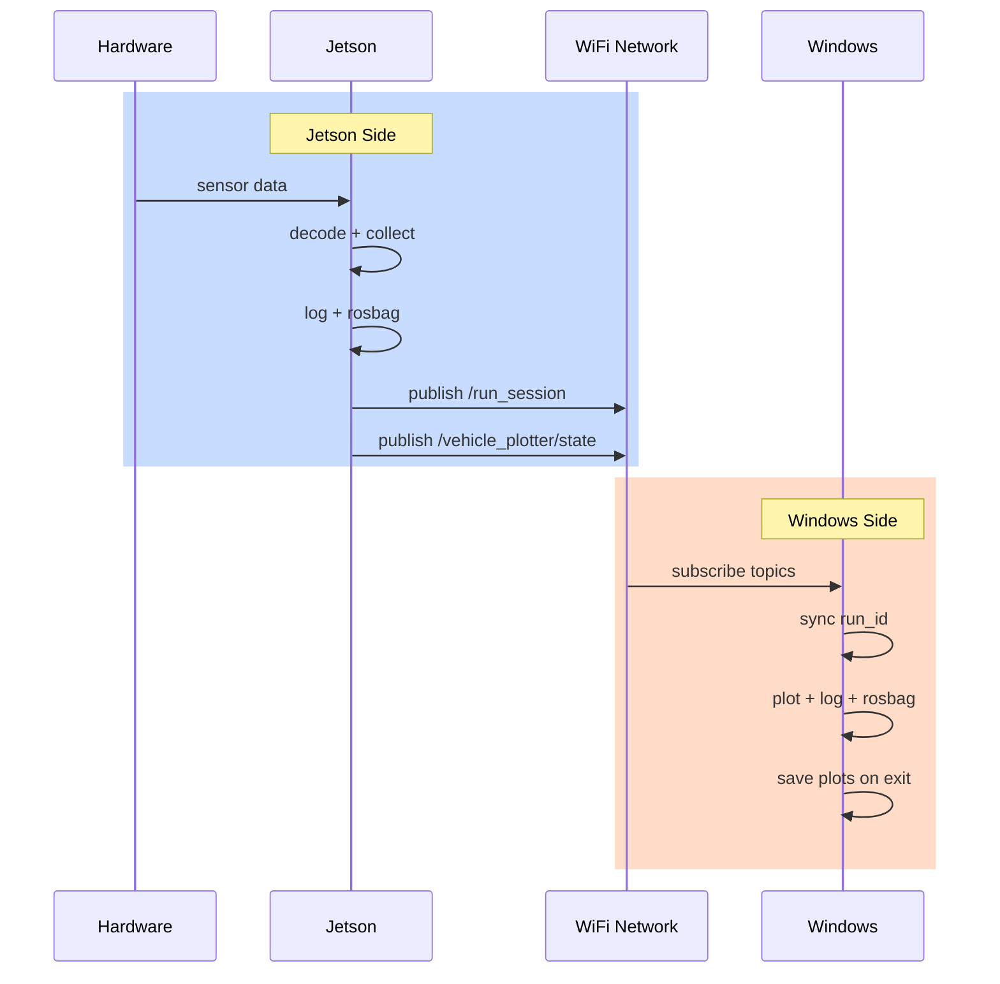
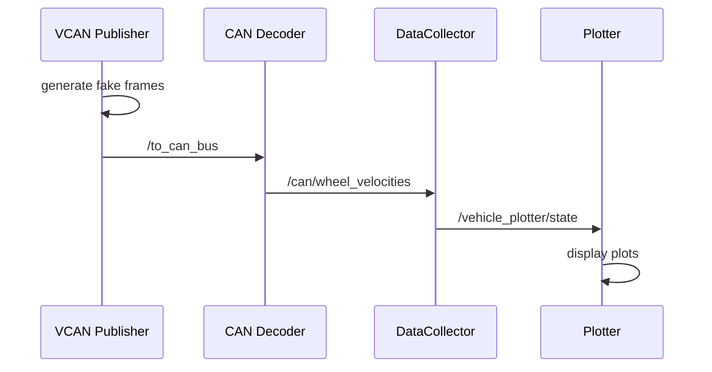
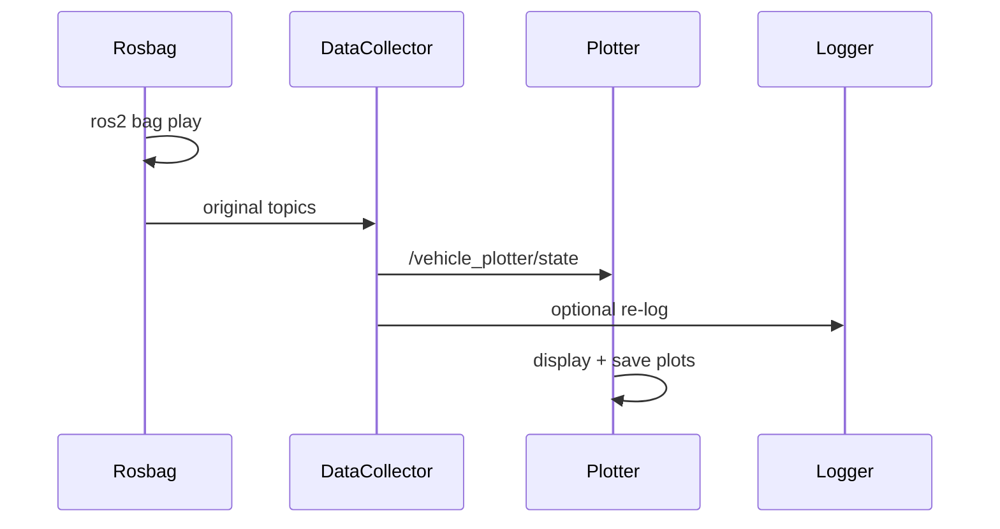

# System Architecture

## Package Overview



## Topic Graph

```mermaid
graph LR
    subgraph "Sensor Topics"
        IMU[/vectornav/imu<br/>sensor_msgs/Imu]
        GPS[/vectornav/gps<br/>sensor_msgs/NavSatFix]
        INS[/vectornav/ins<br/>nav_msgs/Odometry]
        WV[/can/wheel_velocities<br/>Float32MultiArray]
        SUS[/can/suspension<br/>Float32MultiArray]
        STR[/can/steering_angle<br/>Float32]
    end

    subgraph "Simulation Topics"
        SIMU[/imu<br/>sensor_msgs/Imu]
        SIMGPS[/navsat<br/>sensor_msgs/NavSatFix]
        ODOM[/odom<br/>nav_msgs/Odometry]
        ENC[/wheel_encoder/*]
    end

    subgraph "Processing"
        DC((DataCollector))
    end

    subgraph "Output Topics"
        VS[/vehicle_plotter/state<br/>VehicleState]
        RS[/run_session<br/>RunSession]
    end

    IMU --> DC
    GPS --> DC
    INS --> DC
    WV --> DC
    SUS --> DC
    STR --> DC

    SIMU --> DC
    SIMGPS --> DC
    ODOM --> DC
    ENC --> DC

    DC --> VS

    SM((SessionManager)) --> RS
```

## Operational Modes

### 1. Simulation Mode


### 2. IRL Jetson Only


### 3. IRL with Windows Plotting


### 4. Virtual CAN Test


### 5. Rosbag Replay


## Storage Layout

```
./multidata/
└── 2026-01-09_14-12-33/          # run_id (timestamp)
    ├── linux/                     # Jetson data
    │   ├── logs/
    │   │   ├── vehicle_state_0000.parquet
    │   │   └── metadata.json
    │   ├── rosbags/
    │   │   └── bag/
    │   ├── plots/
    │   │   └── plots_20260109_141530.png
    │   ├── plot_data/
    │   │   ├── trajectory.csv
    │   │   └── velocity.csv
    │   ├── ground_truth/
    │   │   ├── nodes.txt
    │   │   ├── topics.txt
    │   │   └── system_info.json
    │   └── session_info.json
    │
    └── windows/                   # Windows data (same structure)
        ├── logs/
        ├── rosbags/
        ├── plots/
        ├── plot_data/
        ├── ground_truth/
        └── session_info.json
```

## Message Types

### VehicleState.msg
```
float64 timestamp
float64 x, y
float64 vx, vy
float64 yaw, yaw_rate
float64 speed, distance_traveled
int32[4] encoder_ticks
float32[4] encoder_velocities
float64 gps_latitude, gps_longitude
bool gps_valid
string estimation_status
```

### RunSession.msg
```
string run_id
string base_path
string originator_hostname
uint32 ros_domain_id
builtin_interfaces/Time start_time
```
