::: {#page1-div style="position:relative;width:918px;height:1188px;"}
[background image]{.image .placeholder
original-image-src="vn200_assets/vn200001.png" original-image-title=""
width="918" height="1188"}

** **

**VectorNav Technologies **

 

**Contact Info **

 

10501 Markison Road 

Phone 

+1 512 772 3615 

 

Dallas, Texas 75238 

Email 

support@vectornav.com 

 

United States of America 

Website 

www.vectornav.com 

 

 

 

 

 

 

 

 

 

 

 

 

 

 

 

 

 

 

 

 

 

Firmware v1.0.0.0 

Document Revision 2.02

 

 

**VN-200 User Manual **

Embedded Navigation Solutions 
:::

::: {#page2-div style="position:relative;width:918px;height:1188px;"}
{width="918"
height="1188"}

VN-200 User Manual

** **

** **

UM004

** **

 

VN-200 User Manual 

2/141 

**Document Information**

** **

**Title **

VN-200 User Manual 

**Subtitle **

Inertial Navigation Modules 

**Document Type **

User Manual 

**Document Number **

UM004 v2.02 

**Document Status **

Released 

 

**VectorNav Technical Documentation **

In  addition  to our  product-specific  technical  data  sheets,  the  following  manuals  are  available  to  assist \
VectorNav customers in product design and development. 



 

**VN-200 User Manual:**

 The user manual provides a high-level overview of product specific 

information for each of our inertial sensors.  Further detailed
information regarding hardware \
integration and application specific use can be found in the
separate documentation listed \
below. 



 

**Hardware Integration Manual:**

 This manual provides hardware design instructions and 

recommendations on how to integrate our inertial sensors into your
product. 



 

**Application Notes:**

  This set of documents provides
a more detailed overview of how to utilize 

many different features and capabilities offered by our
products, designed to enhance \
performance and usability in a wide range of
application-specific scenarios. 

**Document Symbols **

The following symbols are used
to highlight important information within the manual: 

 

The information symbol
points to important information within the manual. 

 

The warning symbol points to crucial information or actions that should be followed to avoid \
reduced performance or damage to the navigation module. 

**Technical Support **

Our website provides a large repository of technical information regarding our navigation sensors.  A list \
of the available documents can be found at the following address: 

<http://www.vectornav.com/support>

[ ](http://www.vectornav.com/support)

If you have technical problems or cannot find the information that you need in the provided documents, \
please contact our support team by email or phone.  Our engineering team is committed to providing \
the  required  support  necessary  to  ensure  that  you  are  successful  with  the  design,  integration,  and \
operation of our embedded navigation sensors. 

 

**Technical Support Contact Info **

**Email:**

[ ](mailto:support@vectornav.com)

<support@vectornav.com>

[** **](mailto:support@vectornav.com)

**Phone:**

  +1.512.772.3615 
:::

::: {#page3-div style="position:relative;width:918px;height:1188px;"}
{width="918"
height="1188"}

VN-200 User Manual

** **

** **

UM004

** **

 

VN-200 User Manual 

3/141 

**Table of Contents **

[**1**](vn200-6.html)

[ ](vn200-6.html)

[**Introduction **](vn200-6.html)

[**6**](vn200-6.html)

[ ](vn200-6.html)

[ ](vn200-6.html)

[PRODUCT DESCRIPTION ](vn200-6.html)

[6](vn200-6.html)

[ ](vn200-6.html)

[1.1](vn200-6.html)

[ ](vn200-6.html)

[FACTORY CALIBRATION ](vn200-6.html)

[6](vn200-6.html)

[ ](vn200-6.html)

[1.2](vn200-6.html)

[ ](vn200-6.html)

[OPERATION OVERVIEW ](vn200-6.html)

[6](vn200-6.html)

[ ](vn200-6.html)

[1.3](vn200-6.html)

[ ](vn200-7.html)

[PACKAGING OPTIONS ](vn200-7.html)

[7](vn200-7.html)

[ ](vn200-7.html)

[1.4](vn200-7.html)

[ ](vn200-9.html)

[VN-200 PRODUCT CODES ](vn200-9.html)

[9](vn200-9.html)

[ ](vn200-9.html)

[1.5](vn200-9.html)

[**2**](vn200-10.html)

[ ](vn200-10.html)

[**Specifications **](vn200-10.html)

[**10**](vn200-10.html)

[ ](vn200-10.html)

[ ](vn200-10.html)

[VN-200 SURFACE-MOUNT SENSOR (SMD) ELECTRICAL ](vn200-10.html)

[10](vn200-10.html)

[ ](vn200-10.html)

[2.1](vn200-10.html)

[ ](vn200-13.html)

[VN-200 RUGGED ELECTRICAL ](vn200-13.html)

[13](vn200-13.html)

[ ](vn200-13.html)

[2.2](vn200-13.html)

[ ](vn200-15.html)

[VN-200 SURFACE-MOUNT SENSOR (SMD) DIMENSIONS ](vn200-15.html)

[15](vn200-15.html)

[ ](vn200-15.html)

[2.3](vn200-15.html)

[ ](vn200-16.html)

[VN-200 RUGGED DIMENSIONS ](vn200-16.html)

[16](vn200-16.html)

[ ](vn200-16.html)

[2.4](vn200-16.html)

[ ](vn200-16.html)

[ABSOLUTE MAXIMUM RATINGS ](vn200-16.html)

[16](vn200-16.html)

[ ](vn200-16.html)

[2.5](vn200-16.html)

[ ](vn200-17.html)

[SENSOR COORDINATE SYSTEM ](vn200-17.html)

[17](vn200-17.html)

[ ](vn200-17.html)

[2.6](vn200-17.html)

[**3**](vn200-19.html)

[ ](vn200-19.html)

[**VN-200 Software Architecture **](vn200-19.html)

[**19**](vn200-19.html)

[ ](vn200-19.html)

[ ](vn200-19.html)

[IMU SUBSYSTEM ](vn200-19.html)

[19](vn200-19.html)

[ ](vn200-19.html)

[3.1](vn200-19.html)

[ ](vn200-22.html)

[NAVSTATE SUBSYSTEM ](vn200-22.html)

[22](vn200-22.html)

[ ](vn200-22.html)

[3.2](vn200-22.html)

[ ](vn200-22.html)

[NAVFILTER SUBSYSTEM ](vn200-22.html)

[22](vn200-22.html)

[ ](vn200-22.html)

[3.3](vn200-22.html)

[ ](vn200-24.html)

[COMMUNICATION INTERFACE ](vn200-24.html)

[24](vn200-24.html)

[ ](vn200-24.html)

[3.4](vn200-24.html)

[ ](vn200-25.html)

[COMMUNICATION PROTOCOL ](vn200-25.html)

[25](vn200-25.html)

[ ](vn200-25.html)

[3.5](vn200-25.html)

[**4**](vn200-26.html)

[ ](vn200-26.html)

[**Basic Communication **](vn200-26.html)

[**26**](vn200-26.html)

[ ](vn200-26.html)

[ ](vn200-26.html)

[SERIAL INTERFACE ](vn200-26.html)

[26](vn200-26.html)

[ ](vn200-26.html)

[4.1](vn200-26.html)

[ ](vn200-26.html)

[SPI INTERFACE ](vn200-26.html)

[26](vn200-26.html)

[ ](vn200-26.html)

[4.2](vn200-26.html)

[ ](vn200-30.html)

[SYSTEM ERROR CODES ](vn200-30.html)

[30](vn200-30.html)

[ ](vn200-30.html)

[4.3](vn200-30.html)

[ ](vn200-31.html)

[CHECKSUM / CRC ](vn200-31.html)

[31](vn200-31.html)

[ ](vn200-31.html)

[4.4](vn200-31.html)

[**5**](vn200-33.html)

[ ](vn200-33.html)

[**User Configurable Binary Output Messages **](vn200-33.html)

[**33**](vn200-33.html)

[ ](vn200-33.html)

[ ](vn200-33.html)

[AVAILABLE OUTPUT TYPES ](vn200-33.html)

[33](vn200-33.html)

[ ](vn200-33.html)

[5.1](vn200-33.html)

[ ](vn200-33.html)

[CONFIGURING THE OUTPUT TYPES ](vn200-33.html)

[33](vn200-33.html)

[ ](vn200-33.html)

[5.2](vn200-33.html)

[ ](vn200-38.html)

[SERIAL OUTPUT MESSAGE FORMAT ](vn200-38.html)

[38](vn200-38.html)

[ ](vn200-38.html)

[5.3](vn200-38.html)

[ ](vn200-42.html)

[BINARY GROUP 1 -- COMMON OUTPUTS ](vn200-42.html)

[42](vn200-42.html)

[ ](vn200-42.html)

[5.4](vn200-42.html)

[ ](vn200-47.html)

[BINARY GROUP 2 -- TIME OUTPUTS ](vn200-47.html)

[47](vn200-47.html)

[ ](vn200-47.html)

[5.5](vn200-47.html)

[ ](vn200-49.html)

[BINARY GROUP 3 -- IMU OUTPUTS ](vn200-49.html)

[49](vn200-49.html)

[ ](vn200-49.html)

[5.6](vn200-49.html)

[ ](vn200-53.html)

[BINARY GROUP 4 -- GPS OUTPUTS ](vn200-53.html)

[53](vn200-53.html)

[ ](vn200-53.html)

[5.7](vn200-53.html)
:::

::: {#page4-div style="position:relative;width:918px;height:1188px;"}
{width="918"
height="1188"}

VN-200 User Manual

** **

** **

UM004

** **

 

VN-200 User Manual 

4/141 

[ ](vn200-56.html)

[BINARY GROUP 5 -- ATTITUDE OUTPUTS ](vn200-56.html)

[56](vn200-56.html)

[ ](vn200-56.html)

[5.8](vn200-56.html)

[ ](vn200-60.html)

[BINARY GROUP 6 -- INS OUTPUTS ](vn200-60.html)

[60](vn200-60.html)

[ ](vn200-60.html)

[5.9](vn200-60.html)

[**6**](vn200-63.html)

[ ](vn200-63.html)

[**System Module **](vn200-63.html)

[**63**](vn200-63.html)

[ ](vn200-63.html)

[ ](vn200-63.html)

[COMMANDS ](vn200-63.html)

[63](vn200-63.html)

[ ](vn200-63.html)

[6.1](vn200-63.html)

[ ](vn200-67.html)

[CONFIGURATION REGISTERS ](vn200-67.html)

[67](vn200-67.html)

[ ](vn200-67.html)

[6.2](vn200-67.html)

[ ](vn200-85.html)

[STATUS REGISTERS ](vn200-85.html)

[85](vn200-85.html)

[ ](vn200-85.html)

[6.3](vn200-85.html)

[ ](vn200-86.html)

[FACTORY DEFAULTS ](vn200-86.html)

[86](vn200-86.html)

[ ](vn200-86.html)

[6.4](vn200-86.html)

[ ](vn200-87.html)

[COMMAND PROMPT ](vn200-87.html)

[87](vn200-87.html)

[ ](vn200-87.html)

[6.5](vn200-87.html)

[**7**](vn200-89.html)

[ ](vn200-89.html)

[**IMU Subsystem **](vn200-89.html)

[**89**](vn200-89.html)

[ ](vn200-89.html)

[ ](vn200-89.html)

[IMU MEASUREMENT REGISTERS ](vn200-89.html)

[89](vn200-89.html)

[ ](vn200-89.html)

[7.1](vn200-89.html)

[ ](vn200-91.html)

[IMU CONFIGURATION REGISTERS ](vn200-91.html)

[91](vn200-91.html)

[ ](vn200-91.html)

[7.2](vn200-91.html)

[ ](vn200-98.html)

[FACTORY DEFAULTS ](vn200-98.html)

[98](vn200-98.html)

[ ](vn200-98.html)

[7.3](vn200-98.html)

[ ](vn200-99.html)

[COMMAND PROMPT ](vn200-99.html)

[99](vn200-99.html)

[ ](vn200-99.html)

[7.4](vn200-99.html)

[**8**](vn200-101.html)

[ ](vn200-101.html)

[**GPS Subsystem **](vn200-101.html)

[**101**](vn200-101.html)

[ ](vn200-101.html)

[ ](vn200-101.html)

[MEASUREMENT REGISTERS ](vn200-101.html)

[101](vn200-101.html)

[ ](vn200-101.html)

[8.1](vn200-101.html)

[ ](vn200-103.html)

[CONFIGURATION REGISTERS ](vn200-103.html)

[103](vn200-103.html)

[ ](vn200-103.html)

[8.2](vn200-103.html)

[ ](vn200-105.html)

[FACTORY DEFAULTS ](vn200-105.html)

[105](vn200-105.html)

[ ](vn200-105.html)

[8.3](vn200-105.html)

[ ](vn200-106.html)

[COMMAND PROMPT ](vn200-106.html)

[106](vn200-106.html)

[ ](vn200-106.html)

[8.4](vn200-106.html)

[**9**](vn200-107.html)

[ ](vn200-107.html)

[**Attitude Subsystem **](vn200-107.html)

[**107**](vn200-107.html)

[ ](vn200-107.html)

[ ](vn200-107.html)

[MEASUREMENT REGISTERS ](vn200-107.html)

[107](vn200-107.html)

[ ](vn200-107.html)

[9.1](vn200-107.html)

[ ](vn200-117.html)

[CONFIGURATION REGISTERS ](vn200-117.html)

[117](vn200-117.html)

[ ](vn200-117.html)

[9.2](vn200-117.html)

[ ](vn200-120.html)

[FACTORY DEFAULTS ](vn200-120.html)

[120](vn200-120.html)

[ ](vn200-120.html)

[9.3](vn200-120.html)

[**10**](vn200-121.html)

[ ](vn200-121.html)

[**INS Subsystem **](vn200-121.html)

[**121**](vn200-121.html)

[ ](vn200-121.html)

[ ](vn200-121.html)

[COMMANDS ](vn200-121.html)

[121](vn200-121.html)

[ ](vn200-121.html)

[10.1](vn200-121.html)

[ ](vn200-122.html)

[MEASUREMENT REGISTERS ](vn200-122.html)

[122](vn200-122.html)

[ ](vn200-122.html)

[10.2](vn200-122.html)

[ ](vn200-126.html)

[CONFIGURATION REGISTERS ](vn200-126.html)

[126](vn200-126.html)

[ ](vn200-126.html)

[10.3](vn200-126.html)

[ ](vn200-128.html)

[FACTORY DEFAULTS ](vn200-128.html)

[128](vn200-128.html)

[ ](vn200-128.html)

[10.4](vn200-128.html)

[**11**](vn200-129.html)

[ ](vn200-129.html)

[**Hard/Soft Iron Estimator Subsystem **](vn200-129.html)

[**129**](vn200-129.html)

[ ](vn200-129.html)

[ ](vn200-129.html)

[CONFIGURATION REGISTERS ](vn200-129.html)

[129](vn200-129.html)

[ ](vn200-129.html)

[11.1](vn200-129.html)

[ ](vn200-130.html)

[STATUS REGISTERS ](vn200-130.html)

[130](vn200-130.html)

[ ](vn200-130.html)

[11.2](vn200-130.html)

[ ](vn200-131.html)

[FACTORY DEFAULTS ](vn200-131.html)

[131](vn200-131.html)

[ ](vn200-131.html)

[11.3](vn200-131.html)

[ ](vn200-132.html)

[COMMAND PROMPT ](vn200-132.html)

[132](vn200-132.html)

[ ](vn200-132.html)

[11.4](vn200-132.html)

[**12**](vn200-136.html)

[ ](vn200-136.html)

[**World Magnetic & Gravity Module **](vn200-136.html)

[**136**](vn200-136.html)

[ ](vn200-136.html)
:::

::: {#page5-div style="position:relative;width:918px;height:1188px;"}
{width="918"
height="1188"}

VN-200 User Manual

** **

** **

UM004

** **

 

VN-200 User Manual 

5/141 

[ ](vn200-136.html)

[CONFIGURATION REGISTERS ](vn200-136.html)

[136](vn200-136.html)

[ ](vn200-136.html)

[12.1](vn200-136.html)

[ ](vn200-138.html)

[FACTORY DEFAULTS ](vn200-138.html)

[138](vn200-138.html)

[ ](vn200-138.html)

[12.2](vn200-138.html)

[ ](vn200-139.html)

[COMMAND PROMPT ](vn200-139.html)

[139](vn200-139.html)

[ ](vn200-139.html)

[12.3](vn200-139.html)

 

** **
:::

::: {#page6-div style="position:relative;width:918px;height:1188px;"}
{width="918"
height="1188"}

VN-200 User Manual

** **

** **

UM004

** **

 

VN-200 User Manual 

6/141 

**1**

** **

**Introduction **

 

**Product Description **

1.1

The  VN-200  is  a  miniature,  surface-mount,  high-performance  GPS-Aided  Inertial  Navigation  System \
(GPS/INS). Incorporating the latest solid-state MEMS sensor technology,
the VN-200 combines a set of 3-\
axis accelerometers, 3-axis gyros, 3-axis magnetometer, a barometric pressure sensor, a 50-channel L1  \
GPS receiver, as well as a 32-bit processor into a miniature surface-mount module.  The VN-200 couples \
measurements from the onboard GPS module with measurements from the onboard inertial sensors to \
provide  position,  velocity,  and  attitude  estimates  of  higher  accuracies  and  with  better  dynamic \
performance than a standalone GPS module
or Attitude Heading Reference System (AHRS). 

 

**Factory Calibration **

1.2

MEMS inertial sensors are
subject to several common sources of error: bias, scale factor,
misalignments, \
temperature  dependencies,  and  gyro  g-sensitivity.    All  VN-200  sensors  undergo  a  rigorous  calibration \
process at the VectorNav factory to minimize these error sources.  Compensation parameters calculated \
during  these  calibrations  are  stored  on  each  individual  sensor  and  digitally  applied  to  the  real-time \
measurements.  VN-200 sensors are available with
two calibration options: 



 

Standard  Calibration  --  single  temperature  point  calibration  at  25C,  which  typically  holds \
performance specifications when operating in an environment with
a range of 15C to 35C. 



 

Thermal Calibration -- this option extends the calibration process over multiple temperatures to \
ensure performance specifications are met over the full operating temperature range of -40C to \
+85C. 

 

**Operation Overview **

1.3

The  VN-200  has  a  built-in  microprocessor  that  runs  a  robust  INS  Kalman  Filter  that  estimates  the \
position,  velocity,  and  attitude  of  the  sensor.    The  VN-200  INS  filter  couples  position  and  velocity \
measurements  from  the  onboard  GPS  module  with  inertial  sensor  measurements  from  the  onboard \
accelerometers, gyroscopes, magnetometers, as well as the barometric pressure sensor.  This coupling \
provides  high  accuracy  attitude  estimates  when  the  sensor  is  subjected  to  dynamic  motion  and  also \
provides position and velocity estimates at high output rates.   

When the VN-200 is in motion, the VN-200 INS filter determines the attitude by comparing the position \
and  velocity  measurements  to  the  onboard  accelerometer  measurements,  and  the  magnetometer \
measurements are ignored by the INS filter.  Compared to an AHRS, the heading accuracy is improved \
since the INS filter does not rely on measurements of Earth's background magnetic field and magnetic \
disturbances  no  not  have  an  effect  on  the  attitude  solution.    In  addition,  the  VN-200  pitch  and  roll \
estimates  are  robust  to  induced  accelerations  caused  by  dynamic  motion  of  the  sensor.   Under  static \
conditions, the heading angle is no longer observable and the VN-200 INS
filter reverts back to relying on \
magnetometer  measurements  operating  in  an  AHRS  mode.    The  VN-200  includes  a  feature  that \
automatically transitions between INS and AHRS modes depending on the
motion of the sensor and GPS \
availability in order to provide optimal performance under both
static and dynamic conditions.       

 

 
:::

::: {#page7-div style="position:relative;width:918px;height:1188px;"}
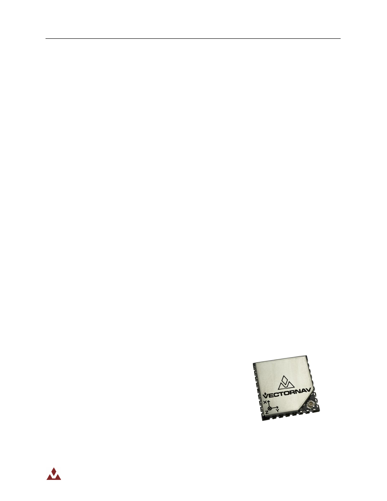{width="918"
height="1188"}

VN-200 User Manual

** **

** **

UM004

** **

 

VN-200 User Manual 

7/141 

Outputs from the VN-200 include: 



 

Position Estimates in the following reference frames: 

o

 

Latitude, Longitude, and Altitude 

o

 

X, Y, Z position in Earth Centered Earth Fixed frame 

o

 

X, Y, Z position in North, East, Down frame 



 

Velocity Estimates in the following reference frames: 

o

 

X, Y, Z velocities in Earth Centered Earth Fixed frame 

o

 

X, Y, Z velocities in the North, East, Down frame 



 

Attitude Estimates: 

o

 

Yaw, Pitch, Roll 

o

 

Quaternions 

o

 

Rotation Matrix 



 

INS Filter Uncertainties 

o

 

Position, Velocity, & Attitude 



 

GPS Time  

o

 

GPS Time of Week 

o

 

UTC Time 



 

Angular Rate Measurements: 

o

 

Bias compensated angular rates 

o

 

Calibrated gyro measurements 



 

Acceleration Measurements: 

o

 

Bias compensated acceleration 

o

 

Calibrated acceleration measurements 

o

 

Gravity vector 



 

Magnetic Measurements 



 

Pressure Measurements / Altitude 

 

**Packaging Options **

1.4

The VN-200 is available in two different configurations; a 30-pin surface mount package (VN-200 SMD) \
and an aluminum encased module (VN-200 Rugged).  The VN-200 surface mount package is well suited \
for customers looking to integrate the VN-200 sensor at the electronics level while the VN-200 Rugged \
provides a precision enclosure with mounting tabs and alignment
holes for a more off-the-shelf solution. 

 

**Surface-Mount Package **

1.4.1

For embedded applications, the VN-200 is available in a \
miniature surface-mount package.  

**Features **



 

Small Size: 22 x 24 x 3 mm 



 

Single Power Supply: 3.2 to 5.5 V 



 

Communication Interface: Serial TTL & SPI 



 

Low Power Requirement: \< 105 mA @ 3.3V 

 

 
:::

::: {#page8-div style="position:relative;width:918px;height:1188px;"}
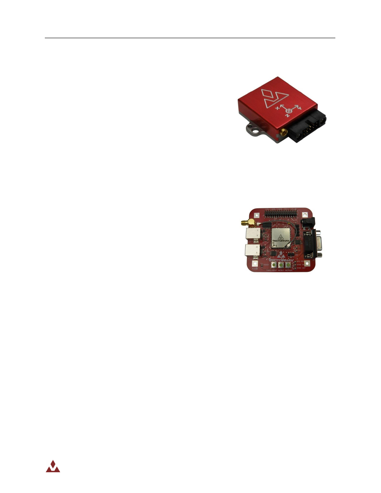{width="918"
height="1188"}

VN-200 User Manual

** **

** **

UM004

** **

 

VN-200 User Manual 

8/141 

 

**Rugged Package **

1.4.2

The VN-200 Rugged consists of the VN-200 sensor installed \
and calibrated in a robust precision aluminum enclosure.  

**Features **



 

Precision aluminum enclosure 



 

Locking 10-pin connector 



 

Mounting tabs with alignment holes 



 

Compact Size: 36 x 33 x 9.5 mm 



 

Single Power Supply: 3.3 to 17 V 



 

Communication Interface: Serial RS-232 & TTL 

 

 

 

**Surface Mount Development Kit **

1.4.3

The  VN-200  Development  Kit  provides  the  VN-200  surface-\
mount sensor installed onto a small PCB, providing easy access \
to all of the features and pins on the VN-200.  Communication \
with  the  VN-200  is  provided  by  USB  and  RS-232  serial \
communication ports.  A 30-pin header provides easy access to \
each  of  the  critical  pins.    The  VN-200  Development  Kit  also \
includes  all  of  the  necessary  cabling,  documentation,  and \
support software.

** **

**Features **



 

Pre-installed VN-200 Sensor 



 

Onboard USB-\>Serial converter 



 

Onboard TTL-\>RS-232 converter 



 

30-pin 0.1" header for access to VN-200 pins 



 

Power supply jack -- 5V (Can be powered from USB) 



 

Board Size: 76 x 76 x 14 mm 

 

 

 

 

 

 
:::

::: {#page9-div style="position:relative;width:918px;height:1188px;"}
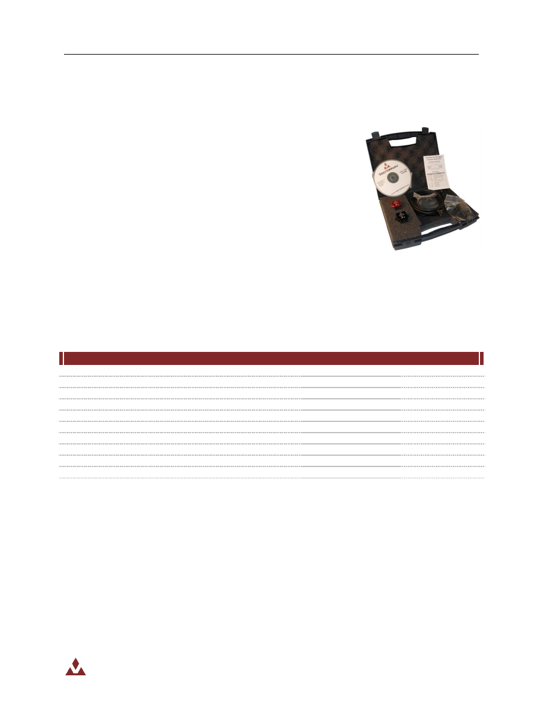{width="918"
height="1188"}

VN-200 User Manual

** **

** **

UM004

** **

 

VN-200 User Manual 

9/141 

 

**VN-200 Rugged GPS/INS Development Kit **

1.4.4

The  VN-200  Rugged  Development  Kit  includes  the  VN-200 \
Rugged sensor along with all of the necessary cabling required \
for operation.  Two cables are provided in each Development \
Kit: one for RS-232 communication and a second custom cable \
with  a  built  in  USB  converter.    The  Development  Kit  also \
includes  all  of  the  relevant  documentation  and  support \
software. 

**Features **



 

VN-200 Rugged Sensor 



 

10 ft RS-232 cable 



 

6 ft USB connector cable 



 

16 ft Magnetic Mount GPS Antenna 



 

MCX to SMA Antenna Adapter  



 

Cable Connection Tool 



 

CD w/Software Development Kit 



 

User Manual, Quick Start Guide & Documentation 



 

Carrying Case 

 

 

 

 

**VN-200 Product Codes **

1.5

**VN-200 Options**

** **

**Item Code **

**Sensor Packaging **

**Calibration Option **

**Product Type **

VN-200S 

Surface Mount Device 

Standard at 25C 

GPS/INS 

VN-200T 

Surface Mount Device 

Thermal -40C to +85C 

GPS/INS 

VN-200S-DEV 

Surface Mount Development Kit 

Standard at 25C 

GPS/INS 

VN-200T-DEV 

Surface Mount Development Kit 

Thermal -40C to +85C 

GPS/INS 

VN-200S-CR 

Rugged Module 

Standard at 25C 

GPS/INS 

VN-200T-CR 

Rugged Module 

Thermal -40C to +85C 

GPS/INS 

VN-200S-CR-DEV 

Rugged Development Kit 

Standard at 25C 

GPS/INS 

VN-200T-CR-DEV 

Rugged Development Kit 

Thermal -40C to +85C 

GPS/INS 

VN-C200-0310 

VN-200 Rugged USB Adapter Cable 

N/A 

Cable 

VN-C200-0410 

VN-200 Rugged Serial Adapter Cable 

N/A 

Cable 

 

 

 

 

** **
:::

::: {#page10-div style="position:relative;width:918px;height:1188px;"}
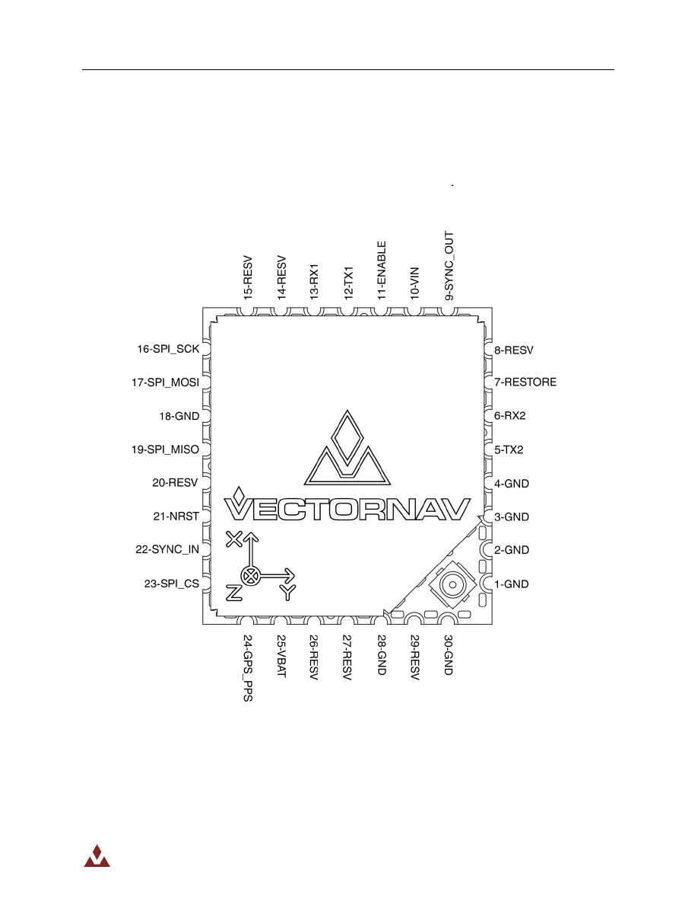{width="918"
height="1188"}

VN-200 User Manual

** **

** **

UM004

** **

 

VN-200 User Manual 

10/141 

**2**

** **

**Specifications **

 

**VN-200 Surface-Mount Sensor (SMD) Electrical **

2.1

 

**Figure 1 -- Pin assignments (top down view)**

** **

** **

 

 

 
:::

::: {#page11-div style="position:relative;width:918px;height:1188px;"}
{width="918"
height="1188"}

VN-200 User Manual

** **

** **

UM004

** **

 

VN-200 User Manual 

11/141 

**Table 1 -- VN-200 SMD Pin Assignments **

**Pin  Pin Name **

**Type **

**Description **

1 

GND 

Supply 

Ground. 

2 

GND 

Supply 

Ground. 

3 

GND 

Supply 

Ground. 

4 

GND 

Supply 

Ground. 

5 

TX2 

Output 

Serial UART #2 data output. (sensor) 

6 

RX2 

Input 

Serial UART #2 data input. (sensor) 

7 

RESTORE 

Input 

During power on or device reset, holding this pin high will cause the module to \
restore the default factory settings.  Internally held low with 10k resistor. 

8 

RESV 

N/A 

Reserved for internal use.  Do not connect. 

9 

SYNC_OUT 

Output 

Time synchronization output signal. 

10 

VIN 

Supply 

3.2 - 5.5 V input. 

11 

ENABLE 

Input 

Leave high for normal operation.  Pull low to enter sleep mode.  Internally pulled \
high with pull-up resistor. 

12 

TX1 

Output 

Serial UART #1 data output. (sensor) 

13 

RX1 

Input 

Serial UART #1 data input. (sensor) 

14 

RESV 

N/A 

Reserved for internal use.  Do not connect. 

15 

RESV 

N/A 

Reserved for internal use.  Do not connect. 

16 

SPI_SCK 

Input 

SPI clock. 

17 

SPI_MOSI 

Input 

SPI input. 

18 

GND 

Supply 

Ground. 

19 

SPI_MISO 

Output 

SPI output. 

20 

RESV 

N/A 

Reserved for internal use.  Do not connect. 

21 

NRST 

Input 

Microcontroller reset line.  Pull low for \> 20
μs to reset MCU.  Internally pulled \
high with 10k. 

22 

SYNC_IN 

Input 

Time synchronization input signal.  

23 

SPI_CS 

Input 

SPI slave select. 

24 

GPS_PPS 

Input 

GPS time pulse. One pulse per second, synchronized on rising edge.
 Pulse width \
is 100 ms. 

25 

VBAT 

Supply 

Optional GPS RTC battery backup.  1.4 V -- 3.6 V input. 

26 

RESV 

N/A 

Reserved for internal use.  Do not connect. 

27 

RESV 

N/A 

Reserved for internal use.  Do not connect. 

28 

GND 

Supply 

Ground. 

29 

RESV 

N/A 

Reserved for internal use.  Do not connect. 

30 

GND 

Supply 

Ground. 

** **

 

** **
:::

::: {#page12-div style="position:relative;width:918px;height:1188px;"}
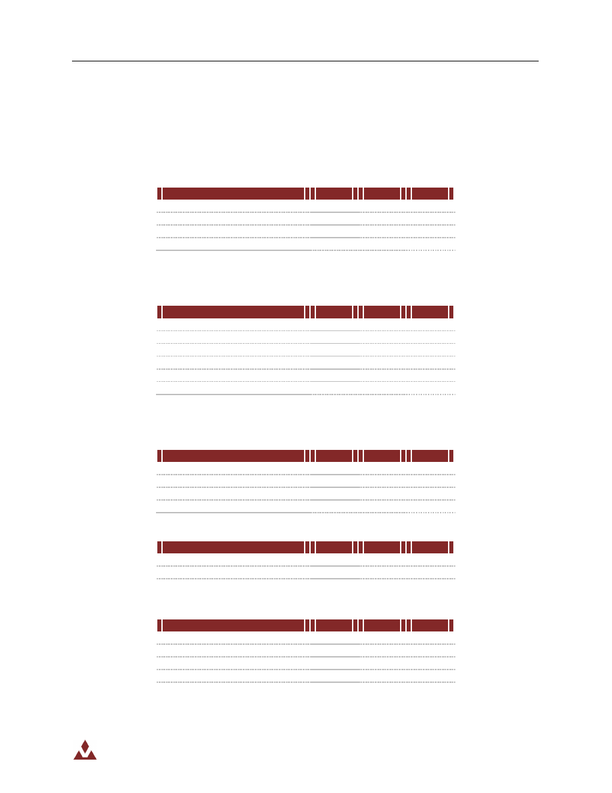{width="918"
height="1188"}

VN-200 User Manual

** **

** **

UM004

** **

 

VN-200 User Manual 

12/141 

 

**VN-200 SMD Power Supply **

2.1.1

The minimum operating supply voltage is 3.2 V
and the absolute maximum is 5.5 V. 

 

**VN-200 SMD Serial (UART) Interface **

2.1.2

The serial interface on the VN-200 operates with 3V TTL logic. 

**Table 2 - Serial I/O Specifications **

**Specification **

**Min **

**Typical **

**Max **

Input low level voltage 

-0.5 V 

 

0.8 V 

Input high level voltage 

2 V 

 

5.5 V 

Output low voltage 

0 V 

 

0.4 V 

Output high voltage 

2.4 V 

 

3.0 V 

 

**VN-200 SMD Serial Peripheral Interface (SPI) **

2.1.3

**Table 3 - Serial I/O Specifications **

**Specification **

**Min **

**Typical **

**Max **

Input low level voltage 

-0.5 V 

 

0.8 V 

Input high level voltage 

2 V 

 

5.5 V 

Output low voltage 

0 V 

 

0.4 V 

Output high voltage 

2.4 V 

 

3.0 V 

Clock Frequency 

 

8 MHz 

16 MHz 

Close Rise/Fall Time 

 

 

8 ns 

 

**VN-200 SMD Reset, SyncIn/Out, and Other General I/O Pins **

2.1.4

**Table 4 - NRST Specifications **

**Specification **

**Min **

**Typical **

**Max **

Input low level voltage 

-0.5 V 

 

0.8 V 

Input high level voltage 

2 V 

 

5.5 V 

Weak pull-up equivalent resistor 

30 kΩ 

40 kΩ 

50 kΩ 

NRST pulse width 

20 μs 

 

 

**Table 5 - SyncIn Specifications **

**Specification **

**Min **

**Typical **

**Max **

Input low level voltage 

-0.5 V 

 

0.8 V 

Input high level voltage 

2 V 

 

5.5 V 

Pulse Width 

100 ns 

 

 

**Table 6 - SyncOut Specifications **

**Specification **

**Min **

**Typical **

**Max **

Output low voltage 

0 V 

 

0.4 V 

Output high voltage 

2.4 V 

 

3.0 V 

Output high to low fall time 

 

 

125 ns 

Output low to high rise time 

 

 

125 ns 

Output Frequency 

1 Hz 

 

1 kHz 
:::

::: {#page13-div style="position:relative;width:918px;height:1188px;"}
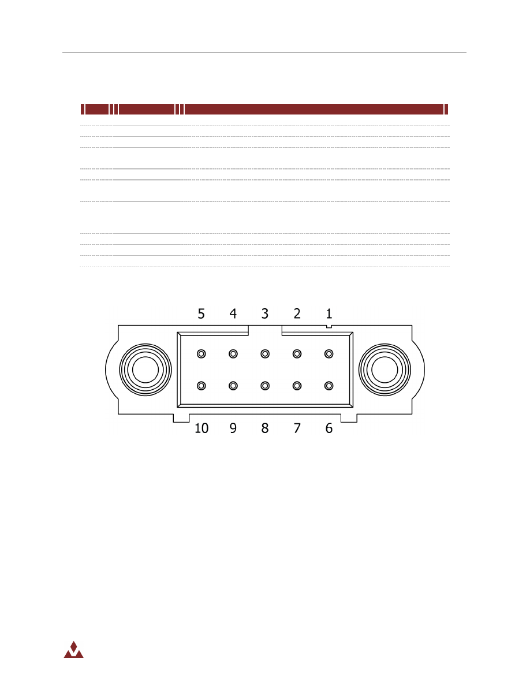{width="918"
height="1188"}

VN-200 User Manual

** **

** **

UM004

** **

 

VN-200 User Manual 

13/141 

 

**VN-200 Rugged Electrical **

2.2

**Table 7 -- VN-200 Rugged Pin Assignments **

**Pin **

**Pin Name **

**Description **

1 

VCC 

+3.3V to +17V

** **

2 

TX1 

RS-232 voltage levels data output from the sensor. (Serial UART #1)

** **

3 

RX1 

RS-232 voltage levels data input to the sensor. (Serial UART #1)

** **

4 

SYNC_OUT 

Output signal used for synchronization purposes. Software configurable \
to pulse when ADC, IMU, or attitude measurements are available. 

** **

5 

GND 

Ground

** **

6 

RESTORE 

If
high at reset, the device will restore to factory default state.  Internally \
held low with 10k resistor.

** **

7 

SYNC_IN 

Input signal for synchronization purposes.  Software configurable to \
either synchronize the measurements or the output with an external \
device.

** **

8 

TX2_TTL 

Serial UART #2 data output from the device at TTL voltage level (3V).

** **

9 

RX2_TTL 

Serial UART #2 data into the device at TTL voltage level (3V).

** **

10 

RESV 

This pin should be left unconnected.

** **

 

**Figure 2 - VN-200 Rugged External Connector **

 

 

** **
:::

::: {#page14-div style="position:relative;width:918px;height:1188px;"}
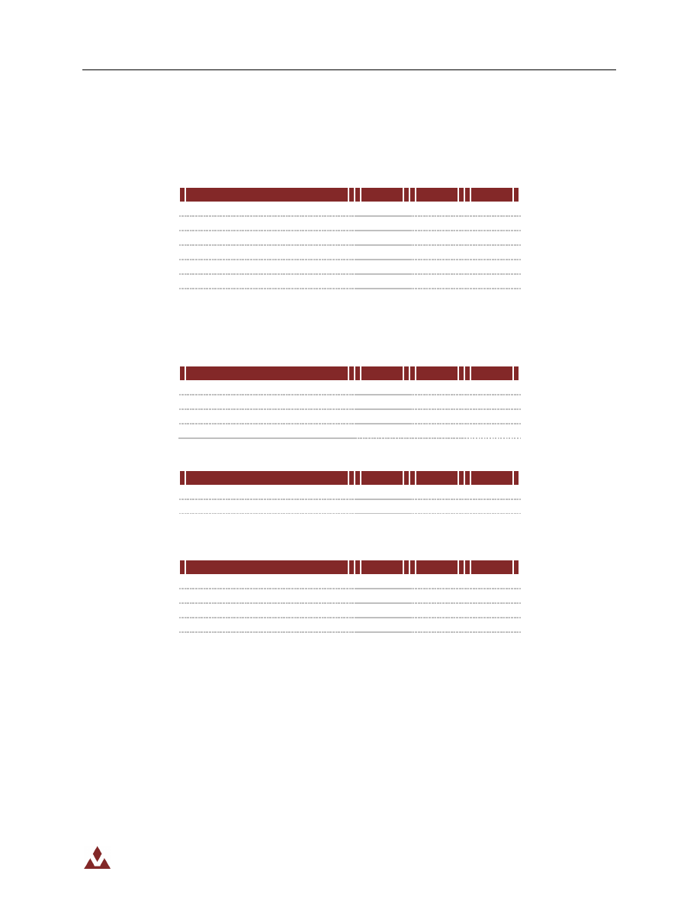{width="918"
height="1188"}

VN-200 User Manual

** **

** **

UM004

** **

 

VN-200 User Manual 

14/141 

 

**VN-200 Rugged Power Supply **

2.2.1

The power supply input for the VN-200 Rugged is 3.3 to 17 V DC. 

 

**VN-200 Rugged Serial UART Interface **

2.2.2

**Table 8 - Serial I/O Specifications **

**Specification **

**Min **

**Typical **

**Max **

Input low level voltage 

-25 V 

 

 

Input high level voltage 

 

 

25 V 

Output low voltage 

-5.0 V 

-5.4 V 

 

Output high voltage 

5.0 V 

5.5 V 

 

Output resistance 

300 Ω 

10 MΩ 

 

Data rate 

 

 

1 Mbps 

Pulse slew 

 

300 ns 

 

 

**VN-200 Rugged Reset, SyncIn/Out, and Other General I/O Pins **

2.2.3

**Table 9 - NRST Specifications **

**Specification **

**Min **

**Typical **

**Max **

Input low level voltage 

-0.5 V 

 

0.8 V 

Input high level voltage 

2 V 

 

5.5 V 

Weak pull-up equivalent resistor 

30 kΩ 

40 kΩ 

50 kΩ 

NRST pulse width 

20 μs 

 

 

**Table 10 - SyncIn Specifications **

**Specification **

**Min **

**Typical **

**Max **

Input low level voltage 

-0.5V 

 

0.8V 

Input high level voltage 

2V 

 

5.5V 

Pulse Width 

100 ns 

 

 

**Table 11 - SyncOut Specifications **

**Specification **

**Min **

**Typical **

**Max **

Output low voltage 

0 V 

 

0.4 V 

Output high voltage 

2.4 V 

 

3.0 V 

Output high to low fall time 

 

 

125 ns 

Output low to high rise time 

 

 

125 ns 

Output Frequency 

1 Hz 

 

1 kHz 
:::

::: {#page15-div style="position:relative;width:918px;height:1188px;"}
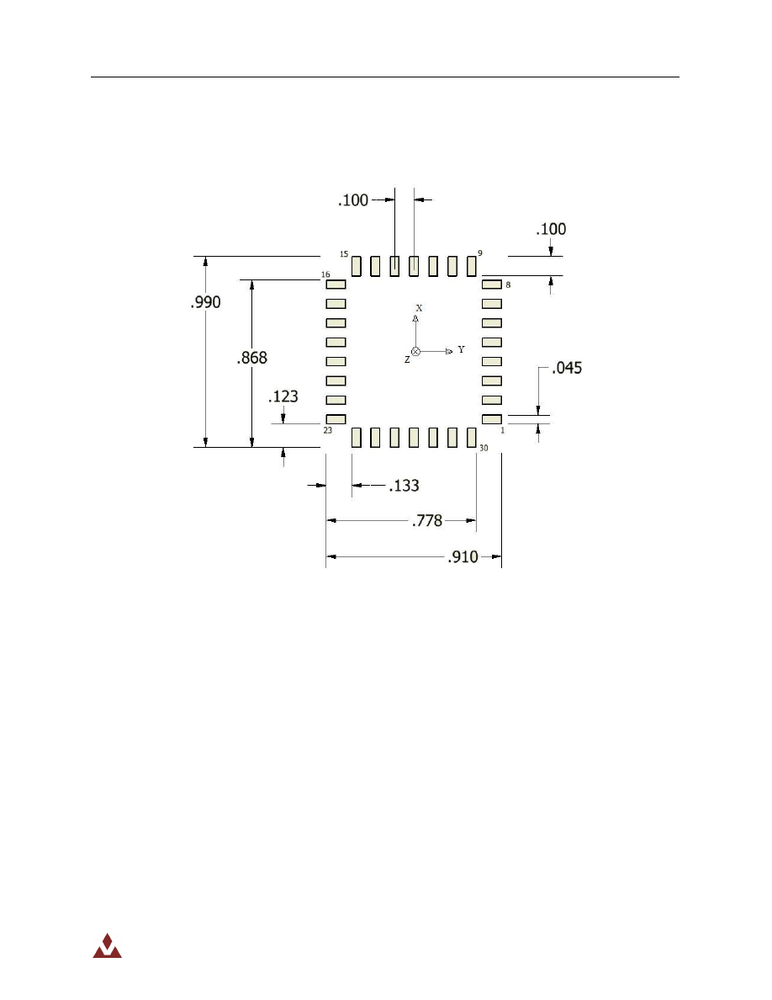{width="918"
height="1188"}

VN-200 User Manual

** **

** **

UM004

** **

 

VN-200 User Manual 

15/141 

 

**VN-200 Surface-Mount Sensor (SMD) Dimensions **

2.3

** **

**Figure 3 -- VN-200 PCB Footprint\* **

 

\* Measurements are in inches 

 

 
:::

::: {#page16-div style="position:relative;width:918px;height:1188px;"}
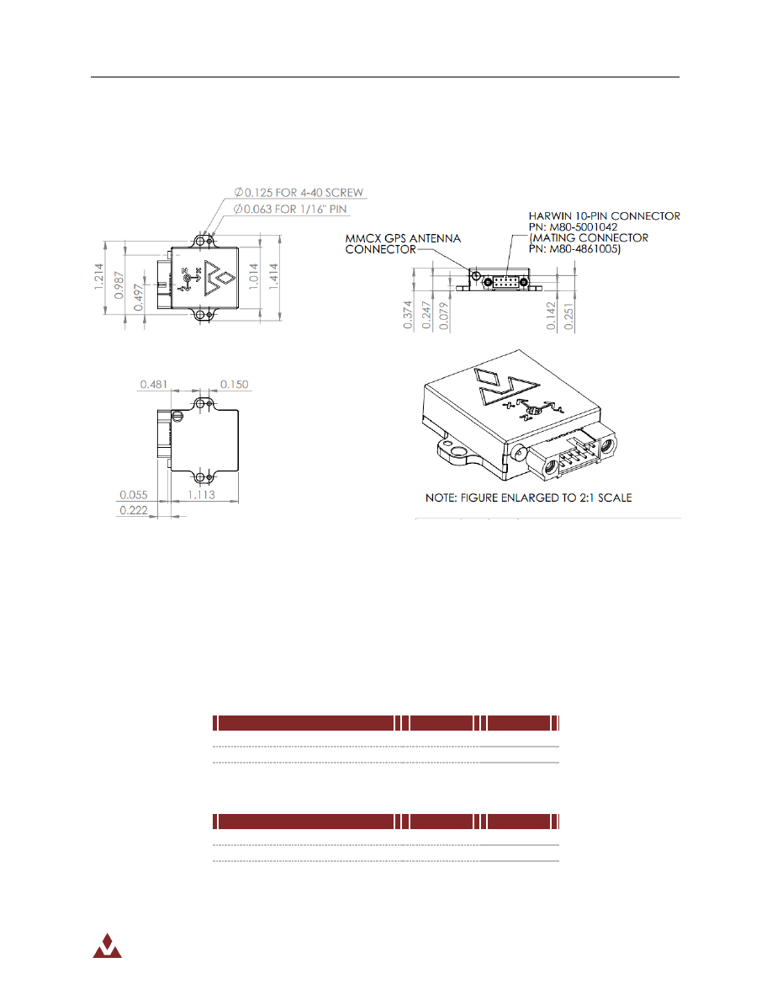{width="918"
height="1188"}

VN-200 User Manual

** **

** **

UM004

** **

 

VN-200 User Manual 

16/141 

 

**VN-200 Rugged Dimensions **

2.4

 

**Figure 4 - VN-200 Rugged Dimensions **

 

\* Measurements are in inches 

 

**Rugged Connector Type **

2.4.1

The  main  connector  used  on  the  VN-200  Rugged  is  a  10-pin  Harwin  M80-5001042.    The  mating \
connector  used  on  the  cable  assemblies  provided  by  VectorNav  for  use  with  the  VN-200  Rugged  is  a \
Harwin M80-4861005.  The RF connector used on the VN-200 Rugged is
a female MMCX jack. 

 

**Absolute Maximum Ratings **

2.5

**Table 12 -- SMD Absolute Maximum Ratings **

**Specification **

**Min **

**Max **

Input Voltage 

-0.3 V 

5.5 V 

Operating Temperature 

-40 C 

85 C 

Storage Temperature 

-40 C 

85 C 

**Table 13 -- Rugged Absolute Maximum Ratings **

**Specification **

**Min **

**Max **

Input Voltage 

-0.3 V 

17 V 

Operating Temperature 

-40 C 

85 C 

Storage Temperature 

-40 C 

85 C 

 
:::

::: {#page17-div style="position:relative;width:918px;height:1188px;"}
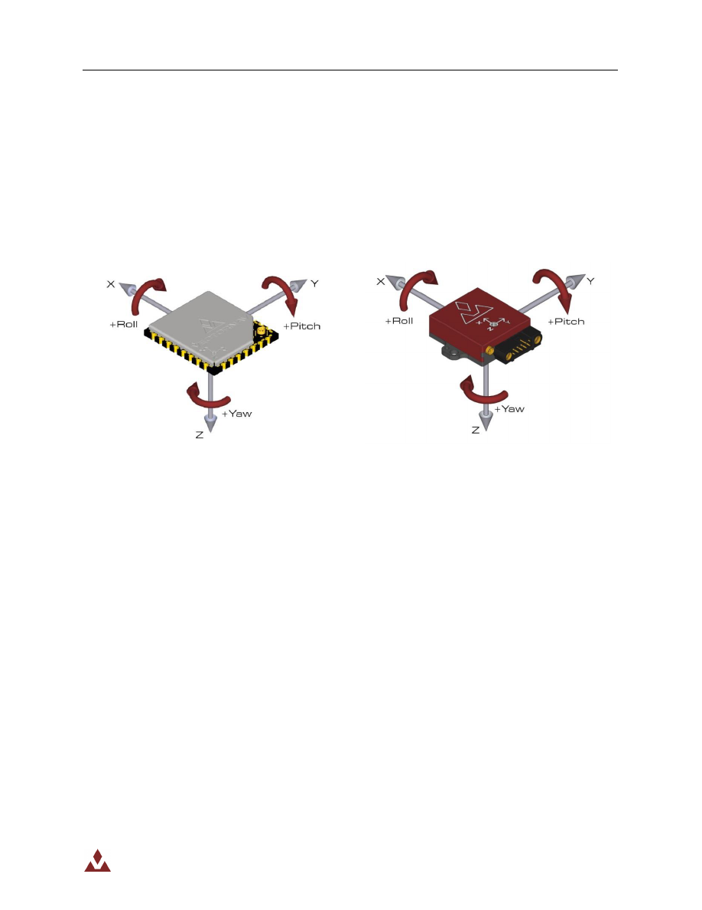{width="918"
height="1188"}

VN-200 User Manual

** **

** **

UM004

** **

 

VN-200 User Manual 

17/141 

 

**Sensor Coordinate System **

2.6

 

**Sensor Coordinate Frame **

2.6.1

The VN-200 uses a right-handed coordinate system.  A positive yaw angle is defined as a positive right-\
handed rotation around the Z-axis.  A positive pitch angle is defined as a positive right-handed rotation \
around the Y-axis.  A positive roll angle is defined as a positive right-handed rotation around the X-axis.  \
The axes direction with respect to the VN-200 module is shown
in[ Figure 5.](vn200-17.html) 

**Figure 5 - VN-200 Coordinate System **

 

 

 

**Earth Centered Earth Fixed Frame **

2.6.2

The  VN-200  position  and  velocity  estimates  can  be  output  in  the  Earth-Centered-Earth-Fixed  (ECEF) \
Frame defined as follows (

**E**

**X**

**, E**

**Y**

**, E**

**Z**

): 



 

Right-handed, Cartesian, non-inertial frame with origin located
at the center of Earth; 



 

Fixed to and rotates with Earth; 



 

Positive X-axis aligns with the WGS84 X-axis, which aligns with the International Earth Rotation \
and Reference Systems Service (IERS) Reference Meridian (IRM); 



 

Positive Z-axis aligns with the WGS84 Z-axis,
which aligns with the IERS Reference Pole (IRP) that \
points towards the North Pole; 



 

Positive Y-axis aligns with
the WGS84 Y-axis, completing the right-handed system. 

 \
 
:::

::: {#page18-div style="position:relative;width:918px;height:1188px;"}
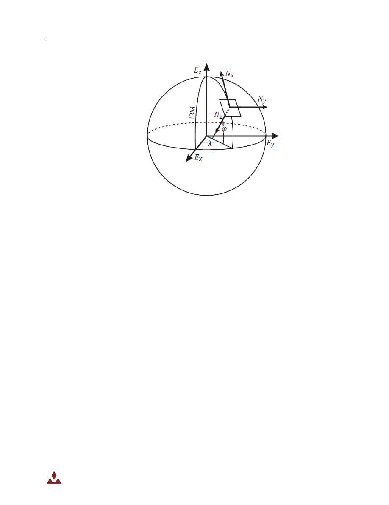{width="918"
height="1188"}

VN-200 User Manual

** **

** **

UM004

** **

 

VN-200 User Manual 

18/141 

**Figure 6 - ECEF Frame **

 

 

 

 

**Latitude, Longitude, Altitude **

2.6.3

The  VN-200  position  estimates  can  be  output  in  Latitude,  Longitude,  Altitude  coordinates  defined  as \
follows (

**ϕ, λ, h**

): 



 

Non-inertial, geodetic frame with origin located at the surface of
Earth (WGS84 ellipsoid); 



 

Latitude is defined as the angle from the equatorial plane to a line normal to the surface of \
the WGS84 ellipsoid at the location of the VN-200; 



 

Longitude  is  defined  as  the  east-west  angular  displacement  measured  positive  to  the  east \
from the IERS Reference Meridian to the location of the VN-200; 

Altitude is defined as the distance from the WGS84 ellipsoid to the location of the VN-200 in a direction \
normal to the ellipsoid. 

 

**North-East-Down Frame **

2.6.4

The VN-200 velocity estimates can be output in the North-East-Down (NED) coordinate frame defined as \
follows (

**N**

**X**

**, N**

**Y**

**, N**

**Z**

): 



 

Right-handed,  Cartesian,  non-inertial,  geodetic  frame  with  origin  located  at  the  surface  of \
Earth (WGS84 ellipsoid); 



 

Positive X-axis points towards North, tangent to WGS84 ellipsoid; 



 

Positive Y-axis points towards East, tangent to WGS84 ellipsoid; 



 

Positive Z-axis points down into the ground completing the right-handed
system. 

 

 
:::

::: {#page19-div style="position:relative;width:918px;height:1188px;"}
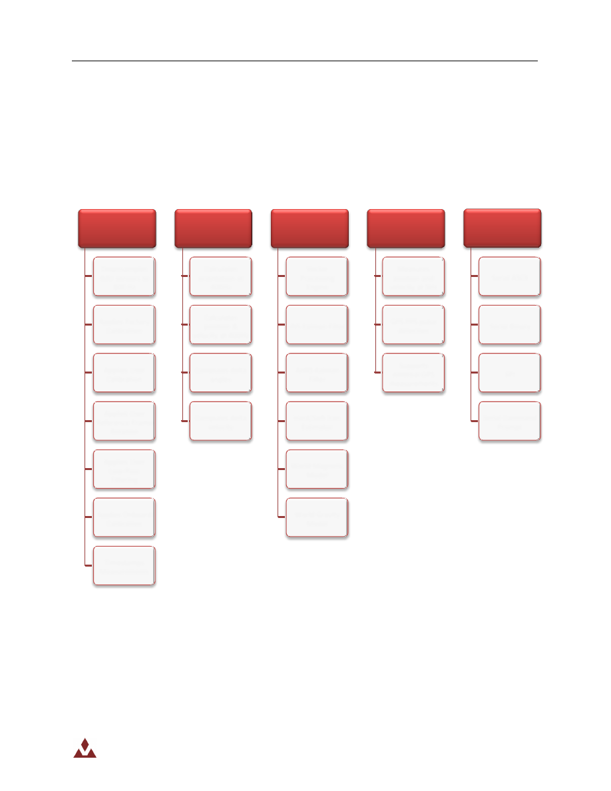{width="918"
height="1188"}

VN-200 User Manual

** **

** **

UM004

** **

 

VN-200 User Manual 

19/141 

**3**

** **

**VN-200 Software Architecture **

The software architecture internal to the VN-200 includes five separate subsystems.  These subsystems \
are  the  IMU,  the  NavState,  the  NavFilter,  the  GPS,  and  the  Communication  Interface.    The  high-level \
functions  performed  by  these  subsystems  are outlined  below.    This  chapter  describes  these  functions \
performed by these subsystems in more detail and describes which of
the various measurement outputs \
originate from each of these corresponding subsystems.  

**Figure 7 - VN-200 Software Architecture **

** **

 

**IMU Subsystem **

3.1

The IMU subsystem runs at the highest system rate, described from this point forward as the IMU Rate \
(defaults to 800Hz). It is responsible for collecting the raw IMU measurements, applying a static, user, \
and  dynamic  calibration  to  these  measurements,  and  optionally  filtering  the  individual  sensor \
measurements for output.  The coning and sculling integrals
also are calculated by the IMU subsystem at \
the full IMU Rate.  The IMU subsystem is also responsible for time stamping the IMU measurements to \
internal system time, and relative to both the SyncIn and the GPS
PPS signal. 

IMU 

Downsamples 

IMU sensors to  

800 Hz 

Applies Factory 

Calibration 

Applies User 

Calibration 

Applies User 

Reference Frame 

Rotation 

Applies User 

Low-Pass 

Filtering 

Applies Onboard 

Calibration 

Timestamps 

Measurements 

NavState 

Calculates 

orientation at 

400Hz 

Calculates 

position & 

velocity at 400Hz 

Computes delta 

angles 

Computes delta 

velocity 

NavFilter 

Vector 

Processing 

Engine 

INS Kalman Filter 

AHRS Kalman 

Filter 

Hard/Soft Iron 

Estimator 

World Magnetic 

Model 

World Gravity 

Model 

GPS 

Measures 

position and 

velocity at 5Hz 

GPS PPS pulse 

detection 

Supports 

external GPS 

measurements 

Comm 

Interface 

Serial ASCII 

Serial Binary 

SPI 

Serial Command 

Prompt 
:::

::: {#page20-div style="position:relative;width:918px;height:1188px;"}
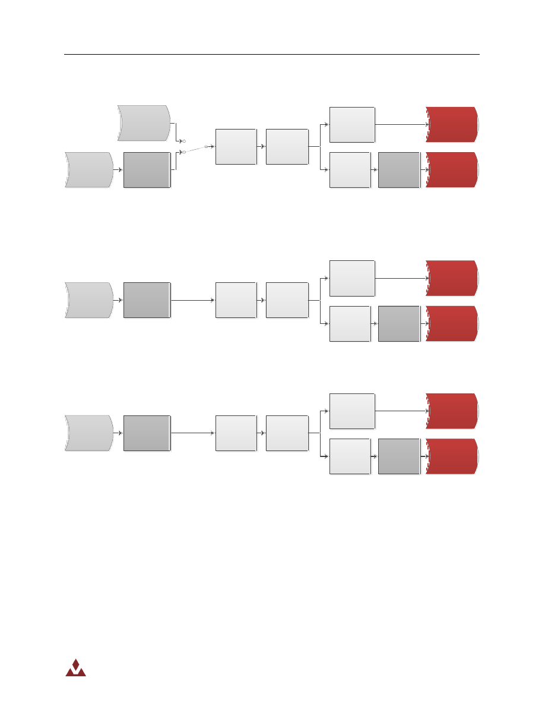{width="918"
height="1188"}

VN-200 User Manual

** **

** **

UM004

** **

 

VN-200 User Manual 

20/141 

 

**Magnetometer **

3.1.1

**Figure 8 - Magnetometer IMU Measurements **

**Raw **

**Magnetometer **

**Data**

**Factory **

**Calibration**

**External **

**Magnetometer **

**Data**

**User  **

**Magnetometer **

**Compensation**

(Register 23)

**User Reference **

**Frame Rotation**

(Register 26)

**User Low-Pass **

**Filtering**

(Uncompensated)

(Register 85)

**Onboard Hard/**

**Soft Iron **

**Compensation**

(Register 44+47)

**Uncompensated **

**Magnetometer**

(uncompMag)

**Compensated **

**Magnetometer**

(magBody)

**User Low-Pass **

**Filtering**

(Compensated)

(Register 85)

 

 

 

**Accelerometer **

3.1.2

**Figure 9 - Accelerometer IMU Measurements **

**Raw **

**Accelerometer **

**Data**

**Factory **

**Calibration**

**User  **

**Accelerometer **

**Compensation**

(Register 25)

**User Reference **

**Frame Rotation**

(Register 26)

**User Low-Pass **

**Filtering**

(Uncompensated)

(Register 85)

**Uncompensated **

**Accelerometer**

(uncompAccel)

**Compensated **

**Accelerometer**

(accelBody)

**User Low-Pass **

**Filtering**

(Compensated)

(Register 85)

**Accelerometer **

**Filter Bias **

**Compensation**

 

 

**Gyro **

3.1.3

**Figure 10 - Gyro IMU Measurements **

**Raw Gyro Data**

**Factory **

**Calibration**

**User  Gyro **

**Compensation**

(Register 84)

**User Reference **

**Frame Rotation**

(Register 26)

**User Low-Pass **

**Filtering**

(Uncompensated)

(Register 85)

**Gyro Filter Bias **

**Compensation**

**Uncompensated **

**Angular Rate**

(uncompGyro)

**Compensated **

**Angular Rate**

(angularRate)

**User Low-Pass **

**Filtering**

(Compensated)

(Register 85)

 

 

**Raw IMU Measurements **

3.1.4

The raw IMU measurements are collected from the internal MEMS at the highest rate available for each \
individual  sensor.   For the  gyro and  accelerometer,  the  measurements  are  down-sampled to  the  IMU \
Rate.   

 

**Factory Calibration **

3.1.5

Each VN-200 sensor is tested at the factory at multiple known
angular rates, accelerations, and magnetic \
field  strengths  to  determine  each  sensor's  unique  bias,  scale  factor,  axis  alignment,  and  temperature \
dependence.  The calibration coefficients required to remove these  unwanted errors are  permanently \
stored in flash memory on each sensor.  At the  IMU Rate, these calibration coefficients are applied to \
the  raw  IMU  measurements,  to  correct  for  and  remove  these  known  measurement  errors.    For 
:::

::: {#page21-div style="position:relative;width:918px;height:1188px;"}
{width="918"
height="1188"}

VN-200 User Manual

** **

** **

UM004

** **

 

VN-200 User Manual 

21/141 

thermally  calibrated  units  the  onboard  temperature  sensor  is  used  to  remove  the  measurement \
temperature  dependence.   The  output  of  the  factory  calibration  stage  is  referred  to  as  the  calibrated \
(but un-compensated) IMU measurements. 

 

**User Calibration **

3.1.6

The VN-200 provides the user with the ability to apply a separate user calibration to remove additional \
bias, scale factor, and axis misalignments.  The user calibration is applied after the factory  calibration, \
and  can  be  used  to  optionally  fine  tune  the  calibration  for  each  of  the  individual  sensors.    The  user \
calibration is optional and in most cases not required for
normal operation. 

 

**User Reference Frame Rotation **

3.1.7

The  user  reference  frame  rotation  provides  the  user  with  the  ability  to  apply  a  rigid  body  rotation  to \
each  of  the  sensor  outputs.    This  can  be  used  to  transform  the  coordinate  system  of  the  onboard \
sensors into any other coordinate frame of the user's choice.  Since this transformation is applied to the \
IMU  measurements  prior  to  their  use  in  the  onboard  attitude  estimation  algorithms,  applying  a  user \
reference frame rotation will not only change the output coordinates for the IMU measurements, it will \
also change the IMU body frame for all
subsequent attitude estimation calculations. 

 

**User Low-Pass Filtering **

3.1.8

The  VN-200  also  provides  a  means  (see  Register  85)  to  apply  low-pass  filtering  to  the  output \
compensated IMU measurements.  It is important to note that the user low-pass filtering only applies to \
the  output  compensated  IMU  measurements.    All  onboard  Kalman  filters  in  the  NavFilter  subsystem \
always use the unfiltered IMU measurements after the User Reference Frame Rotation (Register 26) has \
been  applied.    As  such  the  onboard  Kalman  filtering  will  not  be  affected  by  the  user  low-pass  filter \
settings.    The  user  low-pass  filtering  can  be  used  to  down-sample  the  output  IMU  measurements  to \
ensure that information is not lost when the IMU measurements are
sampled by the user at a lower rate \
than the internal IMU Rate. 

 

**Timestamp Measurements **

3.1.9

All onboard measurements captured by the IMU
subsystem are time stamped relative to several internal \
timing events.  These events include the monotonically increasing system time (time since startup), the \
time  since  the  last  SyncIn  event,  and  the  time  since  the  last  GPS  PPS  pulse.    These  timestamps  are \
recorded  with  microsecond  resolution  and  \~10  microsecond  accuracy  relative  to  the  onboard \
temperature  compensated crystal oscillator.  The onboard oscillator has a timing  accuracy  of \~20ppm \
over the temperature range of -40C to 80C. 

 

**Coning & Sculling **

3.1.10

The  IMU  subsystem  is  also  responsible  for  computing  and  accumulating  the  coning  and  sculling \
integrals.  These  integrals track  the  delta  angle and delta  velocity  accumulated  from one time  step to \
another.  The coning and sculling integrals are reset each time the delta angle and/or delta velocity are \
outputted (asynchronously) or polled from the delta theta and velocity register (Register 80).  Between \
output and polling events, the coning and sculling integration are performed by the IMU subsystem at \
the IMU Rate. 
:::

::: {#page22-div style="position:relative;width:918px;height:1188px;"}
{width="918"
height="1188"}

VN-200 User Manual

** **

** **

UM004

** **

 

VN-200 User Manual 

22/141 

 

**NavState Subsystem **

3.2

The NavState subsystem generates a continuous reliable stream of low-latency, low-jitter state outputs \
at a rate fixed to the IMU sample rate.  The state outputs include any output such as attitude, position, \
and velocity, which is
not directly measureable by the IMU and hence must be estimated
by the onboard \
Kalman  filters.    The  NavState  runs  immediately  after,  and  in  sync  with  the  IMU  subsystem,  at  a  rate \
divisible into the IMU Rate.  This rate is referred to as the NavState Rate (default 400Hz).  The NavState \
decouples  the  rate  at  which the  state  outputs  are made  available to the  user,  from the rate  at which \
they are  being estimated by the onboard Kalman filters.  This is very important  for many applications \
which depend on low-latency, low-jitter attitude, position, and velocity measurements as inputs to their \
control loops.  The NavState guarantees the output of new updated state information at a rate fixed to \
the IMU Rate with very low latency and output jitter.  The NavState also provides the ability for the VN-\
200 to output estimated states at rates faster than the rate of the onboard Kalman filters, which may be \
affected by system load and input measurements availability. 

 

**NavState Measurements **

3.2.1

The measurements shown below are calculated by the NavState  subsystem and are made available at \
the NavState Rate (default 400 Hz).  

**NavState Outputs**

** **

Attitude  

(Yaw, Pitch, Roll, Quaternion, DCM) 

Position 

(LLA, ECEF) 

Velocity 

(NED, ECEF, Body) 

Delta Angle 

Delta Velocity 

 

**NavFilter Subsystem **

3.3

The  NavFilter  subsystem consists of the  INS  Kalman filter,  the  Vector  Processing  Engine  (VPE),  and  its \
collection of other Kalman filters
and calculations that run at a lower rates than the NavState.
 Most high \
level states such as the estimated attitude, position, and velocity are passed from the NavFilter to the \
NavState,  and  as  such  are  made  available  to  the  user  at  the  NavState  rate.    There  are  a  handful  of \
outputs however that will only update at the rate of the NavFilter,
some of which are listed below. 

**NavFilter Outputs**

** **

Attitude Uncertainty 

Position & Velocity Uncertainty 

Gyro & Accel Filter Biases 

Mag & Accel Disturbance Estimation 

Onboard Magnetic Hard & Soft Iron 

Estimation 

World Magnetic & Gravity Model 

 

**INS Kalman Filter **

3.3.1

The INS Kalman filter consists of an Extended Kalman filter which nominally runs at the NavFilter rate \
(default  200  Hz).    The  INS  Kalman  filter  uses  the  accelerometer,  gyro,  GPS,  and  (at  startup)  the 
:::

::: {#page23-div style="position:relative;width:918px;height:1188px;"}
{width="918"
height="1188"}

VN-200 User Manual

** **

** **

UM004

** **

 

VN-200 User Manual 

23/141 

magnetometer to simultaneously estimate the full quaternion based attitude solution, the position and \
velocity, as well as the time  varying gyro, accelerometer, and barometric pressure  sensor biases.  The \
output of the INS
Kalman filter is passed to the NavState, allowing for the attitude, position, and velocity \
to be made available at the higher fixed rate of the NavState.  The INS Kalman filter provides superior \
attitude  estimation  performance  compared  to  the  AHRS  Kalman  filter  due  to  its  inherent  ability  to \
account for dynamic motion through its use of the GPS measurements.  As such when GPS is available \
the VN-200 will utilize the INS Kalman filter for attitude estimation. 

 

**Vector Processing Engine **

3.3.2

The Vector Processing Engine  (VPE) is a collection of sophisticated algorithms which provide  real-time \
monitoring  and  simultaneous  estimation  of  the  attitude  as  well  as  the  uncertainty  of  the  input \
measurements  used  by  the  attitude  estimation  algorithm.    By  estimating  its  own  input  measurement \
uncertainty  the  VPE  is  capable  of  providing  significantly  improved  performance  when  compared  to \
traditional statically tuned Kalman  Filters.  The  estimated measurement  uncertainty is used to in real-\
time adaptively tune the onboard Kalman filters.  This adaptive tuning eliminates the need in most cases \
for the user to perform any custom filter tuning for
different applications. 

 

**AHRS Kalman Filter **

3.3.3

Since the INS Kalman filter relies upon a continuous stream of GPS measurements to operate, the VN-\
200 supports automatic transition from INS to AHRS attitude estimation modes. In situations when GPS \
measurements are not available, the VN-200 will automatically begin to use the magnetometer and the \
accelerometer  to  estimate  attitude.    The  transition  is  handled  automatically  by  the  VN-200,  and \
performed in a seamless fashion, thus eliminating any potential jump discontinuities from appearing in \
the  attitude  or  angular  rate  output  when  the  transition  to  and  from  AHRS/INS  mode  is  performed.  \
Optionally the user can also manually select between using the INS or AHRS attitude estimation modes.  \
The  type  of  estimation  algorithm  used  is  controlled  by  the  INS  Scenario  field  in  the  INS  basic \
configuration register (Register 67). 

 

**Hard/Soft Iron Estimator **

3.3.4

The NavFilter subsystem also includes a separate  EKF which provides real-time estimation of the  local \
magnetic  hard  and  soft  iron  distortions.    Hard  and  soft  iron  distortions  are  local  magnetic  field \
distortions  created  by  nearby  ferrous  material  which  moves  with  the  sensor  (attached  to  the  same \
vehicle or rigid-body as the sensor).  These ferrous materials distort the direction and magnitude of the \
local  measured  magnetic  field,  thus  negatively  impacting  the  ability  of  an  AHRS  to  reliably  and \
accurately  estimate  heading  based  on  the  magnetometer  measurements.    To  remove  the  unwanted \
effect of these materials, a hard & soft iron calibration needs to be performed which requires rotating \
the  sensor  around  in  multiple  circles  while  collecting  magnetic  data  for  off-line  calculation  of  the \
magnetic  hard  &  soft  iron  calibration  coefficients.    This  calibration  can  be  very  time  consuming,  and \
might  not  be  possible  for  some  applications.    The  onboard  hard/soft  iron  estimator  runs  in  the \
background without requiring any user intervention.  For many applications this simplifies the process \
for the end user, and allows for operation in environments where the hard/soft iron may change slowly \
over  time.    On  the  VN-200  the  onboard  hard/soft  iron  estimator  is  turned  off  by  default,  and  can  be \
configured or enabled by the user the Magnetic Calibration Control
Register (see Sectio[n 11.1.1)](vn200-129.html). 
:::

::: {#page24-div style="position:relative;width:918px;height:1188px;"}
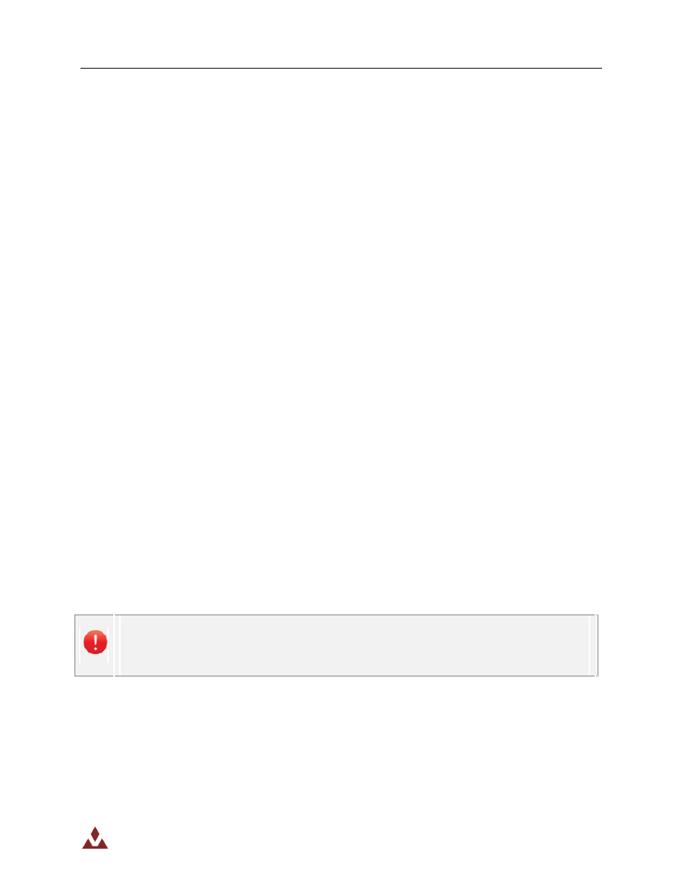{width="918"
height="1188"}

VN-200 User Manual

** **

** **

UM004

** **

 

VN-200 User Manual 

24/141 

 

**World Magnetic Model **

3.3.5

The world magnetic model (WMM) is a large spatial-scale representation of the Earth's magnetic field.
 \
The internal model
used on the VN-200 is consistent with the current WMM2010 model
which consist of \
a  spherical-harmonic  expansion  of  the  magnetic  potential  of  the  geomagnetic  field  generated  in  the \
Earth's core.  By default the world magnetic model
on the VN-200 is enabled, and automatically uses the \
estimated position from the INS to directly set the reference magnetic field strength.  Alternatively the \
world magnetic model can be manually used to calculate the magnetic
field strength for a given latitude, \
longitude,  altitude,  and  date  which  is  then  subsequently  used  as  the  fixed  magnetic  field  reference \
strength.  Control of the world magnetic model is performed using the Reference Vector Configuration \
register (Register 83). 

 

**World Gravity Model **

3.3.6

The world gravity model (WGM) is a large spatial-scale representation of the Earth's gravity potential as \
a function of position on the globe. The internal model used on the VN-200 is consistent with the Earth \
Gravity Model (EGM96), which consist of
a spherical-harmonic expansion of the Earth's geopotential.  By \
default  the  world  gravity  model  on  the  VN-200  is  enabled,  and  automatically  is  set  based  on  the \
estimated  INS  position.    Control  of  the  world  gravity  model  is  performed  using  the  Reference  Vector \
Configuration register (Register 83). 

 

**Communication Interface **

3.4

The VN-200 provides three separate communication interfaces; two physically separate serial ports and \
one SPI (Serial Peripheral Interface) bus. 

 

**Serial Interface **

3.4.1

The serial interface consists of two physically separate bi-directional UARTs.  Each UART supports baud \
rates from 9600 bps up to a maximum of 921600 bps.  

The  surface  mount  version  of  the  VN-200  offers  both  UARTS  with  3V  TTL  voltage  level  inputs  and \
outputs. 

The rugged version includes  an onboard TTL to RS-232 level shifter, thus at the  10-pin connector one \
serial port is offered with RS-232 voltages levels (Serial 1), while the other serial port (Serial 2) remains \
at 3V TTL logic levels. 

 

It  is  important  to  note  that  the  ability  to  update  the  firmware  using  the  onboard  bootloader  is  only \
supported on the serial port 1 interface.  It is highly recommended that if serial port 1 is not used for \
normal  operation,  a  means  of  accessing  it  is  designed  into  the  product  to  support  future  firmware \
updates. 

 

**SPI Interface **

3.4.2

The SPI interface consists of a standard 4-wire synchronous serial data link which is capable of high data \
rates up to 16 Mbps.  The VN-200 operates as slave on the bus enabled by the master using the slave \
select (SPI_CS)
line.  See section[ 4.2 ](vn200-26.html)for more information on the operation of the SPI
interface. 
:::

::: {#page25-div style="position:relative;width:918px;height:1188px;"}
{width="918"
height="1188"}

VN-200 User Manual

** **

** **

UM004

** **

 

VN-200 User Manual 

25/141 

 

**Communication Protocol **

3.5

The  VN-200  utilizes  a  simple  command  based  communication  protocol  for  both  the  serial  and  SPI \
interfaces.  For the serial interface an ASCII protocol is used for command and register polling, whereas \
the  SPI  interfaces  utilizes  a  binary  protocol.    Optionally  the  serial  interface  also  provides  support  for \
streaming real-time sensor measurements using binary output packets. 

 

**Serial ASCII **

3.5.1

On the serial interface a full ASCII protocol provides support for all commands, and register polling.  The \
ASCII protocol is very similar to the widely used NMEA 0183 protocol supported by most GPS receivers, \
and  consists  of  comma  delimited  parameters  printed  in  human  readable  text.    Below  is  an  example \
command  request  and  response  on  the  VN-200  used  to  poll  the  attitude  (register  8)  using  the  ASCII \
protocol.   

**Figure 11 - Example Serial Request **

\$VNRRG,8\*4B  

**Figure 12 - Example Serial Response **

\$VNRRG,08,-114.314,+000.058,-001.773\*5F 

 

Chapte[r 6 ](vn200-63.html)provides a list of all commands and registers supported by each software subsystem on the \
VN-200.  For each command and register an example ASCII response is given to demonstrating the ASCII \
formatting.   

 

**Serial Binary **

3.5.2

The  serial  interface  offers  support  for  streaming  sensor  measurements  from  the  sensor  at  fixed  rates \
using  simple  binary  output  packets.    These  binary  output  packets  provide  a  low-overhead  means  of \
streaming  high-speed sensor  measurements  from the  device minimizing both the required bandwidth \
and the necessary overhead required to parse the incoming measurements for the host system.  Section \
[5 ](vn200-33.html)provides a detailed overview on how to parse and configure the binary output messages on the serial \
interface. 

 

**Serial Command Prompt **

3.5.3

A simple command prompt is also provided on the serial
interface which provides support for advanced \
device configuration and diagnostics.  The serial command prompt is an optional
feature that is \
designed to provide more detailed
diagnostic view of overall system performance than is possible using \
normal command & register structure.  It is strictly intended to be used
by a human operator, using a \
simple serial terminal to type commands to the device using a serial
terminal, and is not designed to be \
used programmatically.  Each software subsystem described
in Chapter[ 6 ](vn200-63.html)provides information on the \
diagnostic commands supported by the serial command prompt at the
end of each subsystem section. 

** **
:::

::: {#page26-div style="position:relative;width:918px;height:1188px;"}
{width="918"
height="1188"}

VN-200 User Manual

** **

** **

UM004

** **

 

VN-200 User Manual 

26/141 

**4**

** **

**Basic Communication **

The VN-200 module supports two communication interfaces: serial and SPI.  On the serial interface, the \
module  communicates  over  a  universal  asynchronous  receiver/transmitter  (UART)  and  uses  ASCII  text \
for its command and data format.  On the SPI interface, the  VN-200 module communicates as a slave \
device on a Serial Peripheral Interface (SPI) data bus and uses a binary command and data format.  Both \
interfaces support the complete command set implemented by the module.  A general overview of the \
command  format  for  each  interface  is  given  in  the  next  two  sections  and  formatting  specific  to  each \
command and associated parameters is provided in the protocol
and register sections. 

 

**Serial Interface **

4.1

On the serial interface, the VN-200 uses ASCII text for its command format.  All commands start with a \
dollar sign, followed by a five character command, a comma, command specific parameters, an asterisk, \
a checksum, and a newline character.  An example command is shown
below. 

\$VNRRG,11\*73 

 

**SPI Interface **

4.2

The  VN-200  supports  a  Serial  Peripheral  Interface  (SPI)  communication  interface.    The  SPI  interface \
consists of synchronous serial communication interface where devices communicate in a master/slave \
mode.  The VN-200 operates as a slave while the device communicating with the  VN-200 will act as a \
master.  The master provides a clock to the slave which synchronizes the data transfer to the rising and \
falling  edge  of  the  clock  signal.  Due  to  its  synchronous  communication,  high  data  transfer  rates,  and \
master/slave  operation,  the  SPI  communication  interface  is  ideal  for  board-level  communication  over \
short distances since it doesn't require a complex software protocol
stack and is fairly straightforward to \
program against on embedded devices. 

 

**SPI Hardware Requirements **

4.2.1

Four hardware lines are required to implement a SPI interface with the VN-200; a clock (SPI_SCK), two \
data  lines  (SPI_MOSI  and  SPI_MISO),  and  a  slave  select  pin  (SPI_CS).    The  master  is  responsible  for \
driving both the clock signal and the slave select lines.  The slave select line should be pulled low when \
the master wants to communicate with the slave.  If multiple slave devices are used on the same bus, \
then each slave will have its own dedicated slave select line, while sharing the clock and data lines.  The \
VN-200 will  leave  the  SPI_MISO  line  in  a  high  impedance  state  while  the  SPI_CS  line  is  high,  enabling \
communication  with  other  slave  devices  on  the  same  SPI  bus.    When  the  master  is  finished \
communicating with the slave the slave select line is pulled high.  The clock line should idle high when \
not in use.  The SPI_MISO and SPI_MOSI pins should both transition between logic states on the falling \
edge of the SPI_SCK clock signal.  Data on both the SPI_MISO and SPI_MOSI should be sampled on the \
rising  edge  of  the  SPI_SCK  line.    The  VN-200  uses  3V  digital  logic  for  the  SPI  interface.    If  you  are \
interfacing with a 5V system, it is recommended that you use a logic level translation circuit to ensure \
reliable communication.  

 

 
:::

::: {#page27-div style="position:relative;width:918px;height:1188px;"}
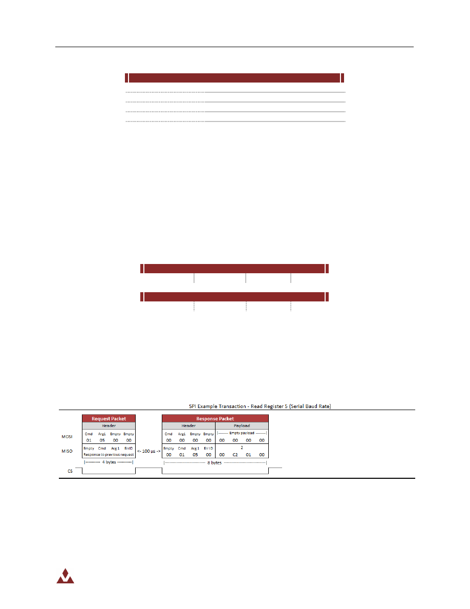{width="918"
height="1188"}

VN-200 User Manual

** **

** **

UM004

** **

 

VN-200 User Manual 

27/141 

 

**SPI Master Settings**

** **

Slave Select 

Active Low 

Clock Polarity 

Idle High (CPOL=1) 

Clock Phase 

Sample second clock edge (CPHA=1) 

Data Format 

Most significant bit first (MSB) 

Byte Order 

Least significant byte first (little-endian) 

 

 

**Software Requirements **

4.2.2

Communication with the VN-200 over SPI is conducted with multiple transactions.  A transaction for the \
purpose of this document is defined as a single operation, such as reading or writing to a register on the \
VN-200 or issuing a command such as requesting a  device  reset.  A single transaction consists to two \
separate data packets sent to the VN-200.  Each packet consists of
a four byte header followed by a data \
payload.  The header for the packet differs depending upon whether it is a request packet or a response \
packet.  For each packet sent to the VN-200 the slave select line (SPI_CS) should be pulled low at the \
beginning of the packet and pulled high at the end. 

**Figure 13 - Packet Headers **

**4-Byte Request Header (MOSI) **

Command ID 

Argument 

0x00 

0x00 

** \
4-Byte Response Header (MISO)**

** **

0x00 

Command ID 

Argument 

0x00 

 

**SPI Example Commands **

4.2.3

The  sections  that  follow  provided  some  example  SPI  transactions  for  the  various  types  of  commands \
available on the VN-200. 

**SPI Read Register Example **

Below is an example of a single transaction with
the VN-200 to read register 5.  

 

The first packet is the request packet and consists of the master sending out the MOSI line a four byte \
header with no payload.  The first byte in the header has the command ID of 1, which corresponds to a \
read register request.  The second byte is the argument.  In the case of the read register command this \
corresponds to the register ID, which in this case is register 5. The next two bytes are always zero in the \
header.  After this packet is sent the master should raise the slave select line (SPI_CS) and wait at least \
50 microseconds before issuing the respond packet.  During this time the VN-200 will process the read 
:::

::: {#page28-div style="position:relative;width:918px;height:1188px;"}
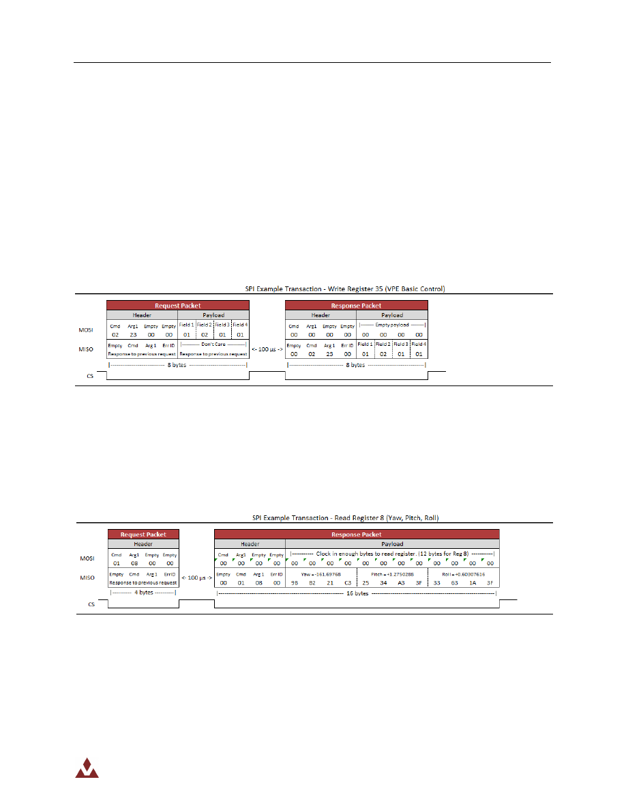{width="918"
height="1188"}

VN-200 User Manual

** **

** **

UM004

** **

 

VN-200 User Manual 

28/141 

register  request  and  place  the  requested  data  in  its  SPI  output  buffer.    On  the  response  packet  the \
master  should clock  in N bytes of  zeroes  on the  MOSI line,  where  N is equal to 4 plus the  size of the \
register being read, which in this example is register 5 (4 bytes).  The header for packets being received \
from the VN-200 has a different structure with the first byte always being zero.  The second and third \
byte in the header is the command ID and the argument (register ID) of
the response.  The fourth byte in \
the header is the error code.  If an error occurred while attempting to service the request the VN-200 \
will issue a non-zero error code in this byte with no payload.  In the payload of the response packet the \
four bytes received correspond to the value of register 5 which in this case is 115200.   As you can see \
from the example multi-byte values are sent in little endian format with the least significant byte sent \
first (0h01C200 = 115200). 

**SPI Write Register Example **

Below is an example of a write register transaction.  In this example the values of {1, 2, 1, 1} are being \
written to the four fields in the VPE Control Register (Register 35). 

 

In the case of writing to a register, the values to be loaded into the register are in the payload of the \
request packet.  The payload of the response packet contains
the contents of the register after the write \
register command has been processed.  In the case that no error occurred the payload of the response \
packet should be the same as the request.  Because of this it is sufficient to just clock in only four bytes \
on the response packet to verify that the write register took effect, which is indicated by a zero error \
code. 

**SPI Read Register Example -- Floating Point Registers **

 

The above examples show a transaction involving reading a register with floating point values.  In this \
case Register 8 is read which contains the sensor attitude (Yaw, Pitch, & Roll).  The floating point values \
are stored as 32-bit
IEEE floating point numbers in little endian byte order. 

 

** **
:::

::: {#page29-div style="position:relative;width:918px;height:1188px;"}
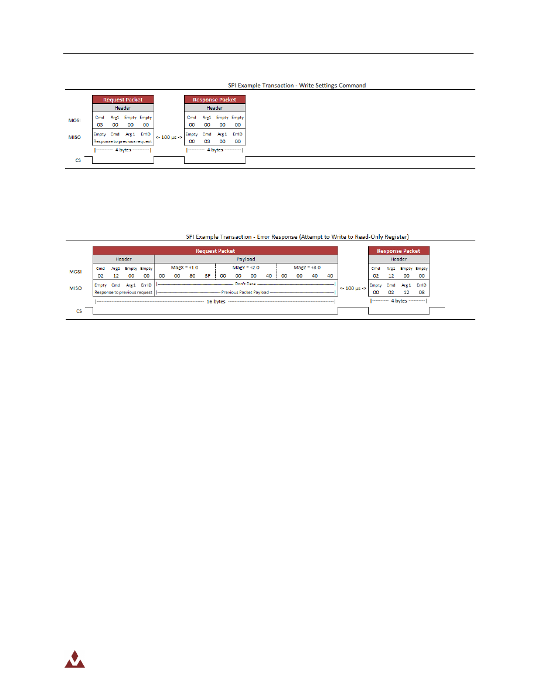{width="918"
height="1188"}

VN-200 User Manual

** **

** **

UM004

** **

 

VN-200 User Manual 

29/141 

**SPI Write Settings Command Example **

 

The above example shows an example transaction that consists of issuing a write settings command to \
the VN-200.  The different commands accepted by the VN-200 are listed
in Sectio[n 6.1.](vn200-63.html) 

**SPI Transaction Error Example **

 

The above example demonstrates what will happen when an error occurs during a transaction.  In this \
case the user attempted to write to a read-only register.  The fourth byte of the
response packet header \
shows an Error ID of 8 was returned, which corresponds to an
Invalid Register.  The different error codes \
are listed in[ Table 14.](vn200-30.html) 

 

 

** **
:::

::: {#page30-div style="position:relative;width:918px;height:1188px;"}
{width="918"
height="1188"}

VN-200 User Manual

** **

** **

UM004

** **

 

VN-200 User Manual 

30/141 

 

**System Error Codes **

4.3

In the event of an error, the VN-200 will output \$VNERR, followed by an error code.  The possible error \
codes are listed in the table below with a description of the error. 

**Table 14 -- Error Codes **

**Error Name **

**Code **

**Description **

Hard Fault 

1 

If
this error occurs, then the firmware on the VN-200 has experienced a \
hard fault exception.  To recover from this error the processor will force \
a restart, and a discontinuity will occur in the serial output.  The \
processor will restart within 50 ms of a hard fault error. 

Serial Buffer Overflow 

2 

The processor's serial input buffer has experienced an overflow.  The \
processor has a 256 character input buffer. 

Invalid Checksum 

3 

The checksum for the received command was invalid. 

Invalid Command 

4 

The user has requested an invalid command. 

Not Enough Parameters 

5 

The user did not supply the minimum number of required parameters \
for the requested command. 

Too Many Parameters 

6 

The user supplied too many parameters for the requested command. 

Invalid Parameter 

7 

The user supplied a parameter for the requested command which was \
invalid. 

Invalid Register 

8 

An invalid register was specified. 

Unauthorized Access 

9 

The user does not have permission to write to this register. 

Watchdog Reset 

10 

A watchdog reset has
occurred.  In the event of a non-recoverable error \
the internal watchdog will
reset the processor within 50 ms of the error. 

Output Buffer Overflow 

11 

The output buffer has experienced an overflow.  The processor has a \
2048 character output buffer. 

Insufficient Baud Rate 

12 

The baud rate is not high enough to support the requested \
asynchronous data output at the requested data rate. 

Error Buffer Overflow 

255 

An overflow event has occurred on the system error buffer. 

 

 

 
:::

::: {#page31-div style="position:relative;width:918px;height:1188px;"}
{width="918"
height="1188"}

VN-200 User Manual

** **

** **

UM004

** **

 

VN-200 User Manual 

31/141 

 

**Checksum / CRC **

4.4

The  serial  interface  provides  the  option  for  either  an  8-bit  checksum  or  a  16-bit  CRC.    In  the  event \
neither the checksum nor the CRC is needed, they can be turned off
by the user. 

 

**Checksum Bypass **

4.4.1

When communicating with the sensor using a serial terminal, the checksum calculation can be bypassed \
by replacing the hexadecimal digits in the checksum with uppercase X characters.  This works for  both \
the  8-bit  and  16-bit  checksum.    An  example  command  to  read  register  1  is  shown  below  using  the \
checksum bypass feature.   

\$VNRRG,1\*XX 

 

**8-bit Checksum **

4.4.2

The 8-bit checksum is an XOR of all bytes between, but not including, the dollar sign (\$) and asterisk (\*).  \
All  comma  delimiters  are  included  in  the  checksum  calculation.    The  resultant  checksum  is  an  8-bit \
number  and  is  represented  in  the  command  as  two  hexadecimal  characters.    The  C  function  snippet \
below calculates the correct checksum.  

**Example C Code **

// Calculates the 8-bit checksum for the given byte sequence. 

unsigned char 

calculateChecksum(

unsigned char

 data\[\], 

unsigned int

 length) 

{ 

    unsigned int 

i

; 

    

unsigned char

 cksum = 0; 

 \
    for(i=0; i\<length; i++){ \
        cksum \^= data\[i\]; \
    } \
 \
    return cksum; \
}

 

 

 

** **
:::

::: {#page32-div style="position:relative;width:918px;height:1188px;"}
{width="918"
height="1188"}

VN-200 User Manual

** **

** **

UM004

** **

 

VN-200 User Manual 

32/141 

 

**16-bit CRC **

4.4.3

For  cases  where  the  8-bit  checksum  doesn\'t  provide  enough  error  detection,  a  full  16-bit  CRC  is \
available.    The  VN-200  uses  the  CRC16-CCITT  algorithm.  The  resultant  CRC  is  a  16-bit  number  and  is \
represented in the command as four hexadecimal characters.  The C function snippet below calculates \
the correct CRC.  

**Example C Code **

// Calculates the 16-bit CRC for the given ASCII or binary message. 

unsigned short 

calculateCRC(

unsigned char

 data\[\], 

unsigned int 

length) 

{ \
  

unsigned int

 i; 

  

unsigned short

 crc = 0; 

 \
  for(i=0; i\<length; i++){ \
    crc  = (

unsigned char

)(crc \>\> 8) \| (crc \<\< 8); 

    crc \^= data\[i\]; \
    crc \^= (

unsigned char

)(crc & 0xff) \>\> 4; 

    crc \^= crc \<\< 12; \
    crc \^= (crc & 0x00ff) \<\< 5; \
  } \
 \
  return crc; \
} 

 

 

** **
:::

::: {#page33-div style="position:relative;width:918px;height:1188px;"}
{width="918"
height="1188"}

VN-200 User Manual

** **

** **

UM004

** **

 

VN-200 User Manual 

33/141 

**5**

** **

**User Configurable Binary Output Messages **

The  VN-200  supports  3  separate  user  configurable  binary  output  messages  available  on  the  serial \
interface.    Each  message  can  be  configured  by  the  user  to  contain  any  of  the  available  output \
measurement  types  from  the  IMU,  NavState,  NavFilter,  or  the  GPS  subsystems.    The  device  can  be \
configured  to  asynchronously  output  each  message  at  a  fixed  rate  based  upon  a  divisor  of  the  IMU \
internal sampling rate (IMU Rate). 

 

**Available Output Types **

5.1

All  real-time  measurements  either measured  or  estimated  by the  VN-200  are  available  using the  user \
output  messages.    The  different  output  types  are  organized  into  6  separate  output  groups.    The  first \
group is a combination of the most common outputs from the remaining 5 groups.  The other 5 groups \
are shown below. 

**Figure 14 -- Binary Outputs **

 

 

**Configuring the Output Types **

5.2

Configuration  of  the  3  output  messages  is  performed  using  the  User  Output  Configuration  Registers \
(Register 75-79).  There are 3 separate configuration registers, one for each available output message.  \
Section[  6.2.11  ](vn200-82.html)describes  in  more  detail  the  format  for  these  registers.    In  each of  these  configuration \
registers  the  user  can  select  which  output  types  they  want  the  message  to  include  by  specifying  the \
OutputGroup and the OutputFields parameters. 

 

** **

Time 

•TimeStartup 

•TimeGps 

•GpsTow 

•GpsWeek 

•TimeSyncIn 

•TimeGpsPps 

•TimeUTC 

•SyncInCnt 

IMU 

•Status 

•UncompMag 

•UncompAccel 

•UncompAngularRate 

•Temp 

•Pres 

•DeltaTheta 

•DeltaVel 

•Mag 

•Accel 

•AngularRate 

•SatFlags 

GPS 

•UTC \
•Tow 

•Week 

•NumSats 

•Fix 

•PosLla 

•PosEcef 

•VelNed \
•VelEcef 

•PosU 

•VelU 

•TimeU 

•Sats 

Attitude 

•Status 

•YawPitchRoll 

•Quaternion 

•DCM 

•MagNed 

•AccelNed 

•LinearAccelBody 

•LinearAccelNed 

•YprU 

INS 

•Status \
•PosLla 

•PosEcef 

•VelBody 

•VelNed \
•VelEcef 

•MagEcef 

•AccelEcef 

•LinearAccelEcef 

•PosU 

•VelU 
:::

::: {#page34-div style="position:relative;width:918px;height:1188px;"}
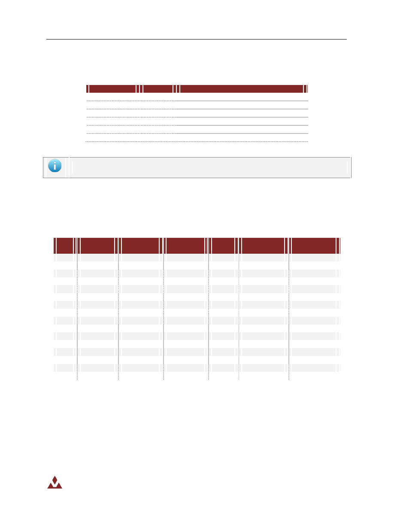{width="918"
height="1188"}

VN-200 User Manual

** **

** **

UM004

** **

 

VN-200 User Manual 

34/141 

 

**OutputGroup **

5.2.1

The OutputGroup parameter is a single byte where the bits select which output groups are active in the \
message. 

**Name **

**Bit Offset **

**Description **

Output Group 1 

0 

Common Group 

Output Group 2 

1 

Time Group 

Output Group 3 

2 

IMU Group 

Output Group 4 

3 

GPS Group 

Output Group 5 

4 

Attitude Group 

Output Group 6 

5 

INS Group 

 

 

Output group 7 is not used on the VN-200. The bit for this unused output group must be set to zero. 

 

**OutputFields **

5.2.2

The OutputFields is an array of 16-bit words, with the array length equal to the number of active groups \
in the OutputGroup.  The OutputFields selects which output fields
are active for each output group. 

Below is a list of the available output fields for each output group. 

**Bit **

**Offset **

**Group 1 **

**Common **

**Group 2 **

**Time **

**Group 3 **

**IMU **

**Group 4 **

**GPS **

**Group 5 **

**Attitude **

**Group 6 **

**INS **

0 

TimeStartup 

TimeStartup 

ImuStatus 

UTC 

VpeStatus 

InsStatus 

1 

TimeGps 

TimeGps 

UncompMag 

Tow 

YawPitchRoll 

PosLla 

2 

TimeSyncIn 

GpsTow 

UncompAccel 

Week 

Quaternion 

PosEcef 

3 

YawPitchRoll 

GpsWeek 

UncompGyro 

NumSats 

DCM 

VelBody 

4 

Quaternion 

TimeSyncIn 

Temp 

Fix 

MagNed 

VelNed 

5 

AngularRate 

TimeGpsPps 

Pres 

PosLla 

AccelNed 

VelEcef 

6 

Position 

TimeUTC 

DeltaTheta 

PosEcef 

LinearAccelBody 

MagEcef 

7 

Velocity 

SyncInCnt 

DeltaVel 

VelNed 

LinearAccelNed 

AccelEcef 

8 

Accel 

 

Mag 

VelEcef 

YprU 

LinearAccelEcef 

9 

Imu 

 

Accel 

PosU 

 

PosU 

10 

MagPres 

 

AngularRate 

VelU 

 

VelU 

11 

DeltaTheta 

 

SensSat 

TimeU 

 

 

12 

InsStatus 

 

 

SvStat 

 

 

13 

SyncInCnt 

 

 

 

 

 

14 

TimeGpsPps 

 

 

 

 

 

15 

 

 

 

 

 

 

 

 

** **
:::

::: {#page35-div style="position:relative;width:918px;height:1188px;"}
{width="918"
height="1188"}

VN-200 User Manual

** **

** **

UM004

** **

 

VN-200 User Manual 

35/141 

 

**Setup the Configuration Register **

5.2.3

Once you have determined the desired outputs for your output messages,
you will need to configure the \
User Output Message Configuration Registers (Register 75 -- 77).  These registers are described in detail \
in Section[ 6.2.11, ho](vn200-82.html)wever for
reference the format of the register is shown below.  

**Binary Output Register 1-3**

** **

**Register ID : **

75-77 

**Firmware : **

v1.0.0.0 

**Access : **

Read / Write 

**Comment : **

These  registers  allow  the  user  to  construct  a  custom  output  message  that  contains  a \
collection of desired estimated states and sensor measurements. 

**Size (Bytes): **

6-22 

**Example Response: **

\$VNWRG,75,2,4,1,8\*XX 

**Offset **

**Name **

**Format **

**Unit **

**Description **

0 

AsyncMode 

uint16 

- 

Selects whether the output message should be sent out on \
the serial port(s) at a fixed rate. \
0 = None.  User message is not automatically sent out \
either serial port. \
1 = Message is sent out serial port 1 at a fixed rate. \
2 = Message is sent out serial port 2 at a fixed rate. \
3 = Message is sent out both serial ports at a fixed rate. 

2 

RateDivisor 

uint16 

- 

Sets the fixed rate at which the message is sent out the \
selected serial port(s). The number given is a divisor of the 

***ImuRate ***

which is nominally 800Hz.  For example to have 

the sensor output at 50Hz you would set the Divisor equal \
to 16. 

4 

OutputGroup 

uint16 

- 

Selects which output groups are active in the message.  \
The number of 

**OutputFields**

 in this message should equal 

the number of active bits in the 

**OutputGroup**

. 

6 

OutputField(1) 

uint16 

- 

Active output fields for the first active group. 

4+2\*N 

OutputField(N) 

uint16 

- 

Active output fields for the Nth active group. 

 

 

** **
:::

::: {#page36-div style="position:relative;width:918px;height:1188px;"}
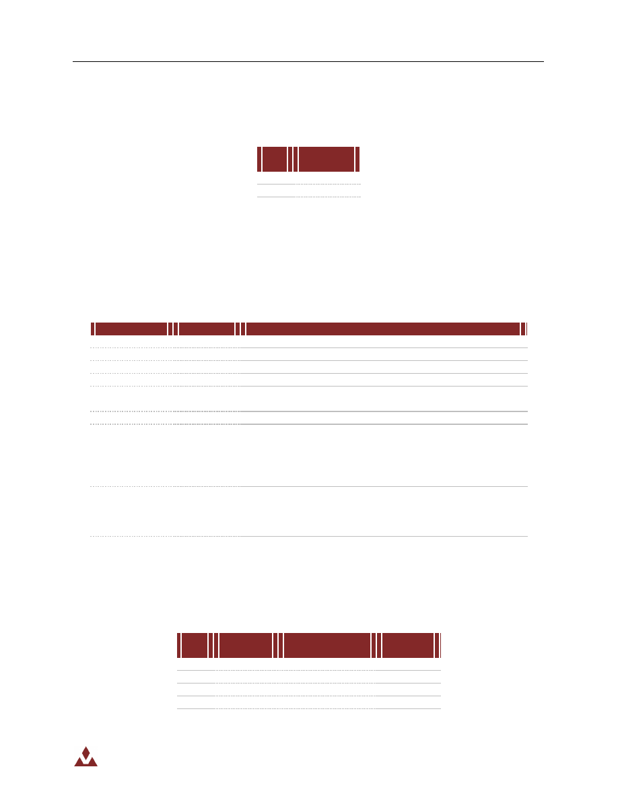{width="918"
height="1188"}

VN-200 User Manual

** **

** **

UM004

** **

 

VN-200 User Manual 

36/141 

 

**Example Case 1 -- Selecting outputs from only the Common Group **

5.2.1

For many applications you might be able to get by with only the output types available in the common \
group.    For  these  situations  the  configuration  of  the  output  message  is  simple.  Suppose  only  the \
following information shown below is desired. 

**Bit **

**Offset **

**Group 1 **

**Common **

0 

TimeStartup

 

3 

YawPitchRoll

 

5 

AngularRate

 

  

For this example we will assume that the data will be polled
using serial port 2 at 50 Hz. 

To configure this output message you would send the following command to the VN-200. 

\$VNWRG,75,2,16,01,0029\*XX 

Now let's dissect this command to see what is actually being set:  

**Field **

**Value **

**Description **

Header 

\$VN 

ASCII message header 

Command 

WRG 

Write register command 

Register ID 

77 

Register 75 (Config register for first output message) 

AsyncMode 

2 

Message set to output on serial port 2. 

RateDivisor 

16 

Divisor = 16. If the 

*ImuRate*

 = 800Hz then, the message output rate 

will be (800 / 16 = 50 Hz). 

OutputGroup 

01 

Groups = 0x01. (Binary group 1 enabled) 

GroupField 1 

0029 

Group 1 Field = 0x0029.  In binary 0x0029 = 0b00101001. \
The active bits correspond to the following active output fields: \
Bit 0 -- TimeStartup \
Bit 3 -- YawPitchRoll \
Bit 5 - AngularRate 

Checksum 

XX 

Payload  terminator  and  checksum.    XX  instructs  the  VN-200  to \
bypass  the  checksum  evaluation.  This  allows  us  to  manually  type \
messages in a serial terminal without needing to calculate a valid \
checksum. 

End Line 

\\r\\n 

Carriage return and line feed.  Terminates the ASCII message. 

 

 

**Example Case 2 -- Outputs from multiple Output Groups **

5.2.2

This example case demonstrates how to select multiple output fields from more than one output group.
 \
Assume that the following bold output types are desired: 

**Bit **

**Offset **

**Group 1 **

**Common **

**Group 3 **

**IMU **

**Group 5 **

**Attitude **

0 

TimeStartup

 

 

 

1 

 

 

 

2 

 

UncompAccel

 

Quaternion

 

3 

 

UncompAngularRate 

 

4 

 

 

MagNed

 
:::

::: {#page37-div style="position:relative;width:918px;height:1188px;"}
{width="918"
height="1188"}

VN-200 User Manual

** **

** **

UM004

** **

 

VN-200 User Manual 

37/141 

Also assume that you want the message to stream at 50 Hz over serial port 1. 

To configure this output message you would send the following command to the VN-200. 

\$VNWRG,75,1,16,15,0001,000C,0014\*XX 

Now let's dissect this command to see what is actually being set:  

**Field **

**Value **

**Description **

Header

 

\$VN 

ASCII message header 

Command

 

WRG 

Write register command 

Register ID

 

75 

Register 75 (Config register for first output message) 

AsyncMode

 

1 

Message sent on serial port 1. 

RateDivisor

 

16 

Divisor = 16. If the 

***ImuRate***

 = 800Hz then, the message output rate 

will be (800 / 16 = 50 Hz). 

OutputGroup

 

15 

Groups = 0x15. In binary 0x15 = 0x00010101. \
The active bits correspond to the following active output groups: \
Bit 0 -- Common \
Bit 2 -- Imu \
Bit 4 - Attitude 

GroupField 1

 

0001 

Group 1 Field = 0x0001.  In binary 0x0001 = 0b00000001. \
The active bits correspond to the following active output fields: \
Bit 0 -- TimeStartup 

GroupField 2

 

000C 

Group 2 Field = 0x000C.  In binary 0x000C = 0b00001100. \
The active bits correspond to the following active output fields: \
Bit 3 -- UncompAccel \
Bit 4 -- UncompGyro 

GroupField 3

 

0014 

Group 3 Field = 0x0014.  In binary 0x0014 = 0b00010100. \
The active bits correspond to the following active output fields: \
Bit 2 -- Qtn \
Bit 4 -- MagNed 

Checksum

 

XX 

Payload  terminator  and  checksum.    XX  instructs  the  VN-200  to \
bypass  the  checksum  evaluation.  This  allows  us  to  manually  type \
messages  in  a  serial  terminal  without  needing  to  calculate  a  valid \
checksum. 

End Line

 

\\r\\n 

Carriage return and line feed.  Terminates the ASCII message. 

 

 

** **
:::

::: {#page38-div style="position:relative;width:918px;height:1188px;"}
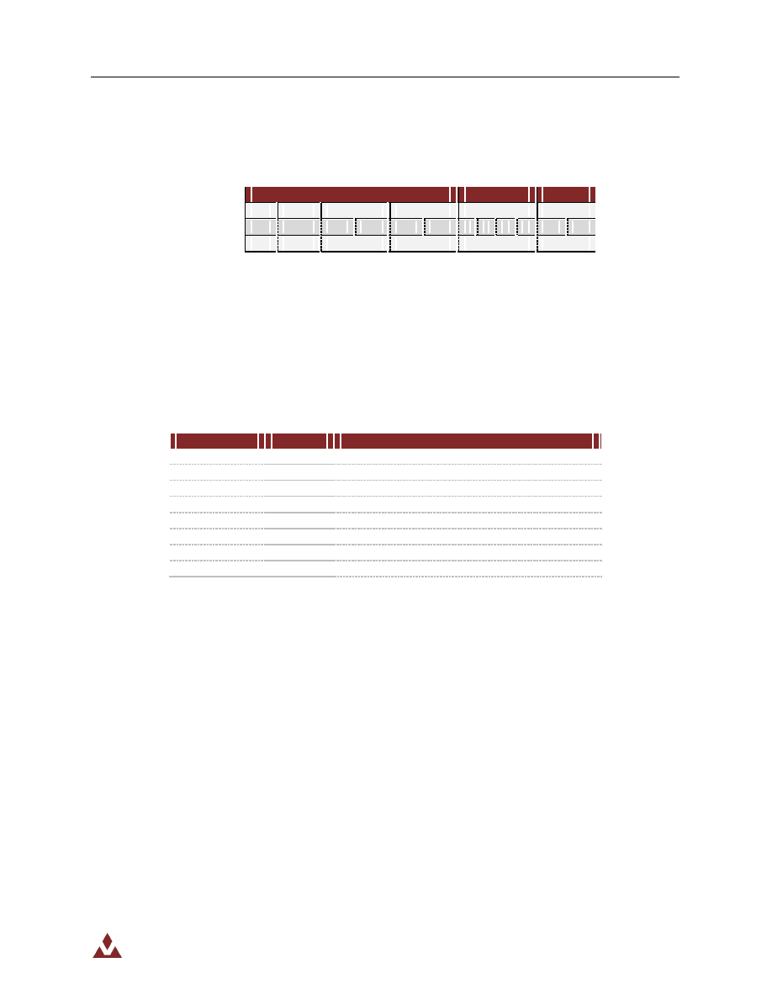{width="918"
height="1188"}

VN-200 User Manual

** **

** **

UM004

** **

 

VN-200 User Manual 

38/141 

 

**Serial Output Message Format **

5.3

The binary output message packets on the serial interface consist of a simple message header, payload, \
and  a  16-bit  CRC.    An  example  packet  is  shown  below  for  reference.    The  header  is  variable  length \
depending upon the number of groups active in the message. 

** **

**Header **

**Payload **

**CRC **

Field 

Sync 

Groups 

Group Field 1 

Group Field 2 

Payload 

CRC 

Byte Offset 

0 

1 

2 

3 

4 

5 

6 

7 

... 

N 

N+1 

N+2 

Type 

u8 

u8 

u16 

u16 

Variable 

u16 

 

** Sync Byte **

5.3.1

The sync byte is the first byte in the header. Its value will always
be equal to 0xFA. 

 

**Groups **

5.3.2

The  group  consist  of  a  single  byte which  determines  which  message  groups  have  been  selected.   The \
user can select from a wide assortment of different output types, which are organized into  8 different \
groups.  The group byte acts as a bit field with each individual bit determining which binary groups are \
active for the given packet.  The various groups are shown below. 

**Name **

**Bit Offset **

**Description **

Binary Group 1 

0 

General Purpose Group 

Binary Group 2 

1 

Time and Event Count Group 

Binary Group 3 

2 

Inertial Measurement Unit Group 

Binary Group 4 

3 

GPS Measurement Group 

Binary Group 5 

4 

AHRS Group 

Binary Group 6 

5 

INS Group 

Binary Group 7 

6 

Reserved for future use. Must be set to zero. 

Binary Group 8 

7 

Reserved for future use. Must be set to zero. 

 

**Group Fields **

5.3.3

The group fields consist of N number of 16-bit bit fields that represent which output types have been \
selected in the active binary groups.  The number of group fields in the header will depend upon how \
many groups are active in the message.  The number of group fields
present in the header will always be \
equal to the number of active bits in the group byte.  When parsing the binary packet you can count the \
number  of active  bits present  in the group byte, and then you can assume that  this number of group \
fields will be present in the header.  For example if only binary group 1 is selected (Group Byte = 0x01), \
then only one Group field will be present in the header, thus
the header will be 4 bytes in length.  If both \
binary group 1 and 3 are active (Group Byte = 0x05), then two Group field elements will be present in \
the header (4 bytes), thus the header in this case will be 6 bytes in
length.  

 

**Payload **

5.3.4

The payload will consist of the output data selected based upon the bits selected in the group byte and \
the group field bytes.  All output data in the payload section consist of the active outputs selected for \
binary  group 1, followed by the  active outputs  selected for binary group 2, and so forth.  No padding \
bytes are used between output fields. 
:::

::: {#page39-div style="position:relative;width:918px;height:1188px;"}
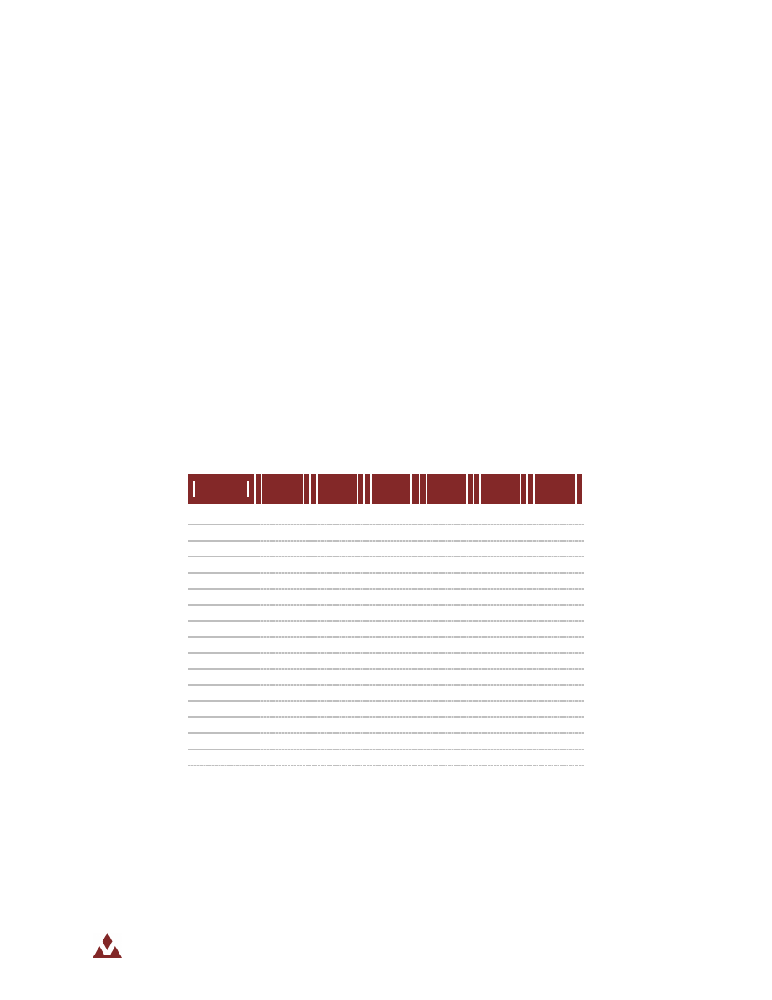{width="918"
height="1188"}

VN-200 User Manual

** **

** **

UM004

** **

 

VN-200 User Manual 

39/141 

 

**CRC **

5.3.5

The CRC consists of a 16-bit CRC of the packet.  The CRC is calculated over the packet starting just after \
the sync byte in the header (not including the sync byte) and ending at the end of the payload. More \
information about the CRC algorithm and example code for how to perform the calculation is shown in \
Section[ 4.4.](vn200-31.html)  The CRC is selected such that if you compute the 16-bit CRC starting with the group byte \
and include the CRC itself, a valid packet will result in 0x0000 computed by the running CRC calculation \
over the entire packet.  This provides a simple way of detecting packet corruption by simply checking to \
see if the CRC calculation of
the entire packet (not including the sync byte) results in zero. 

 

**Payload Length **

5.3.6

When parsing the packet you will need to know the length of the payload (in bytes) in order to know \
where the packet ends in the data stream.  In
order to reduce the overhead of the packet header length, \
the  length  of  the  payload  is  not  included  in  the  header.    Instead  it  should  be  derived  based  upon \
determining the type of data present in the packet.  All output data types are fixed length, thus the total \
length of the payload can be determined based upon inspection of the group byte and the group field \
bytes.    In  most  applications  you  will  likely  only  use  a  few  binary  output  types,  thus  hard  coding  the \
payload length in your parser is the easiest approach.  If you want to develop a more generic parser that \
can  handle  all  available  data  output  types  supported  by  the  VN-200,  the  easiest  approach  is  to  use  a \
table lookup.  Below is a table with the payload size (in bytes) for all
available output types. 

**Table 15 - Binary Output Payload Length In Bytes **

** **

**Group **

**1 **

**Group **

**2 **

**Group **

**3 **

**Group **

**4 **

**Group **

**5 **

**Group **

**6 **

Field 1 

8 

8 

2 

8 

2 

2 

Field 2 

8 

8 

12 

8 

12 

24 

Field 3 

8 

8 

12 

2 

16 

24 

Field 4 

12 

2 

12 

1 

36 

12 

Field 5 

16 

8 

4 

1 

12 

12 

Field 6 

12 

8 

4 

24 

12 

12 

Field 7 

24 

8 

16 

24 

12 

12 

Field 8 

12 

4 

12 

12 

12 

12 

Field 9 

12 

0 

12 

12 

12 

12 

Field 10 

24 

0 

12 

12 

12 

4 

Field 11 

20 

0 

12 

4 

28 

4 

Field 12 

28 

0 

2 

4 

24 

68 

Field 13 

2 

0 

40 

32 

0 

64 

Field 14 

4 

0 

0 

0 

0 

0 

Field 15 

8 

0 

0 

0 

0 

0 

Field 16 

0 

0 

0 

0 

0 

0 

 

The above lookup table can be implemented in C as shown
below using a simple 2D array.  Since none of \
the  individual  outputs  types  exceed  256  bytes  in  length,  this  lookup  table  can  be  implemented  as  an \
array of bytes, which consumes only 96 bytes of memory. 

** **

** **
:::

::: {#page40-div style="position:relative;width:918px;height:1188px;"}
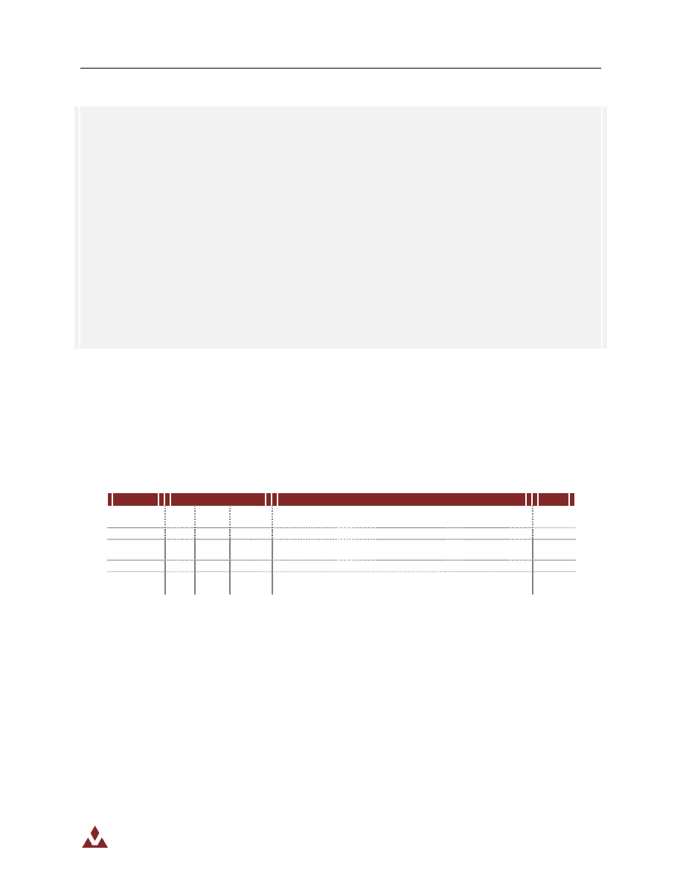{width="918"
height="1188"}

VN-200 User Manual

** **

** **

UM004

** **

 

VN-200 User Manual 

40/141 

**Example Code **

// 2D array to determine the payload length for a binary output packet.
The first 

// index of the array is the group number, and the second index 

// is the group field index. Both indices are assumed to be zero based. 

 

const unsigned char 

groupLen\[6\]\[16\] = 

{ 

{8,  8,  8,  12, 16, 12, 24, 12, 12, 24, 20, 28, 2,  4,  8,  0}, 

//Group 1

 

{8,  8,  8,  2,  8,  8,  8,  4,  0,  0,  0,  0,  0,  0,  0,  0}, 

//Group 2 

{2,  12, 12, 12, 4,  4,  16, 12, 12, 12, 12, 2,  40, 0,  0,  0}, 

//Group 3 

{8,  8,  2,  1,  1,  24, 24, 12, 12, 12, 4,  4,  32, 0,  0,  0}, 

//Group 4 

{2,  12, 16, 36, 12, 12, 12, 12, 12, 12, 28, 24, 0,  0,  0,  0}, 

//Group 5 

{2,  24, 24, 12, 12, 12, 12, 12, 12, 4,  4,  68, 64, 0,  0,  0}, 

//Group 6 

}; 

 

**Example Cases **

5.3.7

To  help  you  better  understand  how  the  binary  protocol  works,  the  next  two  sections  provide  an \
overview of how the binary output packets are formed
for two separate example cases. 

**Example Case 1 **

For example 1 we will assume that only binary group 1 is active, and only the yaw, pitch, and roll output \
is active within this binary group.  In this case the header will
have the following form. 

** **

**Header **

**Payload **

**CRC **

Field 

Sync 

Group 

Group 1 

Fields 

YawPitchRoll 

CRC 

Byte Offset 

0 

1 

2 

3 

4 

5 

6 

7 

8 

9 

10 

11 

12 

13 

14 

15 

16 

17 

Byte  Value 

(Hex) 

FA 

01 

08 

00 

93 

50 

2E 

42 

83 

3E 

F1 

3F 

48 

B5 

04 

BB 

92 

88 

Type 

u8 

u8 

u16 

float 

float 

float 

u16 

Value 

0xFA 

1 

8 

0x422E5093 

+43.578686 (Yaw) 

0x3FF13E83 

 +1.8847202 (Pitch) 

0xBB04B548 

-2.0249654e-3 (Roll) 

0x9288 

** **

 

 
:::

::: {#page41-div style="position:relative;width:918px;height:1188px;"}
{width="918"
height="1188"}

VN-200 User Manual

** **

** **

UM004

** **

 

VN-200 User Manual 

41/141 

**Example Case 2 **

For the second example case we will assume that both binary group 1 and 3 are active. In binary group \
1, the Ypr output is selected,
and in binary group 3, the Temp output is selected. 

** **

**Header **

Field 

Sync 

Group 

Group 1 

Fields 

Group 3 

Fields 

Byte Offset 

0 

1 

2 

3 

4 

5 

Byte Value 

(Hex) 

FA 

01 

08 

00 

01 

00 

Type 

u8 

u8 

u16 

u16 

Value 

0xFA 

0x01 

0x08 

0x01 

 

** **

**Payload **

**CRC **

Field 

YawPitchRoll 

Temp 

CRC 

Byte Offset 

6 

7 

8 

9 

10 

11 

12 

13 

14 

15 

16 

17 

18 

19 

20 

21 

22 

23 

Byte Value 

(Hex) 

A4 

15 

02 

42 

4D 

DF 

EB 

3F 

F6 

1A 

36 

BE 

BF 

2D 

A4 

41 

A8 

3A 

Type 

float 

float 

float 

float 

u16 

Value 

0x420215A4 

+32.521133 (Yaw) 

0X3FEBDF4D 

+1.8427521 (Pitch) 

0XBE361AF6 

-1.7783722e-1 (Roll) 

0X41A42DBF 

+20.522337 (Temp) 

0XA83A 

 

 

 
:::

::: {#page42-div style="position:relative;width:918px;height:1188px;"}
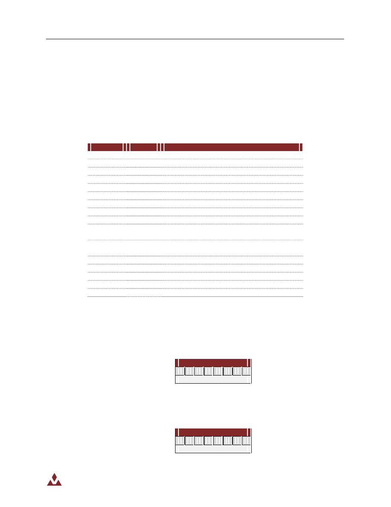{width="918"
height="1188"}

VN-200 User Manual

** **

** **

UM004

** **

 

VN-200 User Manual 

42/141 

 

**Binary Group 1 -- Common Outputs **

5.4

Binary group 1 contains a wide assortment of commonly used data
required for most applications.  All of \
the outputs found in group 1 are also present in the other groups.  In this sense, group 1 is a subset of \
commonly  used  outputs  from  the  other  groups.    This  simplifies  the  configuration  of  binary  output \
messages  for applications that only  require access  to the  commonly used data  found in group 1.  For \
these applications you can hard code the group field to 1,
and not worry about implemented support for \
the other binary groups.  Using group 1 for commonly used outputs also has the advantage of reducing \
the overall packet size, since the packet length is dependent
upon the number of binary groups active. 

**Table 16 -- Binary Group 1 **

**Name **

**Bit Offset **

**Description **

TimeStartup  0 

Time since startup. 

TimeGps 

1 

GPS time. 

TimeSyncIn 

2 

Time since last SyncIn trigger. 

Ypr 

3 

Estimated attitude as yaw pitch and roll angles. 

Qtn 

4 

Estimated attitude as a quaternion. 

AngularRate  5 

Compensated angular rate. 

Position 

6 

Estimated position. (LLA) 

Velocity 

7 

Estimated velocity. (NED) 

Accel 

8 

Estimated acceleration (compensated). (Body) 

Imu 

9 

Calibrated uncompensated gyro and accelerometer \
measurements. 

MagPres 

10 

Calibrated magnetic (compensated), temperature, \
and pressure measurements. 

DeltaTheta 

11 

Delta time, theta, and velocity. 

InsStatus 

12 

INS status. 

SyncInCnt 

13 

SyncIn count. 

TimeGpsPps  14 

Time since last GPS PPS trigger. 

Resv 

15 

Reserved for future use. Should be set to zero. 

 

 

**Time Startup **

5.4.1

The  system  time  since  startup  measured  in  nano  seconds.    The  time  since  startup  is  based  upon  the \
internal TXCO oscillator for the MCU.  The accuracy of the internal
TXCO is +/- 20ppm (-40C to 85C).  This \
field is equivalent to the TimeStartup field in group 2. 

** **

**TimeStartup**

** **

Byte Offset 

0 

1 

2 

3 

4 

5 

6 

7 

Type 

uint64 

 

**TimeGps **

5.4.2

The absolute GPS time since start of GPS epoch 1980 expressed in nano seconds.  This field is equivalent \
to the TimeGps field in group 2. 

** **

**TimeGps**

** **

Byte Offset 

0 

1 

2 

3 

4 

5 

6 

7 

Type 

uint64 
:::

::: {#page43-div style="position:relative;width:918px;height:1188px;"}
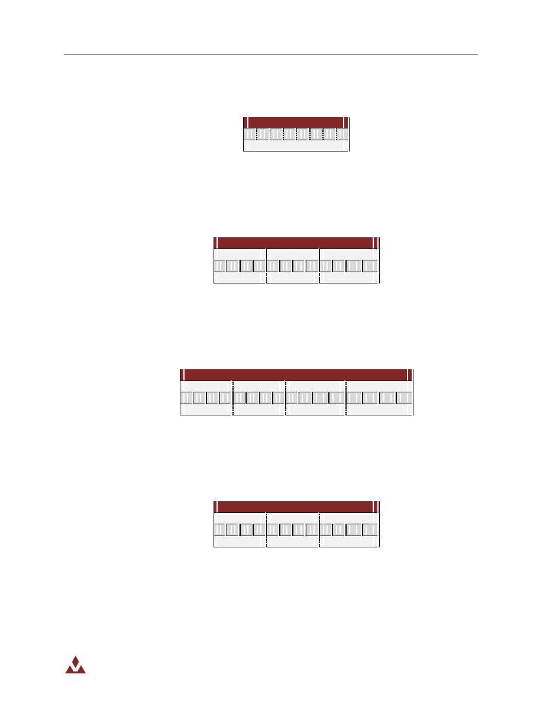{width="918"
height="1188"}

VN-200 User Manual

** **

** **

UM004

** **

 

VN-200 User Manual 

43/141 

 

**TimeSyncIn **

5.4.3

The time  since  the  last  SyncIn trigger  event  expressed in  nano  seconds.   This field s equivalent  to the \
TimeSyncIn field in group 2. 

** **

**TimeSyncIn**

** **

Byte Offset 

0 

1 

2 

3 

4 

5 

6 

7 

Type 

uint64 

 

 

**YawPitchRoll **

5.4.4

The estimated attitude Yaw, Pitch, and Roll angles measured in degrees.  The attitude is given as a 3,2,1 \
Euler angle sequence describing the body frame with respect to the local North East Down (NED) frame.  \
This field is equivalent to the YawPitchRoll field in group 5. 

** **

**YawPitchRoll**

** **

 

yaw 

pitch 

roll 

Byte Offset 

0 

1 

2 

3 

4 

5 

6 

7 

8 

9 

10 

11 

Type 

float 

float 

float 

 

 

**Quaternion **

5.4.5

The estimated attitude quaternion. The last term is the scalar value. The attitude is given as the body \
frame with respect to the local North East Down (NED) frame.  This field is equivalent to the Quaternion \
field in group 5. 

** **

**Quaternion **

 

qtn\[0\] 

qtn\[1\] 

qtn\[2\] 

qtn\[3\] 

Byte Offset 

0 

1 

2 

3 

4 

5 

6 

7 

8 

9 

10 

11 

12 

13 

14 

15 

Type 

float 

float 

float 

float 

 

 

**AngularRate **

5.4.6

The estimated angular rate measured in rad/s. The angular rates are compensated by the onboard filter \
bias  estimates.    The  angular  rate  is  expressed  in  the  body  frame.    This  field  is  equivalent  to  the \
AngularRate field in group 3. 

** **

**AngularRate**

** **

 

rate\[0\] 

rate\[1\] 

rate\[2\] 

Byte Offset 

0 

1 

2 

3 

4 

5 

6 

7 

8 

9 

10 

11 

Type 

float 

float 

float 

 

 

** **
:::

::: {#page44-div style="position:relative;width:918px;height:1188px;"}
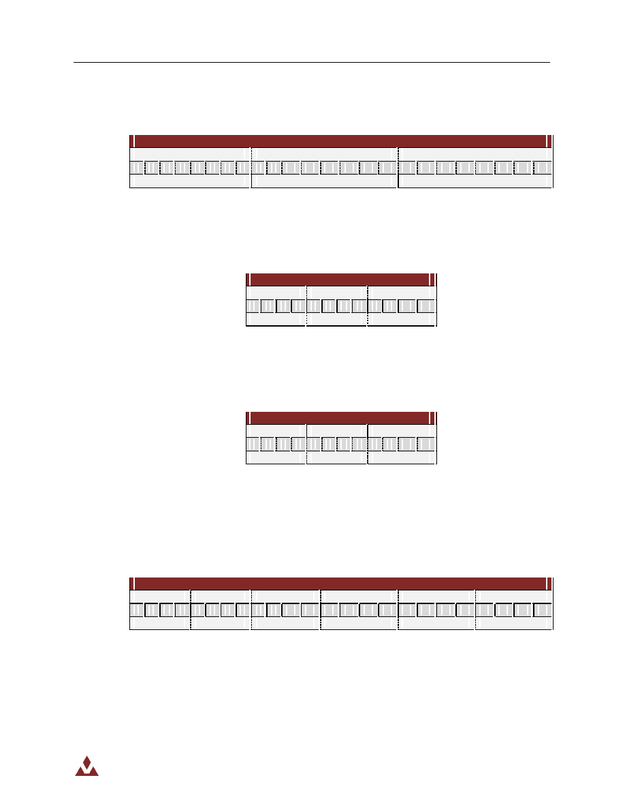{width="918"
height="1188"}

VN-200 User Manual

** **

** **

UM004

** **

 

VN-200 User Manual 

44/141 

 

**Position **

5.4.7

The estimated position given as latitude, longitude, and altitude given in \[deg, deg, m\] respectfully.  This \
field is equivalent to the PosLla field in group 6. 

** **

**Position **

 

latitude 

longitude 

altitude 

Byte Offset 

0 

1 

2 

3 

4 

5 

6 

7 

8 

9 

10 

11 

12 

13 

14 

15 

16 

17 

18 

19 

20 

21 

22 

23 

Type 

double 

double 

double 

 

 

**Velocity **

5.4.8

The estimated velocity in the North East Down (NED) frame, given in m/s.  This field is equivalent to the \
VelNed field in group 6. 

** **

**Velocity**

** **

 

vel\[0\] 

vel\[1\] 

vel\[2\] 

Byte Offset 

0 

1 

2 

3 

4 

5 

6 

7 

8 

9 

10 

11 

Type 

float 

float 

float 

 

**Accel **

5.4.9

The estimated acceleration in the body frame, given in m/s\^2.  This
acceleration includes gravity and has \
been bias compensated by the onboard INS Kalman filter.  This field is equivalent to the Accel field in \
group 3. 

** **

**Accel**

** **

 

accel\[0\] 

accel\[1\] 

accel\[2\] 

Byte Offset 

0 

1 

2 

3 

4 

5 

6 

7 

8 

9 

10 

11 

Type 

float 

float 

float 

 

**Imu **

5.4.10

The  uncompensated  IMU  angular  rate  and  acceleration  measurements.    The  angular  rate  is  given  in \
rad/s, and the acceleration is given in m/s\^2.
 These measurements correspond to the calibrated angular \
rate  and  acceleration  measurements  straight  from  the  IMU.    The  measurements  have  not  been \
corrected  for  bias  offset  by  the  onboard  AHRS/INS  Kalman  filter.    This  field  is  equivalent  to  the \
UncompGyro and UncompAccel fields in group 3. 

** **

**Imu **

 

rate\[0\] 

rate\[1\] 

rate\[2\] 

accel\[0\] 

accel\[1\] 

accel\[2\] 

Byte Offset 

0 

1 

2 

3 

4 

5 

6 

7 

8 

9 

10 

11 

12 

13 

14 

15 

16 

17 

18 

19 

20 

21 

22 

23 

Type 

float 

float 

float 

float 

float 

float 

 

 

** **
:::

::: {#page45-div style="position:relative;width:918px;height:1188px;"}
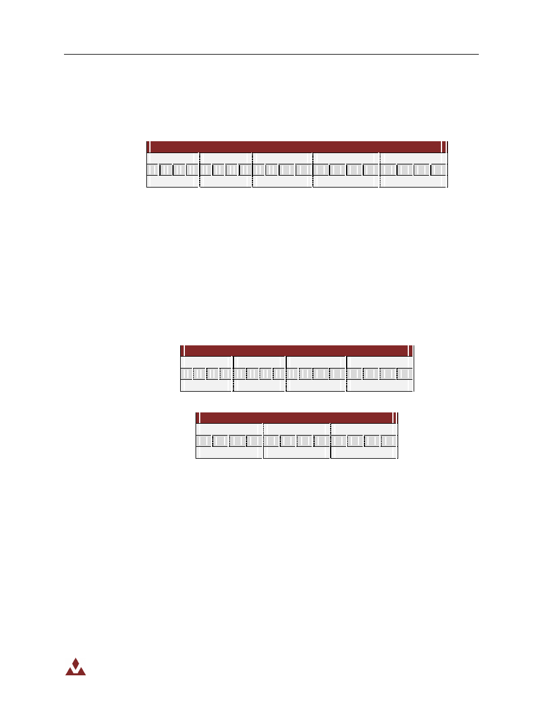{width="918"
height="1188"}

VN-200 User Manual

** **

** **

UM004

** **

 

VN-200 User Manual 

45/141 

 

**MagPres **

5.4.11

The  compensated  magnetic,  temperature,  and  pressure  measurements  from  the  IMU.    The  magnetic \
measurement is given in Gauss, and has been corrected for hard/soft iron corrections (if enabled).  The \
temperature measurement is given in Celsius. The pressure measurement is given in kPa.  This field is \
equivalent to the Mag, Temp, and Pres fields in group 3. 

** **

**MagPres **

 

mag\[0\] 

mag\[1\] 

mag\[2\] 

temp 

pres 

Byte Offset 

0 

1 

2 

3 

4 

5 

6 

7 

8 

9 

10 

11 

12 

13 

14 

15 

16 

17 

18 

19 

Type 

float 

float 

float 

float 

float 

 

 

**DeltaThetaVel **

5.4.12

The delta time, angle, and velocity measurements.  The delta time (dtime) is the time interval that the \
delta  angle  and  velocities  are  integrated  over.    The  delta  theta  (dtheta)  is  the  delta  rotation  angles \
incurred due to rotation, since the last time the
values were outputted by the device.  The delta velocity \
(dvel) is the delta velocity incurred due to motion, since the last time the values were outputted by the \
device.    These  delta  angles  and  delta  velocities  are  calculated  based  upon  the  onboard  conning  and \
sculling integration performed onboard the sensor at the IMU rate (default 800Hz).  The integration for \
both the delta angles and velocities are reset each time either of the
values are either polled or sent out \
due to a scheduled asynchronous ASCII or binary output.  This field is equivalent to the DeltaTheta and \
DeltaVel fields in group 3 with the inclusion of the additional
delta time parameter. 

** **

**DeltaThetaVel **

 

dtime 

dtheta\[0\] 

dtheta\[1\] 

dtheta\[2\] 

Byte Offset 

0 

1 

2 

3 

4 

5 

6 

7 

8 

9 

10 

11 

12 

13 

14 

15 

Type 

float 

float 

float 

float 

 

** **

**DeltaThetaVel (continued)**

** **

 

dvel\[0\] 

dvel\[1\] 

dvel\[2\] 

Byte Offset 

16 

17 

18 

19 

20 

21 

22 

23 

24 

25 

26 

27 

Type 

float 

float 

float 

 

 

** **
:::

::: {#page46-div style="position:relative;width:918px;height:1188px;"}
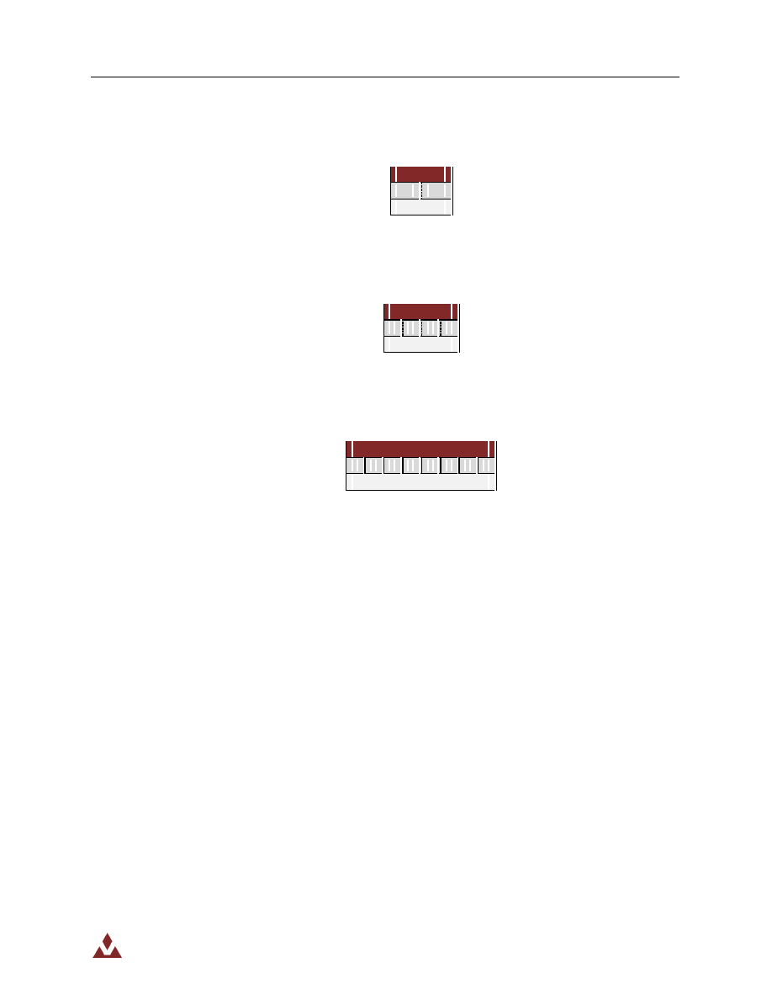{width="918"
height="1188"}

VN-200 User Manual

** **

** **

UM004

** **

 

VN-200 User Manual 

46/141 

 

**InsStatus **

5.4.13

The INS status bitfield.  This field is equivalent to the InsSatus field in group 6.  See register 63 for more \
information on the individual bits in this field. 

**  SolStatus**

** **

Byte Offset 

0 

1 

Type 

u16 

 

**SyncInCnt **

5.4.14

The number of SyncIn trigger events that have occurred.  This field is equivalent
to the SyncInCnt field in \
group 2. 

** **

**SyncInCnt **

Byte Offset 

0 

1 

2 

3 

Type 

u32 

 

**TimeGpsPps **

5.4.15

The time since the last GPS PPS trigger event expressed in nano seconds.  This field is equivalent to the \
TimePPS field in group 2. 

** **

**TimeGpsPps **

Byte Offset 

0 

1 

2 

3 

4 

5 

6 

7 

Type 

uint64 

 

 

** **
:::

::: {#page47-div style="position:relative;width:918px;height:1188px;"}
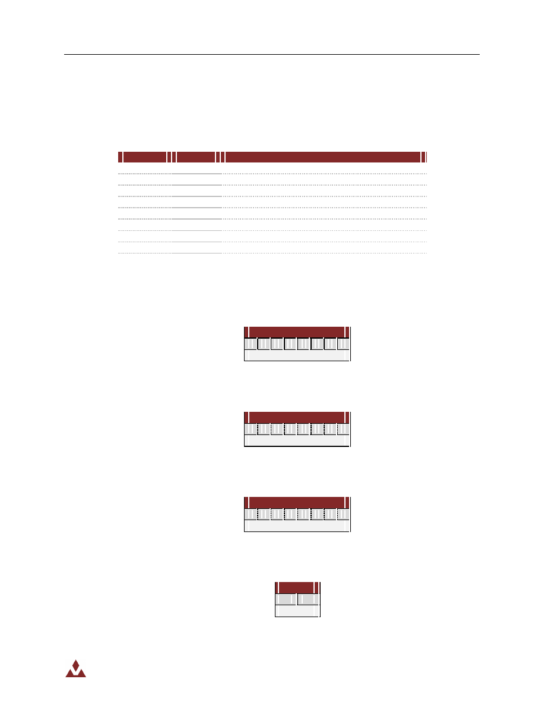{width="918"
height="1188"}

VN-200 User Manual

** **

** **

UM004

** **

 

VN-200 User Manual 

47/141 

 

**Binary Group 2 -- Time Outputs **

5.5

Binary group 2 provides all timing and event counter related outputs.  Some of these outputs (such as \
the TimeGps, TimePps, and TimeUtc), require either that the internal GPS to be enabled, or an external \
GPS must be present. 

**Table 17 - Binary Group 2 **

**Name **

**Bit Offset **

**Description **

TimeStartup  0 

Time since startup. 

TimeGps 

1 

Absolute GPS time. 

GpsTow 

2 

Time since start of GPS week. 

GpsWeek 

3 

GPS week. 

TimeSyncIn 

4 

Time since last SyncIn trigger. 

TimePPS 

5 

Time since last GPS PPS trigger. 

TimeUTC 

6 

UTC time. 

SyncInCnt 

7 

SyncIn trigger count. 

Resv 

8-15 

Reserved for future use. Should be set to zero. 

 

**TimeStartup **

5.5.1

The  system  time  since  startup  measured  in  nano  seconds.    The  time  since  startup  is  based  upon  the \
internal TXCO oscillator for the MCU.  The accuracy of the
internal TXCO is +/- 20ppm (-40C to 85C). 

** **

**TimeStartup**

** **

Byte Offset 

0 

1 

2 

3 

4 

5 

6 

7 

Type 

uint64 

 

**TimeGps **

5.5.2

The GPS time of week expressed in nano seconds. 

** **

**TimeGps**

** **

Byte Offset 

0 

1 

2 

3 

4 

5 

6 

7 

Type 

uint64 

 

**GpsTow **

5.5.3

The time since the start of the current GPS
time week expressed in nano seconds. 

** **

**GpsTow**

** **

Byte Offset 

0 

1 

2 

3 

4 

5 

6 

7 

Type 

uint64 

 

**GpsWeek **

5.5.4

The current GPS week. 

**  GpsWeek**

** **

Byte Offset 

0 

1 

Type 

u16 

  
:::

::: {#page48-div style="position:relative;width:918px;height:1188px;"}
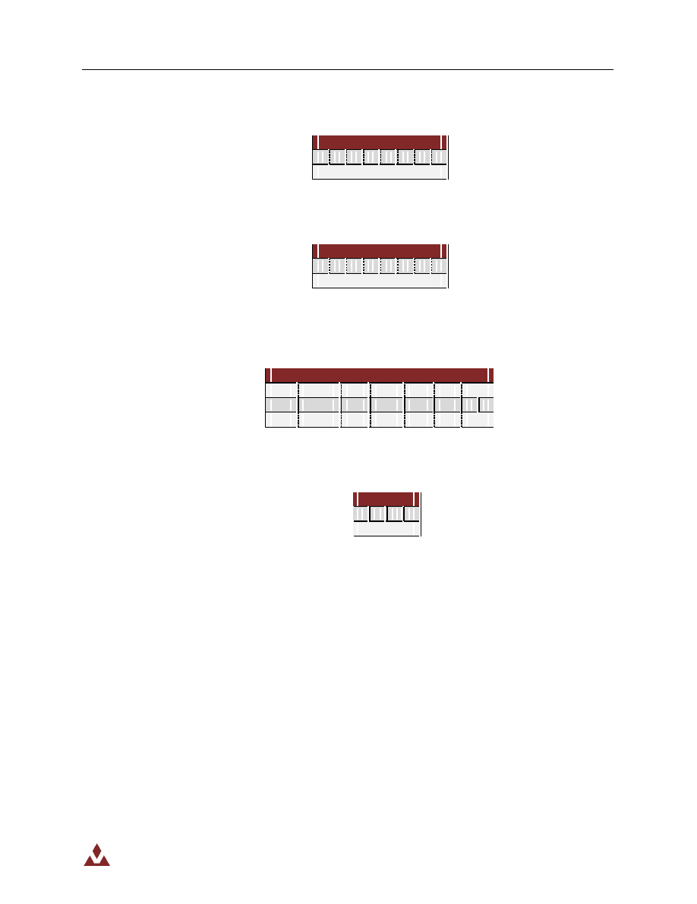{width="918"
height="1188"}

VN-200 User Manual

** **

** **

UM004

** **

 

VN-200 User Manual 

48/141 

 

**TimeSyncIn **

5.5.5

The time since the last SyncIn event trigger expressed in nano seconds. 

** **

**TimeSyncIn**

** **

Byte Offset 

0 

1 

2 

3 

4 

5 

6 

7 

Type 

uint64 

 

**TimeGpsPps **

5.5.6

The time since the last GPS PPS
trigger event expressed in nano seconds. 

** **

**TimePps**

** **

Byte Offset 

0 

1 

2 

3 

4 

5 

6 

7 

Type 

uint64 

 

**TimeUtc **

5.5.7

The current UTC time.  The year is given as a signed byte year offset from the year 2000.  For example \
the year 2013 would be given as year 13. 

** **

**TimeUtc**

** **

Fields  year  month  day  hour  min  sec 

ms 

Byte Offset 

0 

1 

2 

3 

4 

5 

6 

7 

Type 

s8 

u8 

u8 

u8 

u8 

u8 

u16 

 

**SyncInCnt **

5.5.8

The number of SyncIn trigger events that have occurred. 

**   **

**SyncInCnt **

Byte Offset   

0 

1 

2 

3 

Type   

u32 

 

 

 
:::

::: {#page49-div style="position:relative;width:918px;height:1188px;"}
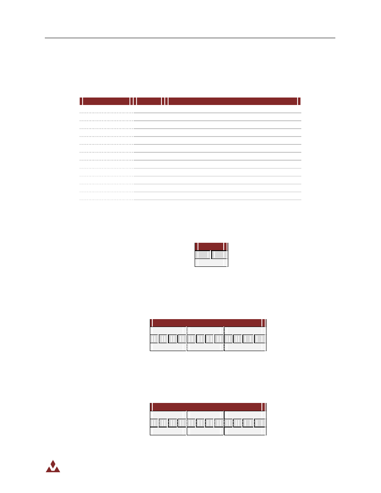{width="918"
height="1188"}

VN-200 User Manual

** **

** **

UM004

** **

 

VN-200 User Manual 

49/141 

 

**Binary Group 3 -- IMU Outputs **

5.6

Binary  group 3  provides  all  outputs  which  are  dependent  upon  the  measurements  collected  from  the \
onboard IMU, or an external IMU (if enabled). 

**Table 18 -- Binary Group 3 **

**Name **

**Bit Offset  Description **

ImuStatus 

0 

Reserved for future use. 

UncompMag 

1 

Uncompensated magnetic measurement. 

UncompAccel 

2 

Uncompensated acceleration measurement. 

UncompGyro 

3 

Uncompensated angular rate measurement. 

Temp 

4 

Temperature measurement. 

Pres 

5 

Pressure measurement. 

DeltaTheta 

6 

Delta theta angles. 

DeltaV 

7 

Delta velocity. 

Mag 

8 

Compensated magnetic measurement. 

Accel 

9 

Compensated acceleration measurement. 

AngularRate 

10 

Compensated angular rate measurement. 

SensSat 

11 

Sensor saturation bit field. 

Resv 

12-15 

Reserved for future use. Should be set to zero. 

 

**ImuStatus **

5.6.1

Status is reserved for future use.  Not currently used
in the current code, as such will always report 0. 

**    ImuStatus**

** **

Byte Offset   

0 

1 

Type   

u16 

 

**UncompMag **

5.6.2

The  IMU  magnetic  field  measured  in  units  of  Gauss,  given  in  the  body  frame.    This  measurement  is \
compensated  by  the  static  calibration  (individual  factory  calibration  stored  in  flash),  and  the  user \
compensation, however it is
not compensated by the onboard Hard/Soft Iron estimator. 

** **

**UncompMag**

** **

 

mag\[0\] 

mag\[1\] 

mag\[2\] 

Byte Offset 

0 

1 

2 

3 

4 

5 

6 

7 

8 

9 

10 

11 

Type 

float 

float 

float 

 

**UncompAccel **

5.6.3

The  IMU  acceleration  measured  in  units  of  m/s\^2,  given  in  the  body  frame.    This  measurement  is \
compensated  by  the  static  calibration (individual  factory  calibration  stored  in  flash),  however  it  is  not \
compensated by any dynamic
calibration such as bias compensation from the onboard INS
Kalman filter. 

** **

**UncompAccel**

** **

 

accel\[0\] 

accel\[1\] 

accel\[2\] 

Byte Offset 

0 

1 

2 

3 

4 

5 

6 

7 

8 

9 

10 

11 

Type 

float 

float 

float 
:::

::: {#page50-div style="position:relative;width:918px;height:1188px;"}
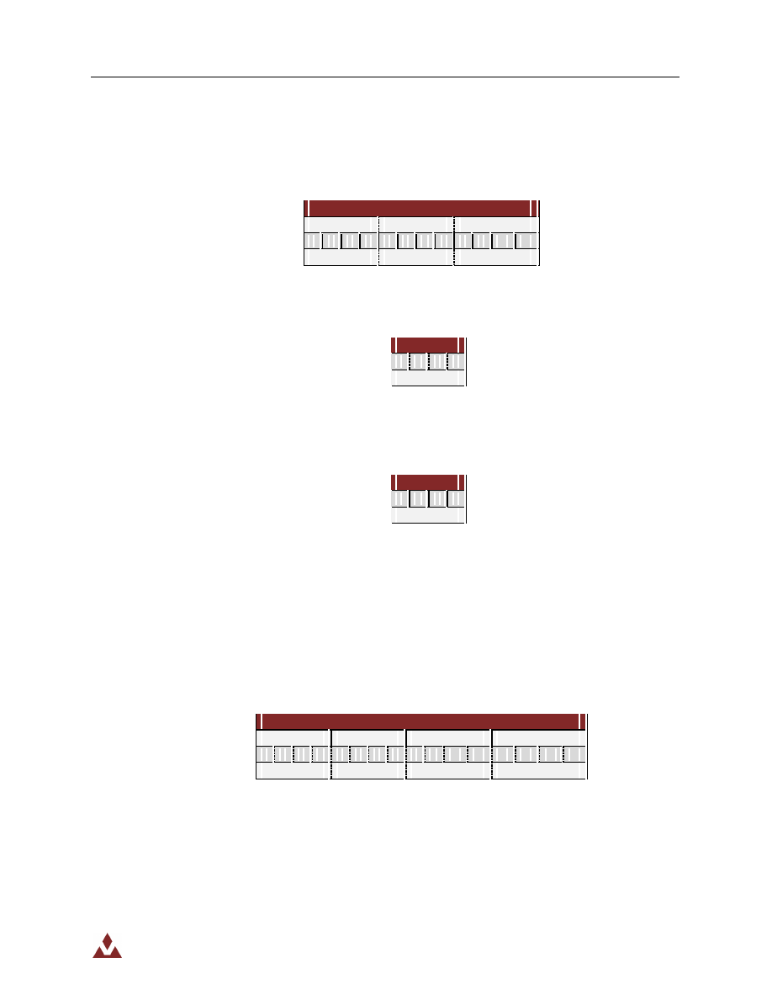{width="918"
height="1188"}

VN-200 User Manual

** **

** **

UM004

** **

 

VN-200 User Manual 

50/141 

 

**UncompGyro **

5.6.4

The  IMU  angular  rate  measured  in  units  of  rad/s,  given  in  the  body  frame.    This  measurement  is \
compensated  by  the  static  calibration (individual  factory  calibration  stored  in  flash),  however  it  is  not \
compensated  by  any  dynamic  calibration  such  as  the  bias  compensation  from  the  onboard  AHRS/INS \
Kalman filters. 

** **

**UncompGyro**

** **

 

gyro\[0\] 

gyro\[1\] 

gyro\[2\] 

Byte Offset 

0 

1 

2 

3 

4 

5 

6 

7 

8 

9 

10 

11 

Type 

float 

float 

float 

 

**Temp **

5.6.5

The IMU temperature measured in units of Celsius. 

**   **

**Temp **

Byte Offset   

0 

1 

2 

3 

Type   

float 

 

**Pres **

5.6.6

The IMU pressure measured in kilopascals.  This is an absolute pressure measurement.  Typical pressure \
at sea level would be around 100 kPa. 

**   **

**Pres **

Byte Offset   

0 

1 

2 

3 

Type   

float 

 

 

**DeltaTheta **

5.6.7

The  delta  theta  (dtheta)  is  the  delta  rotation  angles  incurred  due  to  rotation,  since  the  last  time  the \
values were output by the device.  The delta angles are calculated based upon the onboard conning and \
sculling  integration  performed  onboard  the  sensor  at  the  IMU  sampling  rate  (nominally  800Hz).    The \
delta  time  (dtime)  is  the  time  interval  that  the  delta  angle  and  velocities  are  integrated  over.    The \
integration  for  the  delta  angles  are  reset  each  time  the  values  are  either  polled  or  sent  out  due  to  a \
scheduled  asynchronous  ASCII  or  binary  output.    Time  is  given  in  sections.    Delta  angles  are  given  in \
degrees. 

** **

**DeltaTheta **

Fields 

dtime 

dtheta\[0\] 

dtheta\[1\] 

dtheta\[2\] 

Byte Offset 

0 

1 

2 

3 

4 

5 

6 

7 

8 

9 

10 

11 

12 

13 

14 

15 

Type 

float 

float 

float 

float 

 

 

** **
:::

::: {#page51-div style="position:relative;width:918px;height:1188px;"}
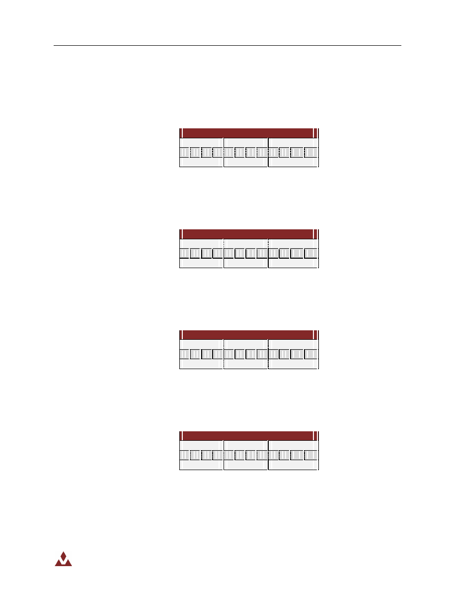{width="918"
height="1188"}

VN-200 User Manual

** **

** **

UM004

** **

 

VN-200 User Manual 

51/141 

 

**DeltaV **

5.6.8

The delta velocity (dvel) is the delta velocity incurred due to motion, since the last time the values were \
output by the device.  The delta velocities are calculated based upon the onboard conning and sculling \
integration performed onboard the sensor at the IMU sampling rate (nominally 800Hz).  The integration \
for the delta velocities are reset each time the values are either polled or sent out due to a scheduled \
asynchronous ASCII or
binary output.  Delta velocity is given in meters per second. 

** **

**DeltaVel **

Fields 

dvel\[0\] 

dvel\[1\] 

dvel\[2\] 

Byte Offset 

0 

1 

2 

3 

4 

5 

6 

7 

8 

9 

10 

11 

Type 

float 

float 

float 

 

**Mag **

5.6.9

The  IMU  compensated  magnetic  field  measured  units  of  Gauss,  and  given  in  the  body  frame.    This \
measurement is compensated by the static calibration (individual factory calibration stored in flash), the \
user compensation, and the dynamic calibration from the
onboard Hard/Soft Iron estimator. 

** **

**Mag**

** **

 

mag\[0\] 

mag\[1\] 

mag\[2\] 

Byte Offset 

0 

1 

2 

3 

4 

5 

6 

7 

8 

9 

10 

11 

Type 

float 

float 

float 

 

**Accel **

5.6.10

The  compensated  acceleration  measured  in  units  of  m/s\^2,  and  given  in  the  body  frame.    This \
measurement is compensated by the static calibration (individual factory calibration stored in flash), the \
user compensation,
and the dynamic bias compensation from the onboard INS Kalman filter. 

** **

**Accel**

** **

 

accel\[0\] 

accel\[1\] 

accel\[2\] 

Byte Offset 

0 

1 

2 

3 

4 

5 

6 

7 

8 

9 

10 

11 

Type 

float 

float 

float 

 

**AngularRate **

5.6.11

The  compensated  angular  rate  measured  in  units  of  rad/s,  and  given  in  the  body  frame.    This \
measurement is compensated by the static calibration (individual factor calibration stored in flash), the \
user compensation, and the dynamic
bias compensation from the onboard INS Kalman filter. 

** **

**AngularRate**

** **

 

gyro\[0\] 

gyro\[1\] 

gyro\[2\] 

Byte Offset 

0 

1 

2 

3 

4 

5 

6 

7 

8 

9 

10 

11 

Type 

float 

float 

float 

 

 

** **
:::

::: {#page52-div style="position:relative;width:918px;height:1188px;"}
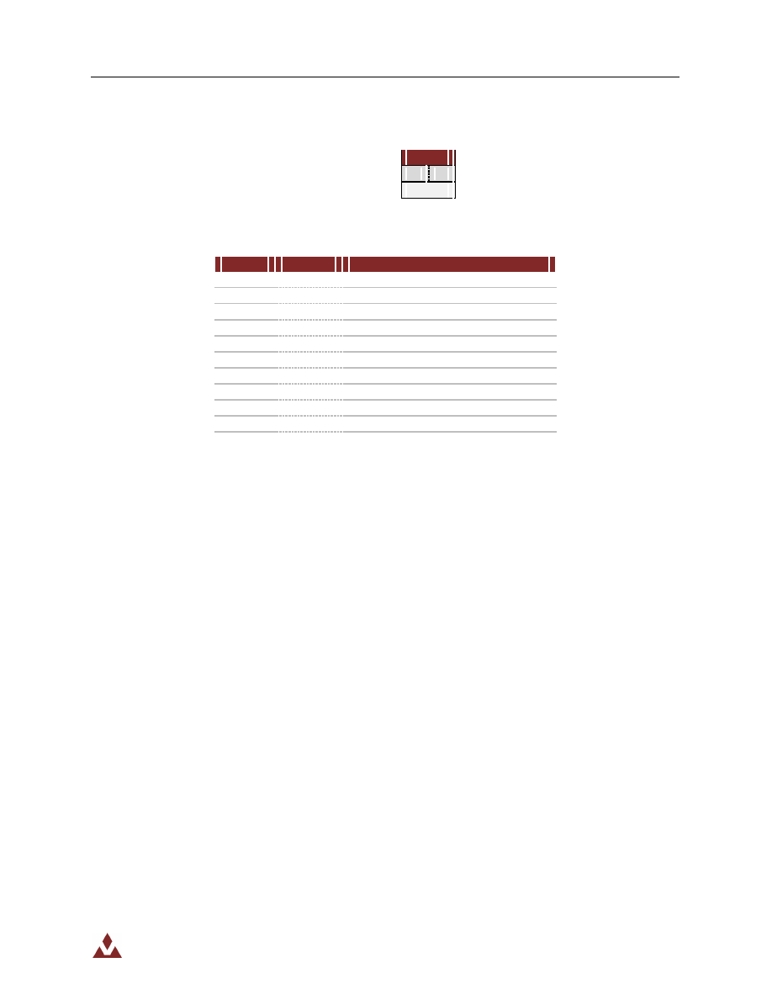{width="918"
height="1188"}

VN-200 User Manual

** **

** **

UM004

** **

 

VN-200 User Manual 

52/141 

 

**SensSat **

5.6.12

This field provides flags identifying whether
any of the measurements are currently saturated. 

**    SensSat**

** **

Byte Offset   

0 

1 

Type   

u16 

 

**Table 19 - SensSat Bit Field Description **

**Name **

**Bit Offset **

**Description **

MagX 

0 

Magnetometer X-axis is saturated. 

MagY 

1 

Magnetometer Y-axis is saturated. 

MagZ 

2 

Magnetometer Z-axis is saturated. 

AccX 

3 

Accelerometer X-axis is saturated. 

AccY 

4 

Accelerometer Y-axis is saturated. 

AccZ 

5 

Accelerometer Z-axis is saturated. 

GyroX 

6 

Gyro X-axis is saturated. 

GyroY 

7 

Gyro Y-axis is saturated. 

GyroZ 

8 

Gyro Z-axis is saturated. 

Pres 

9 

Pressure measurement is saturated. 

Reserved  10-15 

Reserved for future use. 

 

** **
:::

::: {#page53-div style="position:relative;width:918px;height:1188px;"}
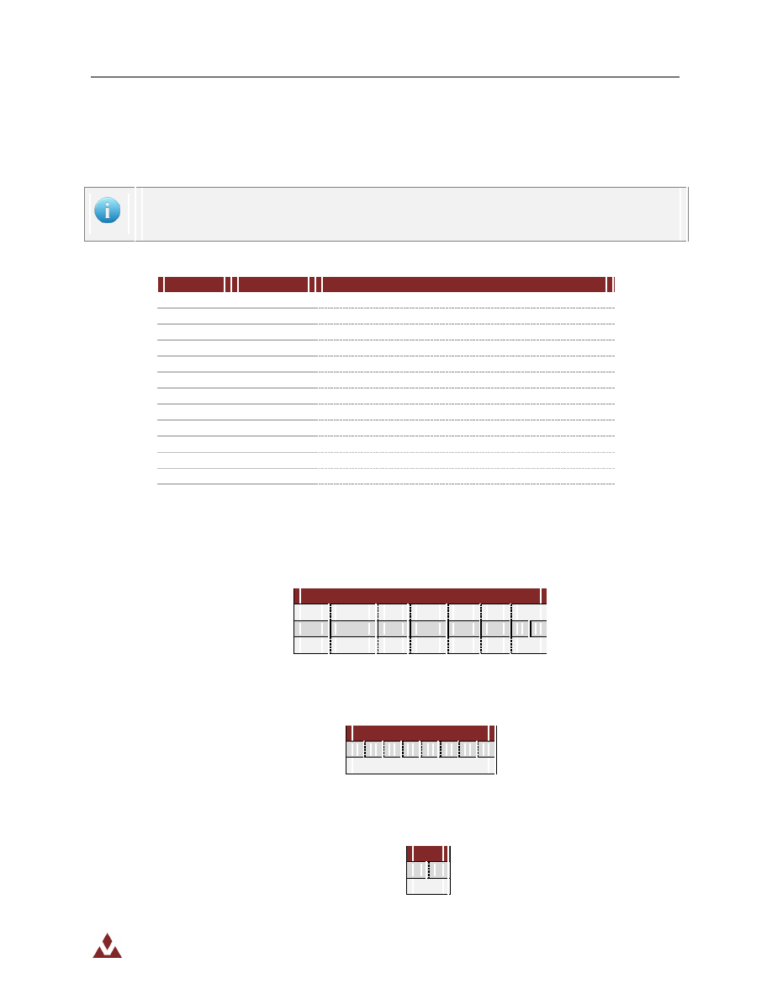{width="918"
height="1188"}

VN-200 User Manual

** **

** **

UM004

** **

 

VN-200 User Manual 

53/141 

 

**Binary Group 4 -- GPS Outputs **

5.7

Binary  group 4  provides  all  outputs  which  are  dependent  upon  the  measurements  collected  from  the \
onboard  GPS,  or  external  GPS  (if  enabled).    All  data  in  this  group  is  updated  at  the  rate  of  the  GPS \
receiver (nominally 5Hz for the internal GPS). 

 

If data is asynchronously sent from group 4 at a rate equal to the GPS update rate, then packets will be \
sent out when updated by the GPS receiver.  For all other rates, the output will be based on the divisor \
selected and the internal IMU sampling rate. 

**Table 20 - Binary Group 4 **

**Name **

**Bit Offset **

**Description **

UTC 

0 

GPS UTC Time 

Tow 

1 

GPS time of week 

Week 

2 

GPS week 

NumSats 

3 

Number of tracked satellites 

Fix 

4 

GPS fix 

PosLla 

5 

GPS position (latitude, longitude, altitude) 

PosEcef 

6 

GPS position (ECEF) 

VelNed 

7 

GPS velocity (NED) 

VelEcef 

8 

GPS velocity (ECEF) 

PosU 

9 

GPS position uncertainty (NED) 

VelU 

10 

GPS velocity uncertainty 

TimeU 

11 

GPS time uncertainty 

Resv 

12-15 

Reserved for future use. Should be set to zero. 

 

**UTC **

5.7.1

The current UTC time.  The year is given as a signed byte year offset from the year 2000.  For example \
the year 2013 would be given as year 13. 

** **

**UTC**

** **

Fields  year  month  day  hour  min  sec 

ms 

Byte Offset 

0 

1 

2 

3 

4 

5 

6 

7 

Type 

s8 

u8 

u8 

u8 

u8 

u8 

u16 

 

**Tow **

5.7.2

The GPS time of week given in nano seconds. 

** **

**Tow **

Byte Offset 

0 

1 

2 

3 

4 

5 

6 

7 

Type 

uint64 

 

**Week **

5.7.3

The current GPS week. 

**    Week**

** **

Byte Offset   

0 

1 

Type   

u16 
:::

::: {#page54-div style="position:relative;width:918px;height:1188px;"}
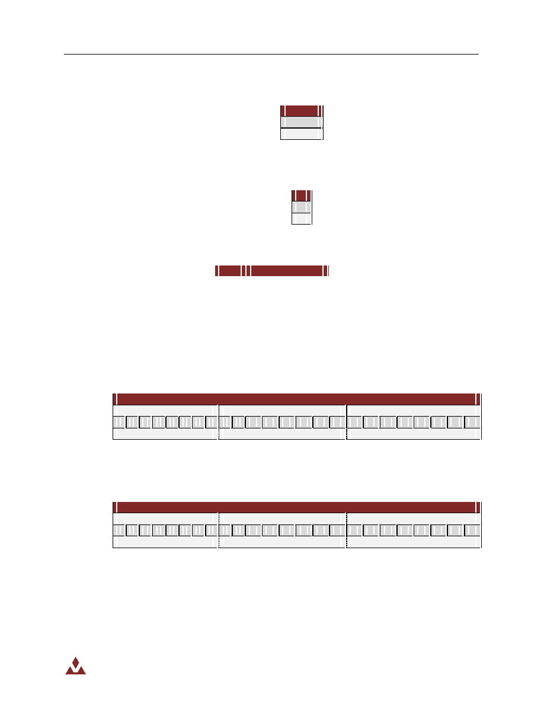{width="918"
height="1188"}

VN-200 User Manual

** **

** **

UM004

** **

 

VN-200 User Manual 

54/141 

 

**NumSats **

5.7.4

The number of tracked GPS satellites. 

**    NumSats**

** **

Byte Offset   

0 

Type   

u8 

 

**Fix **

5.7.5

The current GPS fix. 

**    Fix**

** **

Byte Offset   

0 

Type    u8 

 

**Table 21 - GPS Fix **

**Value **

**Description **

0 

No fix 

1 

Time only 

2 

2D 

3 

3D 

 

 

**PosLla **

5.7.6

The current GPS position measurement given as the geodetic latitude, longitude and altitude above the \
ellipsoid. The units are in \[deg, deg, m\] respectfully. 

** **

**PosLla **

 

latitude 

longitude 

altitude 

Byte Offset 

0 

1 

2 

3 

4 

5 

6 

7 

8 

9 

10 

11 

12 

13 

14 

15 

16 

17 

18 

19 

20 

21 

22 

23 

Type 

double 

double 

double 

 

**PosEcef **

5.7.7

The  current  GPS  position  given  in  the  Earth  centered  Earth  fixed  (ECEF)  coordinate  frame,  given  in \
meters. 

** **

**PosEcef **

 

pos\[0\] 

pos\[1\] 

pos\[2\] 

Byte Offset 

0 

1 

2 

3 

4 

5 

6 

7 

8 

9 

10 

11 

12 

13 

14 

15 

16 

17 

18 

19 

20 

21 

22 

23 

Type 

double 

double 

double 

 

 

** **
:::

::: {#page55-div style="position:relative;width:918px;height:1188px;"}
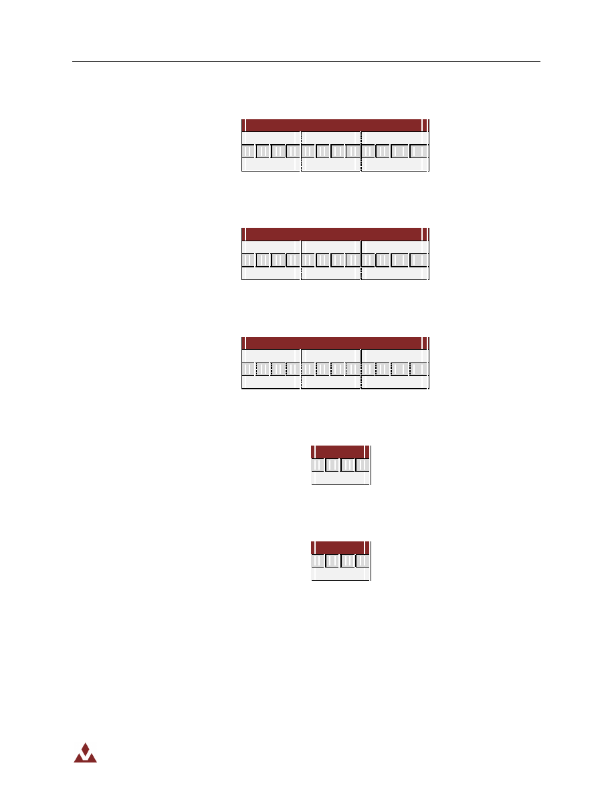{width="918"
height="1188"}

VN-200 User Manual

** **

** **

UM004

** **

 

VN-200 User Manual 

55/141 

 

**VelNed **

5.7.8

The current GPS velocity in the North
East Down (NED) coordinate frame, given in m/s. 

** **

**VelNed**

** **

 

vel\[0\] 

vel\[1\] 

vel\[2\] 

Byte Offset 

0 

1 

2 

3 

4 

5 

6 

7 

8 

9 

10 

11 

Type 

float 

float 

float 

 

**VelEcef **

5.7.9

The current GPS velocity in the Earth centered
Earth fixed (ECEF) coordinate frame, given in m/s. 

** **

**VelEcef**

** **

 

vel\[0\] 

vel\[1\] 

vel\[2\] 

Byte Offset 

0 

1 

2 

3 

4 

5 

6 

7 

8 

9 

10 

11 

Type 

float 

float 

float 

 

**PosU **

5.7.10

The current GPS position uncertainty in
the North East Down (NED) coordinate frame, given in meters. 

** **

**PosU**

** **

 

posU\[0\] 

posU\[1\] 

posU\[2\] 

Byte Offset 

0 

1 

2 

3 

4 

5 

6 

7 

8 

9 

10 

11 

Type 

float 

float 

float 

 

**VelU **

5.7.11

The current GPS velocity uncertainty, given in m/s. 

**   **

**VelU **

Byte Offset   

0 

1 

2 

3 

Type   

float 

 

**TimeU **

5.7.12

The current GPS time uncertainty, given in nano seconds. 

**   **

**TimeU **

Byte Offset   

0 

1 

2 

3 

Type   

u32 

 

 

 
:::

::: {#page56-div style="position:relative;width:918px;height:1188px;"}
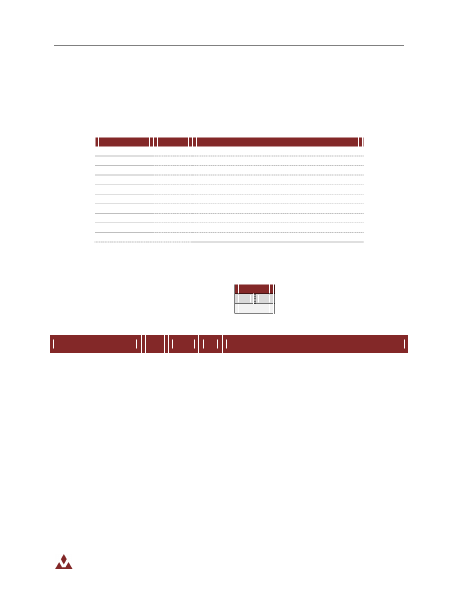{width="918"
height="1188"}

VN-200 User Manual

** **

** **

UM004

** **

 

VN-200 User Manual 

56/141 

 

**Binary Group 5 -- Attitude Outputs **

5.8

Binary  group  5  provides  all  estimated  outputs  which  are  dependent  upon  the  estimated  attitude \
solution.  The attitude will be derived from either the AHRS or the INS, depending upon which filter is \
currently  active  and  tracking.    All  of  the  fields  in  this  group  will  only  be  valid  if  the  AHRS/INS  filter  is \
currently enabled and tracking. 

**Table 22 - Binary Group 5 **

**Name **

**Bit Offset **

**Description **

VpeStatus 

0 

VPE Status 

Ypr 

1 

Yaw Pitch Roll 

Qtn 

2 

Quaternion 

DCM 

3 

Directional Cosine Matrix 

MagNed 

4 

Compensated magnetic (NED) 

AccelNed 

5 

Compensated acceleration (NED) 

LinearAccelBody  6 

Compensated linear acceleration (no gravity) 

LinearAccelNed 

7 

Compensated linear acceleration (no gravity)  (NED) 

YprU 

8 

Yaw Pitch Roll uncertainty 

Resv 

9-15 

Reserved for future use. Should be set to zero. 

 

**VpeStatus **

5.8.1

The VPE status bitfield. 

**    VpeStatus**

** **

Byte Offset   

0 

1 

Type   

u16 

**Table 23 - VpeStatus BitField **

**Name **

**Bit \
Offset **

**Format  Unit **

**Description **

AttitudeQuality 

0 

2 bits 

- 

Provides an indication of the quality of the attitude \
solution. 

GyroSaturation 

2 

1 bit 

- 

At least one gyro axis is currently saturated. 

GyroSaturationRecovery 

3 

1 bit 

- 

Filter is in the process of recovering from a gyro \
saturation event. 

MagDisturbance 

4 

2 bit 

- 

A magnetic DC disturbance has been detected. \
0 -- No magnetic disturbance \
1 to 3 -- Magnetic disturbance is present. 

MagSaturation 

6 

1 bit 

- 

At least one magnetometer axis is currently saturated. 

AccDisturbance 

7 

2 bit 

- 

A strong acceleration disturbance has been detected. \
0 -- No acceleration disturbance. \
1 to 3 -- Acceleration disturbance has been detected. 

AccSaturation 

9 

1 bit 

- 

At least one accelerometer axis is currently saturated. 

Reserved 

10 

1 bit 

- 

Reserved for internal use.  May change state at run-time. 

KnownMagDisturbance 

11 

1 bit 

- 

A known magnetic disturbance has been reported by the \
user and the magnetometer is currently tuned out. 

KnownAccelDisturbance 

12 

1 bit 

- 

A known acceleration disturbance has been reported by \
the user and the accelerometer is currently tuned out. 

Reserved 

13 

3 bits 

- 

Reserved for future use. 

 
:::

::: {#page57-div style="position:relative;width:918px;height:1188px;"}
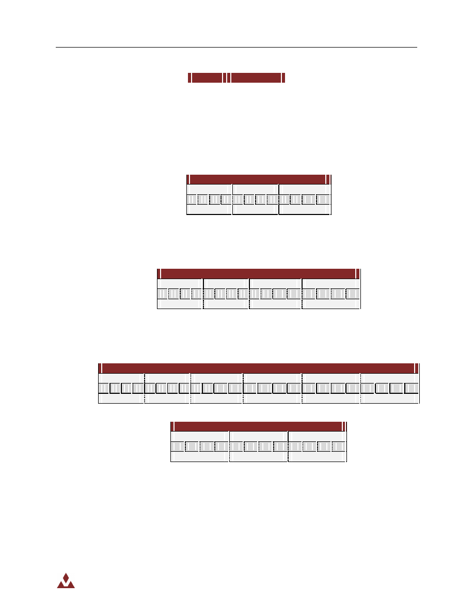{width="918"
height="1188"}

VN-200 User Manual

** **

** **

UM004

** **

 

VN-200 User Manual 

57/141 

**Table 24 - AttitudeQuality Field **

**Value **

**Description **

0 

Excellent 

1 

Good 

2 

Bad 

3 

Not tracking 

 

**YawPitchRoll **

5.8.2

The estimated attitude Yaw, Pitch, and Roll angles measured in degrees.  The attitude is given as a 3,2,1 \
Euler angle sequence describing the body frame with respect to the local
North East Down (NED) frame. 

** **

**YawPitchRoll**

** **

 

yaw 

pitch 

roll 

Byte Offset 

0 

1 

2 

3 

4 

5 

6 

7 

8 

9 

10 

11 

Type 

float 

float 

float 

 

**Quaternion **

5.8.3

The estimated attitude quaternion. The last term is the scalar value. The attitude is given as the body \
frame with respect to the local North East Down (NED) frame. 

** **

**Quaternion **

 

qtn\[0\] 

qtn\[1\] 

qtn\[2\] 

qtn\[3\] 

Byte Offset 

0 

1 

2 

3 

4 

5 

6 

7 

8 

9 

10 

11 

12 

13 

14 

15 

Type 

float 

float 

float 

float 

 

**DCM **

5.8.4

The estimated attitude directional cosine matrix given in column major order.  The DCM maps vectors \
from the North East Down (NED) frame into the body frame. 

** **

**Dcm **

Fields 

dcm\[0\] 

dcm\[1\] 

dcm\[2\] 

dcm\[3\] 

dcm\[4\] 

dcm\[5\] 

Byte Offset 

0 

1 

2 

3 

4 

5 

6 

7 

8 

9 

10 

11 

12 

13 

14 

15 

16 

17 

18 

19 

20 

21 

22 

23 

Type 

float 

float 

float 

float 

float 

float 

 

** **

**Dcm (continued) **

Fields 

dcm\[6\] 

dcm\[7\] 

dcm\[8\] 

Byte Offset 

24 

25 

26 

27 

28 

29 

30 

31 

32 

33 

34 

35 

Type 

float 

float 

float 

 

 

** **
:::

::: {#page58-div style="position:relative;width:918px;height:1188px;"}
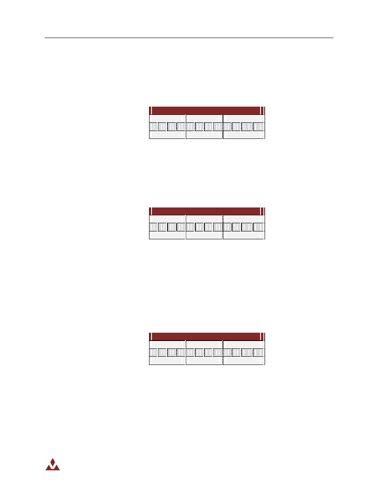{width="918"
height="1188"}

VN-200 User Manual

** **

** **

UM004

** **

 

VN-200 User Manual 

58/141 

 

**MagNed **

5.8.5

The current estimated magnetic field (Gauss), given in the North East Down (NED) frame.  The current \
attitude solution is used to map the measurement from the measured body frame to the inertial (NED) \
frame.  This  measurement  is  compensated  by  both  the  static  calibration  (individual  factory  calibration \
stored in flash), and the dynamic calibration such as the user or onboard Hard/Soft Iron compensation \
registers. 

** **

**MagNed**

** **

 

mag\[0\] 

mag\[1\] 

mag\[2\] 

Byte Offset 

0 

1 

2 

3 

4 

5 

6 

7 

8 

9 

10 

11 

Type 

float 

float 

float 

 

**AccelNed **

5.8.6

The estimated acceleration (with gravity) reported in m/s\^2, given in the North East Down (NED) frame.  \
The  acceleration  measurement  has  been  bias  compensated  by  the  onboard  INS  filter.    This \
measurement is attitude dependent, since the attitude is used to map the measurement from the body \
frame  into  the  inertial  (NED)  frame.      If  the  device  is  stationary  and  the  INS  filter  is  tracking,  the \
measurement
should be nominally equivalent to the gravity reference vector in the
inertial frame (NED). 

** **

**AccelNed**

** **

 

accel\[0\] 

accel\[1\] 

accel\[2\] 

Byte Offset 

0 

1 

2 

3 

4 

5 

6 

7 

8 

9 

10 

11 

Type 

float 

float 

float 

 

 

**LinearAccelBody **

5.8.7

The estimated linear acceleration (without gravity) reported in m/s\^2, and given in the body frame.  The \
acceleration  measurement  has  been  bias  compensated  by  the  onboard  INS  filter,  and  the  gravity \
component has been removed using the current gravity reference vector model.  This measurement is \
attitude dependent, since the attitude solution is required to map the gravity reference vector (known \
in the inertial NED frame), into the body frame so that it can be removed from the measurement.  If the \
device is stationary and the onboard INS filter is tracking, the measurement nominally will read 0 in all \
three axes. 

** **

**LinearAccelBody**

** **

 

accel\[0\] 

accel\[1\] 

accel\[2\] 

Byte Offset 

0 

1 

2 

3 

4 

5 

6 

7 

8 

9 

10 

11 

Type 

float 

float 

float 

 

 

** **
:::

::: {#page59-div style="position:relative;width:918px;height:1188px;"}
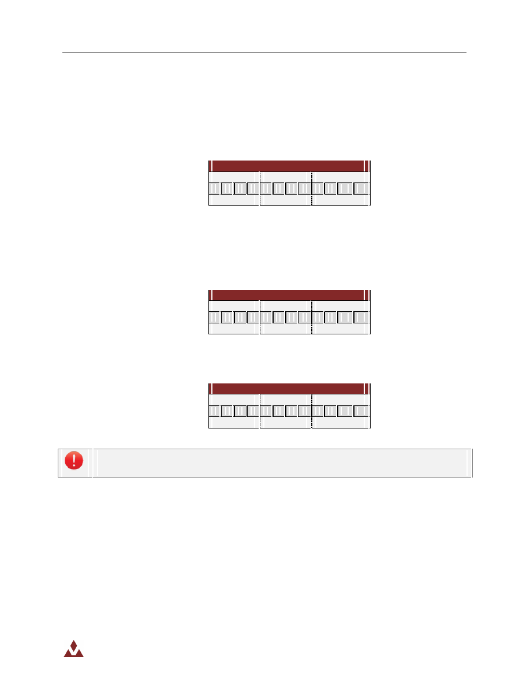{width="918"
height="1188"}

VN-200 User Manual

** **

** **

UM004

** **

 

VN-200 User Manual 

59/141 

 

**LinearAccelNed **

5.8.8

The estimated linear acceleration (without gravity) reported in m/s\^2, and given in the North East Down \
(NED)  frame.    This  measurement  is  attitude  dependent  as  the  attitude  solution  is  used  to  map  the \
measurement from the body frame into the inertial (NED) frame.  This acceleration measurement has \
been bias compensated by the onboard INS filter, and the gravity component has been removed using \
the  current gravity reference  vector estimate.  If the device is stationary  and the  onboard INS filter  is \
tracking, the measurement nominally will read 0 in all three axes. 

** **

**LinearAccelNed**

** **

 

accel\[0\] 

accel\[1\] 

accel\[2\] 

Byte Offset 

0 

1 

2 

3 

4 

5 

6 

7 

8 

9 

10 

11 

Type 

float 

float 

float 

 

**AngularRate **

5.8.9

The  estimated  angular  rotation  rate  reported  in  rad/s,  given  in  the  body  frame.    This  angular  rate \
measurement  has  been  bias  compensated  by  the  onboard  AHRS/INS  Kalman  filter.    If  the  device  is \
stationary  (not  rotating)  and  the  onboard  AHRS/INS filter  is  tracking,  the  measurement  nominally  will \
read 0 in all three axes. 

** **

**AngularRate**

** **

 

rate\[0\] 

rate\[1\] 

rate\[2\] 

Byte Offset 

0 

1 

2 

3 

4 

5 

6 

7 

8 

9 

10 

11 

Type 

float 

float 

float 

 

**YprU **

5.8.10

The estimated attitude (Yaw, Pitch,
Roll) uncertainty (1 Sigma), reported in degrees. 

** **

**YprU**

** **

 

yaw 

pitch 

roll 

Byte Offset 

0 

1 

2 

3 

4 

5 

6 

7 

8 

9 

10 

11 

Type 

float 

float 

float 

 

 

The  estimated  attitude  (YprU)  field  is  not  valid  when  the  INS  Scenario  mode  in  the  INS  Basic \
Configuration register is set to AHRS
mode.  See section[ 10.3.1 f](vn200-126.html)or more details. 

 

 
:::

::: {#page60-div style="position:relative;width:918px;height:1188px;"}
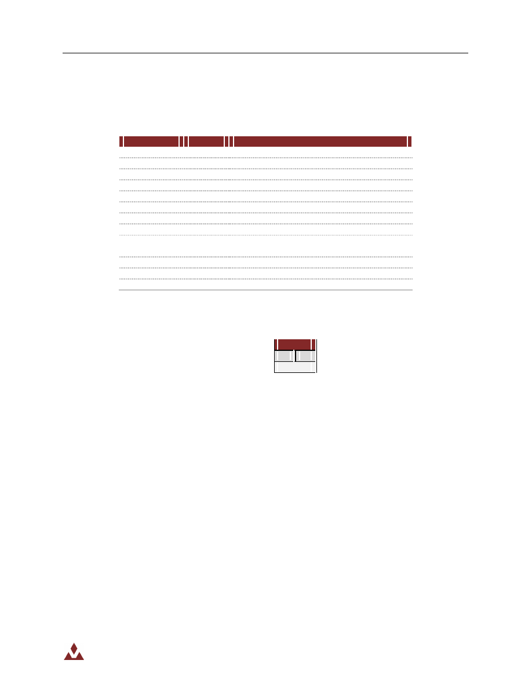{width="918"
height="1188"}

VN-200 User Manual

** **

** **

UM004

** **

 

VN-200 User Manual 

60/141 

 

**Binary Group 6 -- INS Outputs **

5.9

Binary  group  6  provides  all  estimated  outputs  which  are  dependent  upon  the  onboard  INS  state \
solution.  All of the fields in this group will only be valid if the INS
filter is currently enabled and tracking. 

**Table 25 - Binary Group 6 **

**Name **

**Bit Offset **

**Description **

InsStatus 

0 

Ins Status 

PosLla 

1 

Ins Position (latitude, longitude, altitude) 

PosEcef 

2 

Ins Position (ECEF) 

VelBody 

3 

Ins Velocity (Body) 

VelNed 

4 

Ins Velocity (NED) 

VelEcef 

5 

Ins Velocity (ECEF) 

MagEcef 

6 

Compensated magnetic (ECEF) 

AccelEcef 

7 

Compensated acceleration (ECEF) 

LinearAccelEcef  8 

Compensated linear acceleration (no gravity) \
(ECEF) 

PosU 

9 

Ins Position Uncertainty 

VelU 

10 

Ins Velocity Uncertainty 

Resv 

11-15 

Reserved for future use. Should be set to zero. 

 

**InsStatus **

5.9.1

The INS status
bitfield.  See register 63 for more information on the individual
bits in this field. 

**    InsStatus**

** **

Byte Offset   

0 

1 

Type   

u16 

 

 

 
:::

::: {#page61-div style="position:relative;width:918px;height:1188px;"}
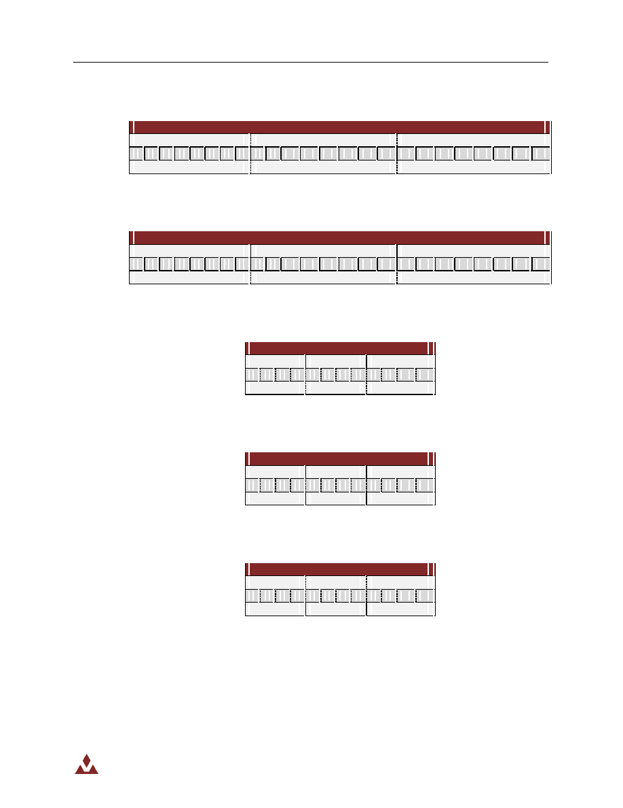{width="918"
height="1188"}

VN-200 User Manual

** **

** **

UM004

** **

 

VN-200 User Manual 

61/141 

 

**PosLla **

5.9.2

The estimated position given as latitude, longitude, and altitude given
in \[deg, deg, m\] respectfully. 

** **

**PosLla **

 

latitude 

longitude 

altitude 

Byte Offset 

0 

1 

2 

3 

4 

5 

6 

7 

8 

9 

10 

11 

12 

13 

14 

15 

16 

17 

18 

19 

20 

21 

22 

23 

Type 

double 

double 

double 

 

**PosEcef **

5.9.3

The estimate position given in the Earth centered Earth fixed (ECEF)
frame, reported in meters. 

** **

**PosEcef **

 

pos\[0\] 

pos\[1\] 

pos\[2\] 

Byte Offset 

0 

1 

2 

3 

4 

5 

6 

7 

8 

9 

10 

11 

12 

13 

14 

15 

16 

17 

18 

19 

20 

21 

22 

23 

Type 

double 

double 

double 

 

**VelBody **

5.9.4

The estimated velocity in the body frame, given in m/s. 

** **

**VelBody**

** **

 

vel\[0\] 

vel\[1\] 

vel\[2\] 

Byte Offset 

0 

1 

2 

3 

4 

5 

6 

7 

8 

9 

10 

11 

Type 

float 

float 

float 

 

**VelNed **

5.9.5

The estimated velocity in the North East Down (NED) frame, given in
m/s.   

** **

**VelNed**

** **

 

vel\[0\] 

vel\[1\] 

vel\[2\] 

Byte Offset 

0 

1 

2 

3 

4 

5 

6 

7 

8 

9 

10 

11 

Type 

float 

float 

float 

 

**VelEcef **

5.9.6

The estimated velocity in the Earth centered Earth fixed
(ECEF) frame, given in m/s.  

** **

**VelEcef**

** **

 

vel\[0\] 

vel\[1\] 

vel\[2\] 

Byte Offset 

0 

1 

2 

3 

4 

5 

6 

7 

8 

9 

10 

11 

Type 

float 

float 

float 

 

**MagEcef **

5.9.7

The  compensated  magnetic  measurement  in  the  Earth  centered  Earth  fixed  (ECEF)  frame,  given  in \
Gauss. 

 

 
:::

::: {#page62-div style="position:relative;width:918px;height:1188px;"}
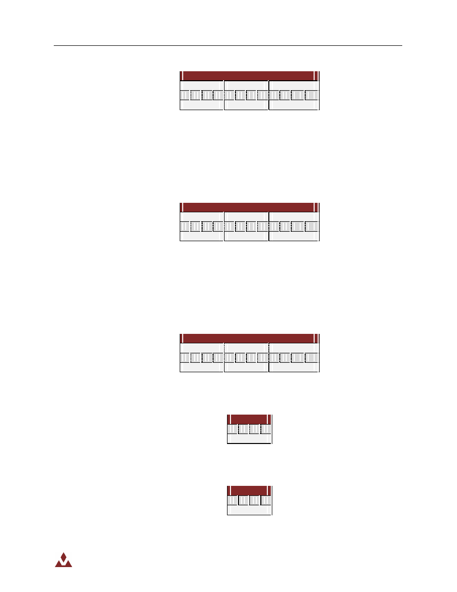{width="918"
height="1188"}

VN-200 User Manual

** **

** **

UM004

** **

 

VN-200 User Manual 

62/141 

 

** **

**MagEcef**

** **

 

mag\[0\] 

mag\[1\] 

mag\[2\] 

Byte Offset 

0 

1 

2 

3 

4 

5 

6 

7 

8 

9 

10 

11 

Type 

float 

float 

float 

 

**AccelEcef **

5.9.8

The  estimated  acceleration  (with  gravity)  reported  in  m/s\^2,  given  in  the  Earth  centered  Earth  fixed \
(ECEF)  frame.    The  acceleration  measurement  has  been  bias  compensated  by  the  onboard  INS  filter.
 \
This measurement is attitude dependent, since the attitude is used to map the measurement from the \
body frame into the inertial (ECEF) frame.   If the device is stationary and the INS filter is tracking, the \
measurement  should  be  nominally  equivalent  to  the  gravity  reference  vector  in  the  inertial  frame \
(ECEF). 

** **

**AccelEcef**

** **

 

accel\[0\] 

accel\[1\] 

accel\[2\] 

Byte Offset 

0 

1 

2 

3 

4 

5 

6 

7 

8 

9 

10 

11 

Type 

float 

float 

float 

 

**LinearAccelEcef **

5.9.9

The estimated linear acceleration (without gravity) reported in m/s\^2, and given in the Earth centered \
Earth fixed  (ECEF) frame.  This measurement is attitude  dependent  as the attitude  solution is used to \
map  the  measurement  from  the  body  frame  into  the  inertial  (ECEF)  frame.    This  acceleration \
measurement  has  been  bias  compensated  by  the  onboard  INS  filter,  and  the  gravity  component  has \
been removed using the current gravity reference vector estimate.  If the device is stationary and the \
onboard INS filter is tracking, the measurement will nominally read 0 in
all three axes. 

** **

**LinearAccelEcef**

** **

 

accel\[0\] 

accel\[1\] 

accel\[2\] 

Byte Offset 

0 

1 

2 

3 

4 

5 

6 

7 

8 

9 

10 

11 

Type 

float 

float 

float 

 

**PosU **

5.9.10

The estimated uncertainty (1 Sigma) in
the current position estimate, given in meters. 

** **

**PosU**

** **

Byte Offset 

0 

1 

2 

3 

Type 

float 

 

**VelU **

5.9.11

The estimated uncertainty (1 Sigma) in
the current velocity estimate, given in m/s. 

** **

**VelU**

** **

Byte Offset 

0 

1 

2 

3 

Type 

float 

 
:::

::: {#page63-div style="position:relative;width:918px;height:1188px;"}
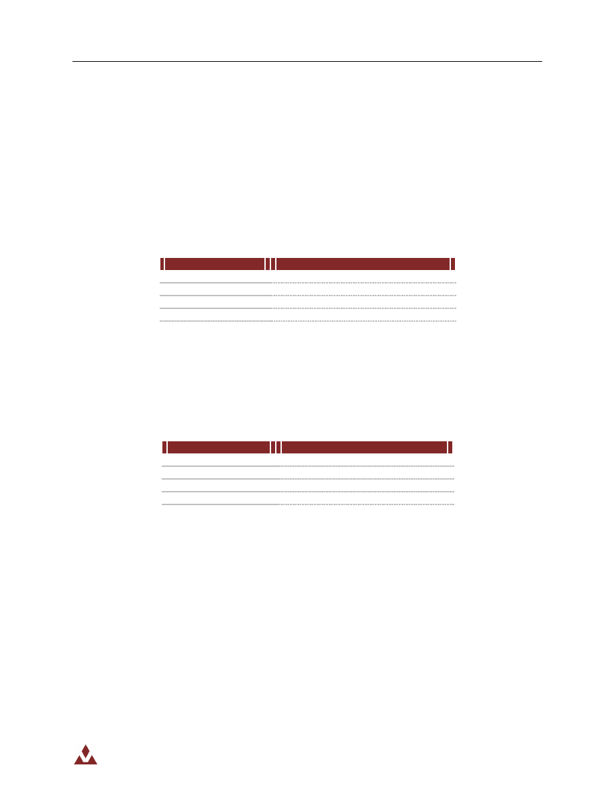{width="918"
height="1188"}

VN-200 User Manual

** **

** **

UM004

** **

 

VN-200 User Manual 

63/141 

**6**

** **

**System Module **

 

**Commands **

6.1

 

**Read Register Command **

6.1.1

This command allows the user to read any of the registers on the  VN-200 module.  The only required \
parameter is the ID of the register to be read.  The first parameter of the
response will contain the same \
register  ID  followed  by  a  variable  number  of  parameters.    The  number  of  parameters  and  their \
formatting is specific to the requested register.  Refer to the appropriate register Section contained in \
Section[ 6 ](vn200-63.html)for details on this formatting.  If an
invalid register is requested, an error code will be returned. 

**Table 26 - Example Read Register Command **

**Example Command **

**Message **

UART Command 

\$VNRRG,5\*46 

UART Response 

\$VNRRG,5,9600\*65 

SPI Command 

01 05 00 00  (shown as hex) 

SPI Response 

00 01 05 00 80 25 00 00  (shown as hex) 

 

**Write Register Command **

6.1.2

This command is used to write data values to a specified register on the VN-200 module.  The ID of the \
register  to  be  written  to  is  the  first  parameter.    This  is  followed  by  the  data  values  specific  to  that \
register.    Refer  to  the  appropriate  register  in  Section[  6  ](vn200-63.html)for  this  formatting.    If  an  invalid  register  is \
requested, an error code will be returned.  

**Table 27 - Example Write Register Command **

**Example Command **

**Message **

UART Command 

\$VNWRG,5,9600\*60 

UART Response 

\$VNWRG,5,9600\*60 

SPI Command 

02 05 00 00 80 25 00 00

  (shown as hex)

 

SPI Response 

00 02 05 00 80 25 00 00

  (shown as hex)

 

 

 

** **
:::

::: {#page64-div style="position:relative;width:918px;height:1188px;"}
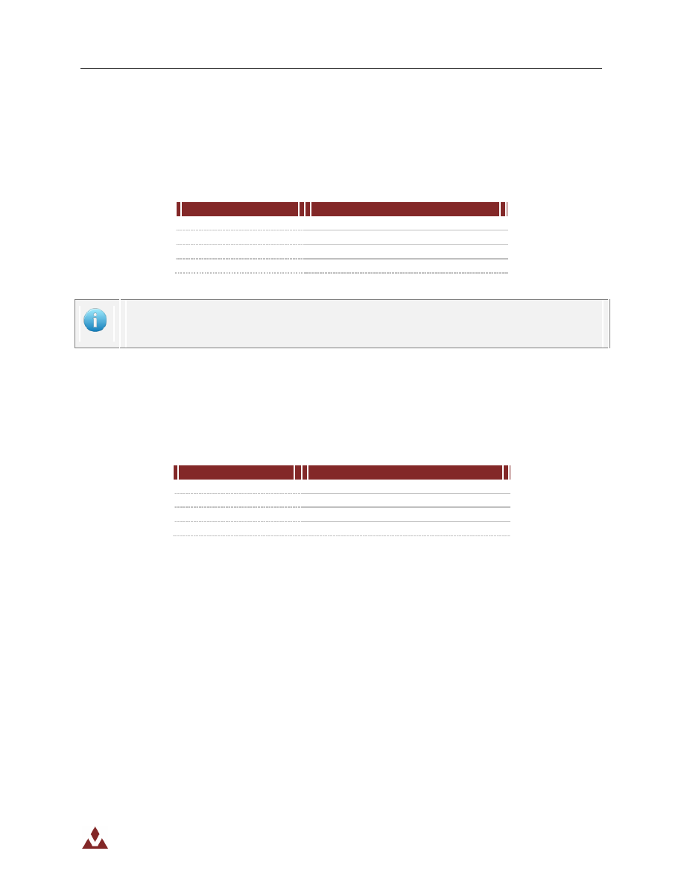{width="918"
height="1188"}

VN-200 User Manual

** **

** **

UM004

** **

 

VN-200 User Manual 

64/141 

 

**Write Settings Command **

6.1.3

This command will write the current register settings into non-volatile memory.  Once the settings are \
stored in non-volatile (Flash) memory, the VN-200 module
can be power cycled or reset, and the register \
will be reloaded from non-volatile memory.  The module can always be reset to the factory settings by \
issuing the Restore Factory Settings
command or by pulling pin 7 (Restore) high during reset. 

**Table 28 - Example Write Settings Command **

**Example Command **

**Message **

UART Command 

\$VNWNV\*57 

UART Response 

\$VNWNV\*57 

SPI Command 

03 00 00 00 (shown as hex) 

SPI Response 

00 03 00 00 (shown as hex) 

 

 

Due to limitations in the flash write speed the write settings command takes \~ 500ms to complete.  Any \
commands  that  are  sent  to  the  sensor  during  this  time  will  be  responded  to  after  the  operation  is \
complete. 

 

**Restore Factory Settings Command **

6.1.4

This  command  will  restore  the  VN-200  module's  factory  default  settings  and  will  reset  the  module.  \
There are no parameters for this command.  The module will respond to this command before restoring \
the factory settings. 

**Table 29 - Example Restore Factory Settings Command **

**Example Command **

**Message **

UART Command 

\$VNRFS\*5F 

UART Response 

\$VNRFS\*5F 

SPI Command 

04 00 00 00 (shown as hex) 

SPI Response 

00 04 00 00 (shown as hex) 

 

 

** **
:::

::: {#page65-div style="position:relative;width:918px;height:1188px;"}
{width="918"
height="1188"}

VN-200 User Manual

** **

** **

UM004

** **

 

VN-200 User Manual 

65/141 

 

**Reset Command **

6.1.5

This command will reset the module.  There are no parameters required for this
command.  The module \
will  first  respond  to  the  command  and  will  then  perform  a  reset.    Upon  a  reset  all  registers  will  be \
reloaded with the values saved in non-volatile memory.  If no values are stored in non-volatile memory, \
the device will default to factory settings.  Also upon reset the VN-200 will re-initialize its Kalman filter, \
thus  the  filter  will take  a  few  seconds  to  completely  converge on  the  correct  attitude  and  correct  for \
gyro bias.  This command is equivalent in functionality to the hardware reset performed by pulling pin \
21 (NRST) low. 

**Table 30 - Example Reset Command **

**Example Command **

**Message **

UART Command 

\$VNRST\*4D 

UART Response 

\$VNRST\*4D 

SPI Command 

06 00 00 00 (shown as hex) 

SPI Response 

00 06 00 00 (shown as hex) 

 

**Firmware Update Command **

6.1.6

This command is used to enter the boot loader for performing firmware updates.  Upon receiving this \
command  on  serial  port  1,  the  VN-200  will  enter  into  firmware  reprogramming  mode.    The  easiest \
method  of  updating  firmware  is  to  use  one  of  the  VectorNav  Firmware  Update  Tools.    If  you  wish \
however  to  incorporate  the  ability  to  update  the  firmware  into  your  own  system,  the  protocol  and \
procedure  for  updating  the  firmware  is  outlined  in  the 

**AN013  Firmware  Update  Protocol**

  application 

note. 

**Table 31 - Example Firmware Update Command **

Example Command 

Message 

UART Command 

\$VNFWU\*XX 

UART Response 

\$VNFWU\*XX 

 

 

Firmware updates are only supported on serial port 1 (pin 12 & 13).  If you plan on using either serial \
port 2 or SPI as your primary means of communicating with the sensor, it is recommended that you also \
provide support in your design to communicate with the sensor using serial port 1 to facilitate firmware \
updates. 

 

**Serial Command Prompt Command **

6.1.7

This command allows you to enter into the command prompt mode on either
serial port.  The command \
mode supports a wide range of diagnostics and configuration options that go beyond the abilities of the \
normal read/write configuration register interface. 

**Table 32 - Example Command Prompt Command **

Example Command 

Message 

UART Command 

\$VNCMD\*XX 

UART Response 

\$VNCMD\*XX 

 
:::

::: {#page66-div style="position:relative;width:918px;height:1188px;"}
{width="918"
height="1188"}

VN-200 User Manual

** **

** **

UM004

** **

 

VN-200 User Manual 

66/141 

 

**Asynchronous Output Pause Command **

6.1.8

This command allows the user to temporarily pause the asynchronous outputs on the given serial port.  \
When  paused  both  the  ASCII  and  the  3  binary  asynchronous  output  messages  will  temporarily  stop \
outputting  from  the  device  on  the  serial  port  for  which  this  command  is  received.    The  state  of  the \
asynchronous  output  register and the binary  output  configuration registers will not  be  changed when \
the  asynchronous outputs are paused.  This command is useful when you want to send configuration \
commands to the  VN-200, but  do not want to deal with the additional overhead of having to parse a \
constant stream of asynchronous output messages while waiting for the response to your configuration \
commands.    It  is  also  useful  when you  want  to type  commands to  the  device from  a  serial  command \
prompt.  The below example commands
demonstrate how to pause and resume asynchronous outputs. 

**Table 33 - Example Asynchronous Pause/Resume Commands **

Example Command 

Message 

Pause Async Outputs 

\$VNASY,0\*XX 

Resume Async Outputs 

\$VNASY,1\*XX 

 

 

** **
:::

::: {#page67-div style="position:relative;width:918px;height:1188px;"}
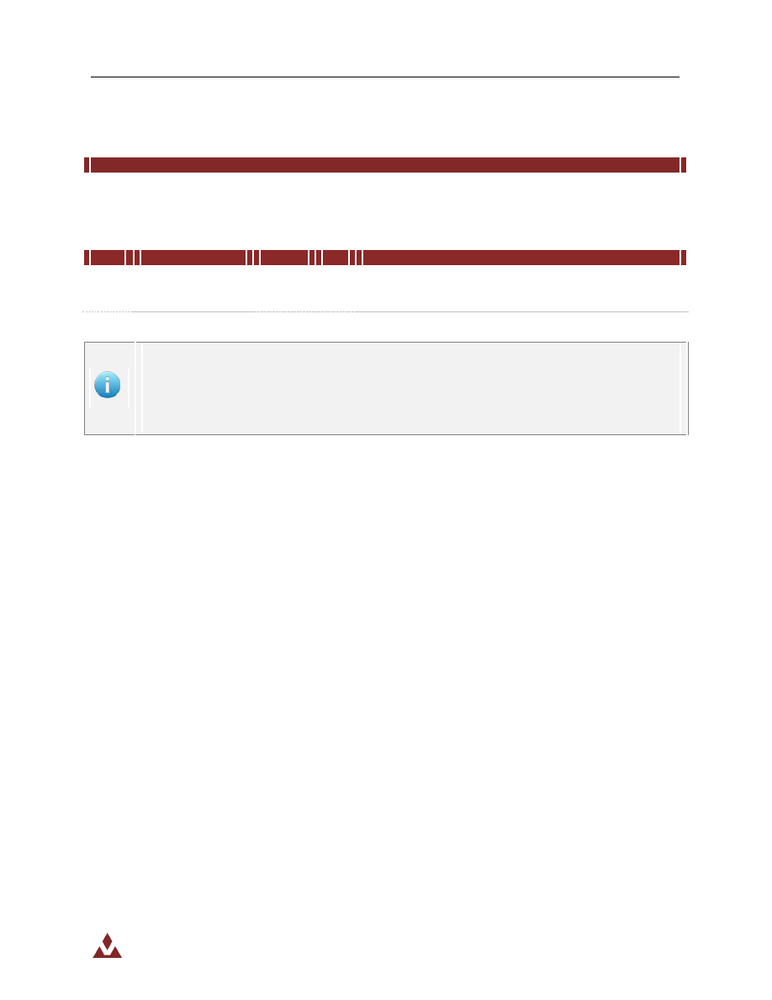{width="918"
height="1188"}

VN-200 User Manual

** **

** **

UM004

** **

 

VN-200 User Manual 

67/141 

 

**Configuration Registers **

6.2

 

**User Tag Register **

6.2.1

**User Tag**

** **

**Register ID : **

0 

**Firmware : **

1.0.0.0 

**Access : **

Read / Write 

**Comment : **

User assigned tag register.  Any values can be assigned to this register.  They will \
be stored to flash upon issuing a write settings command. 

**Size (Bytes): **

20 

**Example Response: **

\$VNRRG,00,SENSOR_A14\*52 

**Offset **

**Name **

**Format **

**Unit **

**Description **

0 

Tag 

char 

- 

User defined tag register.  Up to 20 bytes or characters.  If a \
string with more than 20 characters is given, then the string \
will be truncated to the first 20. 

 

 

 

Only printable ASCII characters are allowed for the user tag register. 

Allowable  characters  include  any  character  in  the  hexadecimal  range  of  0x20  to  0x7E,  excluding  0x24 \
('\$'), 0x2C (','), and 0x2A ('\*').  The use any other character will result in an invalid parameter error code \
returned.    This  restriction  is  required  to  ensure  that  the  value  set  in  the  user  tag  register  remains \
accessible using both the SPI and serial ASCII protocols. 

 

** **
:::

::: {#page68-div style="position:relative;width:918px;height:1188px;"}
{width="918"
height="1188"}

VN-200 User Manual

** **

** **

UM004

** **

 

VN-200 User Manual 

68/141 

 

**Model Number Register **

6.2.2

**Model Number**

** **

**Register ID : **

1 

**Firmware : **

1.0.0.0 

**Access : **

Read Only 

**Comment : **

Model Number 

**Size (Bytes): **

24 

**Example Response: **

\$VNRRG,01,VN-200T-DEV\*74 

**Offset **

**Name **

**Format **

**Unit **

**Description **

0 

Product \
Name 

char 

- 

Product name. Max 24 characters. 

 

 

** **
:::

::: {#page69-div style="position:relative;width:918px;height:1188px;"}
{width="918"
height="1188"}

VN-200 User Manual

** **

** **

UM004

** **

 

VN-200 User Manual 

69/141 

 

**Hardware Revision Register **

6.2.3

**Hardware Revision Register**

** **

**Register ID : **

2 

**Firmware : **

1.0.0.0 

**Access : **

Read Only 

**Comment : **

Hardware revision. 

**Size (Bytes): **

4 

**Example Response: **

\$VNRRG,02,1\*6C 

**Offset **

**Name **

**Format **

**Unit **

**Description **

0 

Revision 

uint32 

- 

Hardware revision. 

 

 

** **
:::

::: {#page70-div style="position:relative;width:918px;height:1188px;"}
{width="918"
height="1188"}

VN-200 User Manual

** **

** **

UM004

** **

 

VN-200 User Manual 

70/141 

 

**Serial Number Register **

6.2.4

**Serial Number**

** **

**Register ID : **

3 

**Firmware : **

1.0.0.0 

**Access : **

Read Only 

**Comment : **

Serial Number 

**Size (Bytes): **

4 

**Example Response: **

\$VNRRG,03,0100011981\*5D 

**Offset **

**Name **

**Format **

**Unit **

**Description **

0 

SerialNum 

uint32 

- 

Serial Number (32-bit unsigned integer) 

 

 

 
:::

::: {#page71-div style="position:relative;width:918px;height:1188px;"}
{width="918"
height="1188"}

VN-200 User Manual

** **

** **

UM004

** **

 

VN-200 User Manual 

71/141 

 

**Firmware Version Register **

6.2.5

**Firmware Version Register**

** **

**Register ID : **

4 

**Firmware : **

1.0.0.0 

**Access : **

Read Only 

**Comment : **

Firmware version. 

**Size (Bytes): **

4 

**Example Response: **

\$VNRRG,04,0.1.7.0\*73 

**Offset **

**Name **

**Format **

**Unit **

**Description **

0 

Major \
Version 

uint8 

- 

Major release version of firmware. 

1 

Minor \
Version 

uint8 

- 

Minor release version of firmware 

2 

Feature \
Version 

uint8 

- 

Feature release version of the firmware. 

3 

HotFix 

uint8 

- 

Hot fix number. Numbers above 100 are reserved for custom \
firmware versions. 

 

 

** **
:::

::: {#page72-div style="position:relative;width:918px;height:1188px;"}
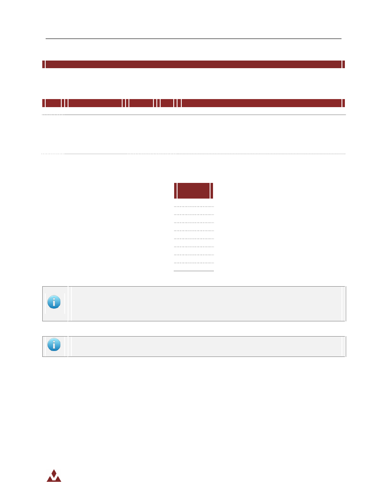{width="918"
height="1188"}

VN-200 User Manual

** **

** **

UM004

** **

 

VN-200 User Manual 

72/141 

 

**Serial Baud Rate Register **

6.2.6

**Serial Baud Rate**

** **

**Register ID : **

5 

**Firmware : **

1.0.0.0 

**Access : **

Read / Write 

**Comment : **

Serial baud rate. 

**Size (Bytes): **

4 

**Example Command: **

\$VNWRG,05,115200\*58 

**Offset  Name **

**Format **

**Unit **

**Description **

0 

Baud Rate 

uint32 

- 

Serial baud rate. 

4 

Serial Port 

uint8 

- 

Optional. The serial port to change the baud rate on. \
If this parameter is not provided then the baud rate will be \
changed for the active serial port. \
1 -- Serial Port 1 \
2 -- Serial Port 2 

 

**Table 34 -- Baud Rate Settings **

**Acceptable \
Baud Rates**

 

9600 \
19200 \
38400 \
57600 \
115200 \
128000 \
230400 \
460800 \
921600 

 

 

The serial port parameter in this register is optional.  If it is not provided, the baud rate will be changed \
on  the  active  serial  port.    The  response  to  this  register  will  include  the  serial  port  parameter  if  the \
optional  parameter  is  provided.    If  the  second  parameter  is  not  provided  then  the  response  will  not \
include this parameter. 

 

 

Upon  receiving  a  baud  rate  change  request,  the  VN-200  will  send  the  response  prior  to  changing  the \
baud rate. 

 

 

** **
:::

::: {#page73-div style="position:relative;width:918px;height:1188px;"}
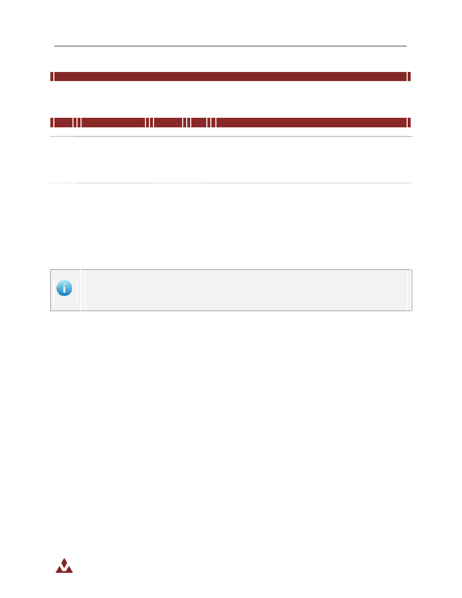{width="918"
height="1188"}

VN-200 User Manual

** **

** **

UM004

** **

 

VN-200 User Manual 

73/141 

 

**Async Data Output Type Register **

6.2.7

**Asynchronous Data Output Type**

** **

**Register ID : **

6 

**Firmware : **

1.0.0.0 

**Access : **

Read / Write 

**Comment : **

Asynchronous data output type. 

**Size (Bytes): **

4 

**Example Command: **

\$VNWRG,06,0\*6C 

**Offset  Name **

**Format **

**Unit **

**Description **

0 

ADOR 

uint32 

- 

Output register. 

4 

Serial Port 

uint8 

- 

Optional. The serial port to change the asynchronous data \
type on. If this parameter is not provided then the ADOR will \
be changed for the active serial port. \
1 -- Serial Port 1 \
2 -- Serial Port 2 

 

This register controls the type of data that will be asynchronously outputted by the module.  With this \
register, the user can specify which data register will be automatically outputted when it gets updated \
with a new reading. [ Table 35 ](vn200-74.html)below lists which registers can be set to asynchronously output, the value \
to  specify  which  register  to  output,  and  the  header  of  the  asynchronous  data  packet.    Asynchronous \
data output can be disabled by setting this register to zero.  The asynchronous data output will be sent \
out automatically at a frequency specified
by the Async Data Output Frequency Register (Section[ 0).](vn200-74.html) 

 

The serial port parameter in this register is optional.  If it is not provided, the ADOF will be changed on \
the active serial port.  The response to this register will include the serial port parameter if the optional \
parameter  is  provided.    If  the  second  parameter  is  not  provided,  the  response  will  not  include  this \
parameter. 

 
:::

::: {#page74-div style="position:relative;width:918px;height:1188px;"}
{width="918"
height="1188"}

VN-200 User Manual

** **

** **

UM004

** **

 

VN-200 User Manual 

74/141 

**Table 35 -- Asynchronous Solution Output Settings **

Setting 

Asynchronous Solution Output Type 

Header 

Formatting Section 

0 

Asynchronous output turned off 

N/A 

 

1 

Yaw, Pitch, Roll 

VNYPR 

 

2 

Quaternion 

VNQTN 

 

8 

Quaternion, Magnetic, Acceleration and Angular \
Rates 

VNQMR 

 

10 

Magnetic Measurements 

VNMAG 

 

11 

Acceleration Measurements 

VNACC 

 

12 

Angular Rate Measurements 

VNGYR 

 

13 

Magnetic, Acceleration, and Angular Rate \
Measurements 

VNMAR 

 

14 

Yaw, Pitch, Roll, Magnetic, Acceleration, and Angular \
Rate Measurements 

VNYMR 

 

16 

Yaw, Pitch, Roll, Body True Acceleration, and Angular \
Rates 

VNYBA 

 

17 

Yaw, Pitch, Roll, Inertial True Acceleration, and \
Angular Rates 

VNYIA 

 

19 

IMU Measurements 

VNIMU 

 

20 

GPS LLA 

VNGPS 

 

21 

GPS ECEF 

VNGPE 

 

22 

INS LLA 

VNINS 

 

23 

INS ECEF 

VNINE 

 

28 

INS LLA 2 

VNISL 

 

29 

INS ECEF 2 

VNISE 

 

30 

Delta theta and delta velocity 

VNDTV 

 

 

 

** **
:::

::: {#page75-div style="position:relative;width:918px;height:1188px;"}
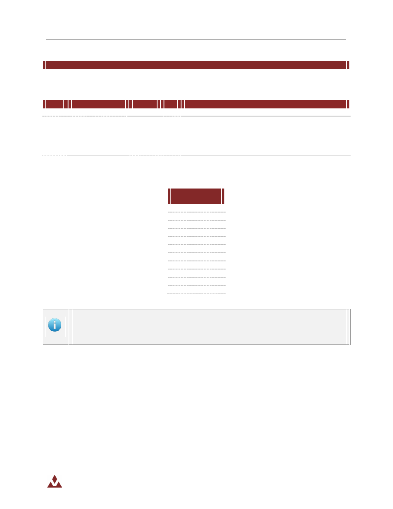{width="918"
height="1188"}

VN-200 User Manual

** **

** **

UM004

** **

 

VN-200 User Manual 

75/141 

 

**Async Data Output Frequency Register **

6.2.8

**Asynchronous Data Output Frequency**

** **

**Register ID : **

7 

**Firmware : **

1.0.0.0 

**Access : **

Read / Write 

**Comment : **

Asynchronous data output frequency. 

**Size (Bytes): **

4 

**Example Command: **

\$VNWRG,07,40\*59 

**Offset **

**Name **

**Format **

**Unit **

**Description **

0 

ADOF 

uint32 

Hz 

Output frequency. 

4 

Serial Port 

uint8 

- 

Optional. The serial port to change the asynchronous data \
type frequency on. If this parameter is not provided then the \
ADOF will be changed for the active serial port. \
1 -- Serial Port 1 \
2 -- Serial Port 2 

** **

**Table 36 - ADOR Data Rates **

**Acceptable \
Data Rates (Hz)**

 

1 \
2 \
4 \
5 

10 \
20 \
25 \
40 \
50 

100 \
200 

 

* *

 

The serial port parameter in this register is optional.  If it is not provided, the ADOF will be changed on \
the active serial port.  The response to this register will include the serial port parameter if the optional \
parameter  is  provided.    If  the  second  parameter  is  not  provided,  the  response  will  not  include  this \
parameter. 

 

** **
:::

::: {#page76-div style="position:relative;width:918px;height:1188px;"}
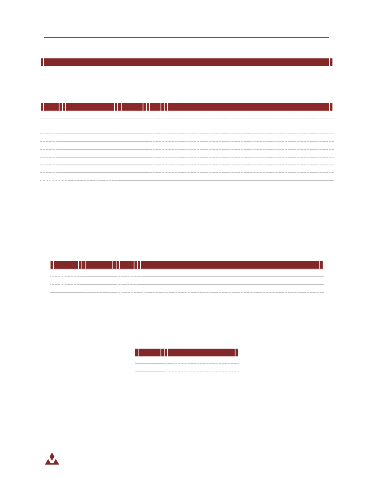{width="918"
height="1188"}

VN-200 User Manual

** **

** **

UM004

** **

 

VN-200 User Manual 

76/141 

 

**Synchronization Control **

6.2.9

**Synchronization Control**

** **

**Register ID : **

32 

**Firmware : **

v1.0.0.0 

**Access : **

Read / Write 

**Comment : **

Contains parameters which allow the timing of the VN-200 to be synchronized with \
external devices.   

**Size (Bytes): **

20 

**Example Response: **

\$VNRRG,32,3,0,0,0,6,1,0,100000000,0\*6B 

**Offset  Name **

**Format **

**Unit  Description **

0 

SyncInMode 

uint8 

- 

Input signal synchronization mode 

1 

SyncInEdge 

uint8 

- 

Input signal synchronization edge selection 

2 

SyncInSkipFactor 

uint16 

- 

Input signal trigger skip factor 

4 

RESERVED 

uint32 

- 

Reserved for future use.  Defaults to 0. 

8 

SyncOutMode 

uint8 

- 

Output synchronization signal mode 

9 

SyncOutPolarity 

uint8 

- 

Output synchronization signal polarity 

10 

SyncOutSkipFactor 

uint16 

- 

Output synchronization signal skip factor 

12 

SyncOutPulseWidth  uint32 

ns 

Output synchronization signal pulse width 

16 

RESERVED 

uint32 

- 

Reserved for future use.  Defaults to 0. 

**SyncInMode **

The SyncInMode register controls the behavior of the SyncIn event.  If the mode is set to COUNT then \
the internal clock will be used to control the IMU sampling.  If SyncInMode is set to IMU then the IMU \
sampling  loop  will  run  on  a  SyncIn  event.    The  relationship  between  the  SyncIn  event  and  a  SyncIn \
trigger is defined by the SyncInEdge and SyncInSkipFactor parameters.  If set to ASYNC then the VN-200 \
will output asynchronous serial messages upon each trigger event. 

**Table 37 -- SyncIn Mode **

**Mode **

**Pin **

**Value  Description **

COUNT 

SYNC_IN 

3 

Count number of trigger events on SYNC_IN (pin 22). 

IMU 

SYNC_IN 

4 

Start IMU sampling on trigger of SYNC_IN (pin 22). 

ASYNC 

SYNC_IN 

5 

Output asynchronous message on trigger of SYNC_IN (pin 22). 

**SyncInEdge **

The  SyncInEdge  register  controls  the  type  of  edge  the  signal  is  set  to  trigger  on.    The  factory  default \
state is to trigger on a rising edge. 

**Table 38 -- SyncInEdge Mode **

**Value **

**Description **

0 

Trigger on rising edge 

1 

Trigger on falling edge 

** **

 

** **
:::

::: {#page77-div style="position:relative;width:918px;height:1188px;"}
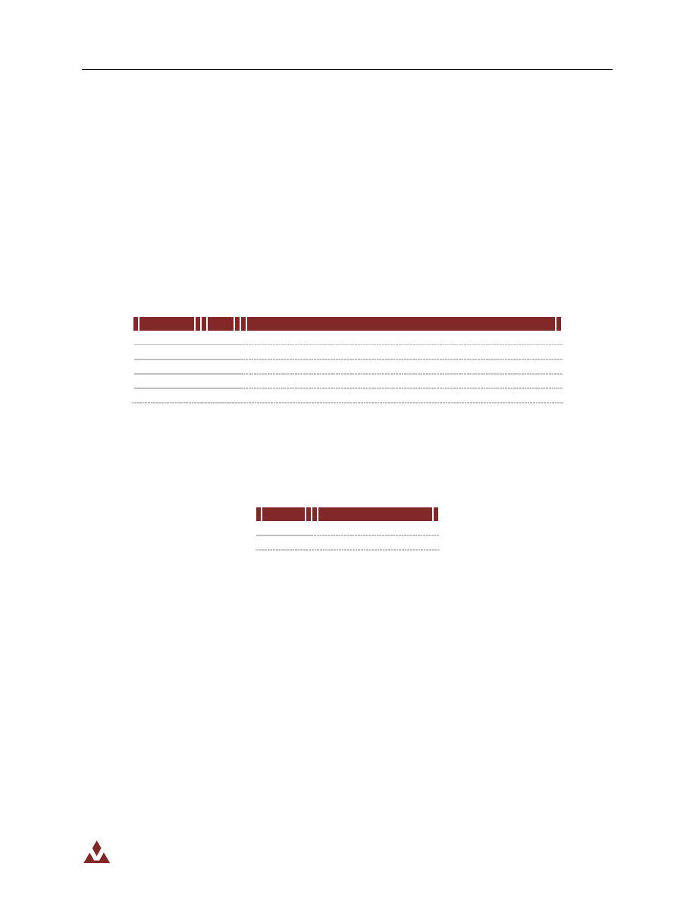{width="918"
height="1188"}

VN-200 User Manual

** **

** **

UM004

** **

 

VN-200 User Manual 

77/141 

**SyncInSkipFactor **

The SyncInSkipFactor defines how many times trigger edges defined by SyncInEdge should occur prior
to \
triggering a SyncIn event.  The action performed on a SyncIn event is determined by the SyncIn mode.  \
As an example if the SyncInSkipFactor was set to 4 and a 1 kHz signal was attached  to the SyncIn pin, \
then the SyncIn event would only occur at 200 Hz.

 

**SyncOutMode **

The  SyncOutMode  register  controls  the  behavior  of  the  SyncOut  pin.  If  this  is  set  to  IMU  then  the \
SyncOut  will  start  the  pulse  when  the  internal  IMU  sample  loop  starts.  This  mode  is  used  to  make  a \
sensor the
Master in a multi-sensor network array.  If this is set to IMU_READY mode then the pulse will \
start  when  IMU  measurements  become  available.    If  this  is  set  to  INS  mode  then  the  pulse  will  start \
when attitude measurements are made available.  Changes to this
register take effect immediately. 

**Table 39 -- SyncOutMode **

**Mode **

**Value  Description **

NONE 

0 

None 

IMU_START 

1 

Trigger at start of IMU sampling 

IMU_READY  2 

Trigger when IMU measurements are available 

INS 

3 

Trigger when attitude measurements are available 

GPS_PPS 

6 

Trigger on a GPS PPS event (1 Hz) when a 3D fix is valid. 

**SyncOutPolarity **

The SyncOutPolarity register controls the polarity of the output pulse on the SyncOut pin.  Changes to \
this register take effect immediately. 

**Table 40 -- SyncOutPolarity **

**Value **

**Description **

0 

Negative Pulse 

1 

Positive Pulse 

**SyncOutSkipFactor **

The SyncOutSkipFactor defines  how many times the sync  out  event should be skipped before  actually \
triggering the SyncOut pin. 

**SyncOutPulseWidth **

The  SyncOutPulseWidth  field  controls  the  desired  width  of  the  SyncOut  pulse.    The  default  value  is \
100,000,000 (100 ms). 

 

** **
:::

::: {#page78-div style="position:relative;width:918px;height:1188px;"}
{width="918"
height="1188"}

VN-200 User Manual

** **

** **

UM004

** **

 

VN-200 User Manual 

78/141 

 

**Communication Protocol Control **

6.2.10

**Communication Protocol Control**

** **

**Register ID : **

30 

**Firmware : **

1.0.0.0 

**Access : **

Read / \
Write 

**Comment : **

Contains parameters that controls the communication protocol used by the VN-200. 

**Size (Bytes): **

7 

**Example Response: **

\$VNRRG,30,0,0,0,0,1,0,1\*6C 

**Offset  Name **

**Format **

**Unit **

**Description **

0 

SerialCount 

uint8 

- 

Provides the ability to append a counter or time to the end of \
the serial asynchronous messages. 

1 

SerialStatus 

uint8 

- 

Provides the ability to append the status to the end of the \
serial asynchronous messages. 

2 

SPICount 

uint8 

- 

Provides the ability to append a counter to the end of the SPI \
packets. 

3 

SPIStatus 

uint8 

- 

Provides the ability to append the status to the end of the SPI \
packets. 

4 

SerialChecksum 

uint8 

- 

Choose the type of checksum used for serial communications. 

5 

SPIChecksum 

uint8 

- 

Choose the type of checksum used for the SPI \
communications. 

6 

ErrorMode 

uint8 

- 

Choose the action taken when errors are generated. 

 

 

** **
:::

::: {#page79-div style="position:relative;width:918px;height:1188px;"}
{width="918"
height="1188"}

VN-200 User Manual

** **

** **

UM004

** **

 

VN-200 User Manual 

79/141 

**Serial Count **

The SerialCount field provides a means of appending a time or counter to the end of all asynchronous \
communication  messages  transmitted  on  the  serial  interface.    The  values  for  each  of  these  counters \
come directly from the Synchronization Status Register (Register 33). 

With  the  SerialCount  field  set  to  OFF  a  typical  serial  asynchronous  message  would  appear  as  the \
following: 

\$VNYPR,+010.071,+000.278,-002.026\*60 

With  the  SerialCount  field  set  to  one  of  the  non-zero  values  the  same  asynchronous  message  would \
appear instead as: 

 

\$VNYPR,+010.071,+000.278,-002.026,T1162704\*2F 

When the SerialCount field is enabled the counter will always be appended to the end of the message \
just prior to the checksum.  The counter will be preceded by the T character to distinguish it from the \
status field. 

**Table 41 -- SerialCount Field **

**Mode **

**Value  Description **

NONE 

0 

OFF 

SYNCIN_COUNT 

1 

SyncIn Counter 

SYNCIN_TIME 

2 

SyncIn Time 

SYNCOUT_COUNT  3 

SyncOut Counter 

GPS_PPS 

4 

Gps Pps Time 

**SerialStatus **

The SerialStatus field provides a means of tracking real-time status information pertaining to the overall \
state  of the  sensor measurements and onboard filtering algorithm.  As with the SerialCount,  a typical \
serial asynchronous message would appear as the following: 

\$VNYPR,+010.071,+000.278,-002.026\*60 

With  the  SerialStatus  field  set  to  one  of  the  non-zero  values,  the  same  asynchronous message  would \
appear instead as: 

 

\$VNYPR,+010.071,+000.278,-002.026,S0000\*1F 

When the SerialStatus field is enabled the status
will always be appended to the end of the message just \
prior to the checksum. If both the SerialCount and SerialStatus are enabled then the SerialStatus will be \
displayed first. The counter will be preceded by the S character to distinguish it from the counter field.  \
The status consists of 4 hexadecimal characters. 

**Table 42 -- SerialStatus **

**Value  Description **

0 

OFF 

1 

VPE Status 

2 

INS Status 
:::

::: {#page80-div style="position:relative;width:918px;height:1188px;"}
{width="918"
height="1188"}

VN-200 User Manual

** **

** **

UM004

** **

 

VN-200 User Manual 

80/141 

**SPICount **

The SPICount field provides a means of appending a time or counter to the end of all SPI packets.  The \
values for each of these counters
come directly from the Synchronization Status Register. 

**Table 43 -- SPICount Field **

**Mode **

**Value  Description **

NONE 

0 

OFF 

SYNCIN_COUNT 

1 

SyncIn Counter 

SYNCIN_TIME 

2 

SyncIn Time 

SYNCOUT_COUNT  3 

SyncOut Counter 

GPS_PPS 

4 

Gps Pps Time 

**SPIStatus **

The AsyncStatus field provides a means of tracking real-time status information pertaining to the overall \
state  of  the  sensor  measurements  and  onboard  filtering  algorithm.    This  information  is  very  useful  in \
situations where action must be taken when certain crucial events happen such as the detection of gyro \
saturation or magnetic interference.  

**Table 44 -- SPIStatus **

**Value  Description **

0 

OFF 

1 

VPE Status 

2 

INS Status 

**SerialChecksum **

This field controls the type of checksum used for the serial communications.  Normally the VN-200 uses \
an  8-bit  checksum  identical  to  the  type  used  for  normal  GPS  NMEA  packets.    This  form  of  checksum \
however offers only a limited means of error checking.  As an alternative a full 16-bit CRC (CRC16-CCITT \
with polynomial = 0x07) is also offered.  The 2-byte CRC
value is printed using 4 hexadecimal digits. 

**Table 45 -- SerialChecksum **

**Value  Description **

1 

8-Bit Checksum 

3 

16-Bit CRC 

**SPIChecksum **

This field controls the type of checksum used for the SPI
communications.  The checksum is appended to \
the  end  of  the  binary  data  packet.    The  16-bit  CRC  is  identical  to  the  one  described  above  for  the \
SerialChecksum. 

**Table 46 -- SPIChecksum **

**Value  Description **

0 

OFF 

1 

8-Bit Checksum 

3 

16-Bit CRC 
:::

::: {#page81-div style="position:relative;width:918px;height:1188px;"}
{width="918"
height="1188"}

VN-200 User Manual

** **

** **

UM004

** **

 

VN-200 User Manual 

81/141 

**ErrorMode **

This field controls the type of action taken by the VN-200 when an error event occurs.  If the send error \
mode is enabled then a message similar to the one shown below will be sent on the serial bus when an \
error event occurs.  

\$VNERR,03\*72

 

Regardless of the state of the ErrorMode, the number of error events is always recorded and is made \
available in the SysErrors field of the Communication Protocol Status
Register. 

**Table 47 -- ErrorMode **

**Value  Description **

0 

Ignore Error 

1 

Send Error 

2 

Send Error and set ADOR register to OFF 

**Example Async Messages **

The following table shows example asynchronous messages with the AsyncCount  and the  AsyncStatus \
values appended to the end. 

**Example Type **

**Message **

Async Message with \
AsyncCount Enabled 

\$VNYPR,+010.071,+000.278,-002.026,T1162704\*2F 

Async Message with \
AsyncStatus Enabled 

\$VNYPR,+010.071,+000.278,-002.026,S0000\*1F 

Async Message with \
AsyncCount and \
AsyncStatus Enabled 

\$VNYPR,+010.071,+000.278,-002.026,T1162704,S0000\*50 

 

 

 

** **
:::

::: {#page82-div style="position:relative;width:918px;height:1188px;"}
{width="918"
height="1188"}

VN-200 User Manual

** **

** **

UM004

** **

 

VN-200 User Manual 

82/141 

 

**Binary Output Register 1 **

6.2.11

**Binary Output Register 1**

** **

**Register ID : **

75 

**Firmware : **

v1.0.0.0 

**Access : **

Read / Write 

**Comment : **

This register allows the user to construct a custom binary output message that contains a \
collection of desired estimated states and sensor measurements. 

**Size (Bytes): **

6-22 

**Example Response: **

\$VNWRG,75,2,4,1,8\*XX 

**Offset **

**Name **

**Format **

**Unit **

**Description **

0 

AsyncMode 

uint16 

- 

Selects whether the output message should be sent out on the \
serial port(s) at a fixed rate. \
0 = None.  User message is not automatically sent out either serial \
port. \
1 = Message is sent out serial port 1 at a fixed rate. \
2 = Message is sent out serial port 2 at a fixed rate. \
3 = Message is sent out both serial ports at a fixed rate. 

2 

RateDivisor 

uint16 

- 

Sets the fixed rate at which the message is sent out the selected \
serial port(s). The number given is a divisor of the 

***ImuRate ***

which 

is nominally 800Hz.  For example to have the sensor output at \
50Hz you would set the Divisor equal to 4. 

4 

OutputGroup 

uint16 

- 

Selects which output groups are active in the message.  The \
number of 

**OutputFields**

 in this message should equal the number 

of active bits in the 

**OutputGroup**

. 

6 

OutputField(1) 

uint16 

- 

Active output fields for the first active group. 

4+2\*N 

OutputField(N) 

uint16 

- 

Active output fields for the Nth active group. 

 

 

See section[ 5.2 f](vn200-33.html)or information on the format for the Groups and Group Fields. 

 

 

The size of this register is variable depending upon the number of group fields present.  When writing to \
this register you must provide the same number of group fields as there are bits active in the group byte.  \
If this condition is not met, the unit will respond with an invalid parameter error code on a write register \
attempt. 

 

 

The maximum size of a binary packet must not exceed 600 bytes.  If you attempt to specify an output \
group  and  output  fields  for  a  packet  with  a  length  greater  than  600  bytes  (including  the  header  and \
CRC), you will receive an invalid parameter error when writing
to this register. 

 

** **
:::

::: {#page83-div style="position:relative;width:918px;height:1188px;"}
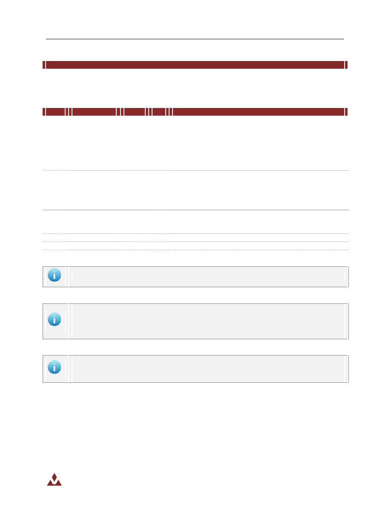{width="918"
height="1188"}

VN-200 User Manual

** **

** **

UM004

** **

 

VN-200 User Manual 

83/141 

 

**Binary Output Register 2 **

6.2.12

**Binary Output Register 2**

** **

**Register ID : **

76 

**Firmware : **

v1.0.0.0 

**Access : **

Read / Write 

**Comment : **

This register allows the user to construct a custom binary output message that contains a \
collection of desired estimated states and sensor measurements. 

**Size (Bytes): **

6-22 

**Example Response: **

\$VNWRG,76,2,4,1,8\*XX 

**Offset **

**Name **

**Format **

**Unit **

**Description **

0 

AsyncMode 

uint16 

- 

Selects whether the output message should be sent out on the \
serial port(s) at a fixed rate. \
0 = None.  User message is not automatically sent out either serial \
port. \
1 = Message is sent out serial port 1 at a fixed rate. \
2 = Message is sent out serial port 2 at a fixed rate. \
3 = Message is sent out both serial ports at a fixed rate. 

2 

RateDivisor 

uint16 

- 

Sets the fixed rate at which the message is sent out the selected \
serial port(s). The number given is a divisor of the 

***ImuRate ***

which 

is nominally 800Hz.  For example to have the sensor output at \
50Hz you would set the Divisor equal to 4.  If you are polling the \
message, set the divisor to 1. 

4 

OutputGroup 

uint16 

- 

Selects which output groups are active in the message.  The \
number of 

**OutputFields**

 in this message should equal the number 

of active bits in the 

**OutputGroup**

. 

6 

OutputField(1) 

uint16 

- 

Active output fields for the first active group. 

4+2\*N 

OutputField(N) 

uint16 

- 

Active output fields for the Nth active group. 

 

 

See section[ 5.2 f](vn200-33.html)or information on the format for the Groups and Group Fields. 

 

 

The size of this register is variable depending upon the number of group fields present.  When writing to \
this register you must provide the same number of group fields as there are bits active in the group byte.  \
If this condition is not met, the unit will respond with an invalid parameter error code on a write register \
attempt. 

 

 

The maximum size of a binary packet must not exceed 600 bytes.  If you attempt to specify an output \
group  and  output  fields  for  a  packet  with  a  length  greater  than  600  bytes  (including  the  header  and \
CRC), you will receive an invalid parameter error when writing
to this register. 

 

 

** **
:::

::: {#page84-div style="position:relative;width:918px;height:1188px;"}
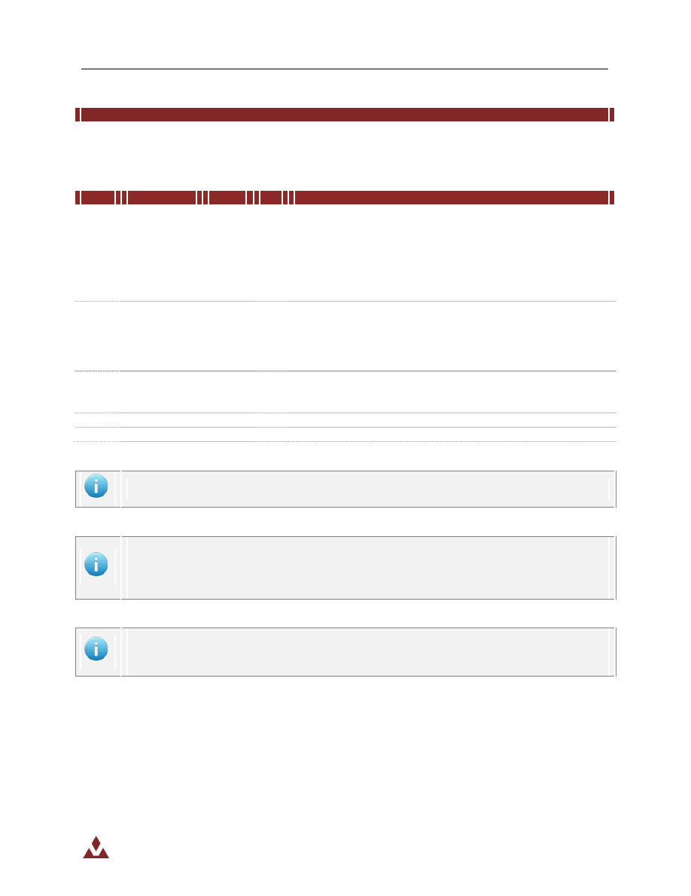{width="918"
height="1188"}

VN-200 User Manual

** **

** **

UM004

** **

 

VN-200 User Manual 

84/141 

 

**Binary Output Register 3 **

6.2.13

**Binary Output Register 3**

** **

**Register ID : **

77 

**Firmware : **

v1.0.0.0 

**Access : **

Read / Write 

**Comment : **

This register allows the user to construct a custom binary output message that contains a \
collection of desired estimated states and sensor measurements. 

**Size (Bytes): **

6-22 

**Example Response: **

\$VNWRG,77,2,4,1,8\*XX 

**Offset **

**Name **

**Format **

**Unit **

**Description **

0 

AsyncMode 

uint16 

- 

Selects whether the output message should be sent out on the \
serial port(s) at a fixed rate. \
0 = None.  User message is not automatically sent out either serial \
port. \
1 = Message is sent out serial port 1 at a fixed rate. \
2 = Message is sent out serial port 2 at a fixed rate. \
3 = Message is sent out both serial ports at a fixed rate. 

2 

RateDivisor 

uint16 

- 

Sets the fixed rate at which the message is sent out the selected \
serial port(s). The number given is a divisor of the 

***ImuRate ***

which is 

nominally 800Hz.  For example to have the sensor output at 50Hz \
you would set the Divisor equal to 4.  If you are polling the message, \
set the divisor to 1. 

4 

OutputGroup 

uint16 

- 

Selects which output groups are active in the message.  The number \
of 

**OutputFields**

 in this message should equal the number of active 

bits in the 

**OutputGroup**

. 

6 

OutputField(1) 

uint16 

- 

Active output fields for the first active group. 

4+2\*N 

OutputField(N)  uint16 

- 

Active output fields for the Nth active group. 

 

 

See section[ 5.2 f](vn200-33.html)or information on the format for the Groups and Group Fields. 

 

 

The size of this register is variable depending upon the number of group fields present.  When writing to \
this register you must provide the same number of group fields as there are bits active in the group byte.  \
If this condition is not met, the unit will respond with an invalid parameter error code on a write register \
attempt. 

 

 

The maximum size of a binary packet must not exceed 600 bytes.  If you attempt to specify an output \
group  and  output  fields  for  a  packet  with  a  length  greater  than  600  bytes  (including  the  header  and \
CRC), you will receive an invalid parameter error when writing
to this register. 

 

 

 

** **
:::

::: {#page85-div style="position:relative;width:918px;height:1188px;"}
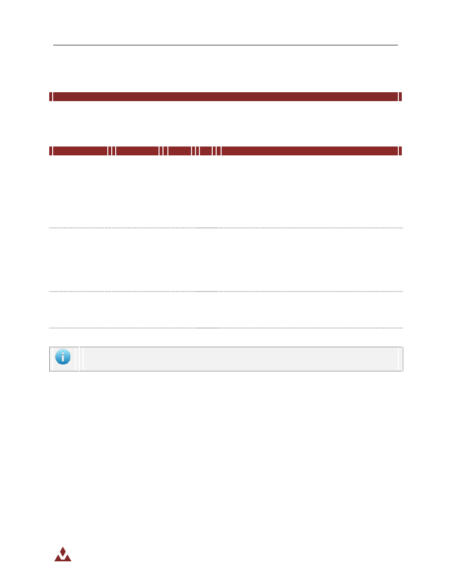{width="918"
height="1188"}

VN-200 User Manual

** **

** **

UM004

** **

 

VN-200 User Manual 

85/141 

 

**Status Registers **

6.3

 

**Synchronization Status **

6.3.1

**Synchronization Status**

** **

**Register ID : **

33 

**Firmware : **

v1.0.0.0 

**Access : **

Read / Write 

**Comment : **

Contains status parameters that pertaining
to the communication synchronization features.   

**Size (Bytes): **

12 

**Example **

**Response: **

\$VNRRG,33,2552498,0,0\*6A 

**Offset **

**Name **

**Format **

**Unit  Description **

0 

SyncInCount 

uint32 

- 

Keeps track of the number of times that the SyncIn trigger \
even has occured. This register can be used to correlate \
the attitude to an event on an external system such as a \
camera or GPS.  \
It is also possible to have the value of this register \
appended to each asynchronous data packet on the serial \
bus.  This can be done by setting the AsyncStatus field in \
the Communication Protocol register to 1. 

4 

SyncInTime 

uint32 

µs 

Keeps track of the amount of time that has elapsed since \
the last SyncIn trigger event.  If the SyncIn pin is connected \
to the PPS (Pulse Per Second) line on a GPS and the \
AsyncStatus field in the Communication Protocol Register \
is set to 1, then each asynchronous measurement will be \
time stamped relative to the last received GPS \
measurement. 

8 

SyncOutCount  uint32 

- 

Keeps track of the number of times that the SyncOut \
trigger event has occurred.  This register can be used to \
index subsequent measurement outputs, which is \
particularly useful when logging sensor data. 

** \
 **

*** ***

 

Writing  zero  to  the  SyncInCount  or  the  SyncOutCount  will  reset  the  status  counter.    Any  other  value \
other than zero will not have an effect.  The
SyncInTime is read only and cannot be reset to zero. 

 

** **
:::

::: {#page86-div style="position:relative;width:918px;height:1188px;"}
{width="918"
height="1188"}

VN-200 User Manual

** **

** **

UM004

** **

 

VN-200 User Manual 

86/141 

 

**Factory Defaults **

6.4

**Settings Name **

**Default Factory Value **

User Tag 

NULL (Empty string) 

Serial Baud Rate 

115200 

Async Data Output Frequency 

40 Hz 

Async Data Output Type 

INS_LLA 

Synchronization Control 

3,0,0,0,6,1,0,100000000,0 

Communication Protocol Control 

0,0,0,0,1,0,1 

Binary Output Register 1 

0, 0, 0 

Binary Output Register 2 

0, 0, 0 

Binary Output Register 3 

0, 0, 0 

 

 

** **
:::

::: {#page87-div style="position:relative;width:918px;height:1188px;"}
{width="918"
height="1188"}

VN-200 User Manual

** **

** **

UM004

** **

 

VN-200 User Manual 

87/141 

 

**Command Prompt **

6.5

The command prompt provides a fast and simple means of configuring and monitoring the status of the \
sensor by typing commands to the unit using the serial port. 

 

**List Available Commands **

6.5.1

Commands for the System subsystem can be accessed by typing in 'system'
at the command prompt.  To \
view all available commands, type 'system ?'. Below is a view of a terminal window showing a list of the \
available commands. 

system ? 

 \
System Module Commands: 

 

Command:    Description: \
\-\-\-\-\-\-\-- 
  \-\-\-\-\-\-\-\-\-\-\-\-\-\-\-\-\-\-\-\-\-\-\-\-\-\-\-\-\-\-\-\-\-\-\-\-\-\-\-\-- \
info        Device specific information such as serial number and
firmware version. \
comm        Information on the communication interfaces. \
errors      Overview of the logged system errors. \
reset       Perform a software reset on the unit. \
save        Save register settings to flash memory. \
restore     Restore register settings to their factory default state.

 

 

**System Info **

6.5.2

system info \
 

\-\-\-\-\-\-\-\-\-\-\-\-\-\-\-\-\-\-\-\-\-\-\-\-\-\-\-\-\-\-\--  System
Info  \-\-\-\-\-\-\-\-\-\-\-\-\-\-\-\-\-\-\-\-\-\-\-\-\-\-\-\-\-\-\-\-- 

 

Hardware: \
      Product Model:  VN-200S-DEV \
      Serial Number:  100013003 \
  MCU Serial Number:  34323439044731322F002100 \
  Hardware Revision:  2 \
      Form Revision:  1 

 

Software: \
   Firmware Version:  1.0.0.0 \
           Revision:  592 \
       Build Number:  1079 

 

\-\-\-\-\-\-\-\-\-\-\-\-\-\-\-\-\-\-\-\-\-\-\-\-\-\-\-\-\-\-\-\-\-\-\-\-\-\-\-\-\-\-\-\-\-\-\-\-\-\-\-\-\-\-\-\-\-\-\-\-\-\-\-\-\-\-\-\-\-\-\-\-\-\-\-\-\-\-\--

 

 

**System Comm **

6.5.3

system comm \
 

\-\-\-\-\-\-\-\-\-\-\-\-\-\-\-\-\-\-\-\-\--  System Communication
Interfaces  \-\-\-\-\-\-\-\-\-\-\-\-\-\-\-\-\-\-\-\-\-\-- 

 

Communication Stats: \
  Serial Messages Parsed              : 29 \
  Spi Messages Parsed                 : 0 \
  Max Serial RX Buffer Usage          : 0 \
  Max Serial TX Buffer Usage          : 4 \
  Max Spi RX Buffer Usage             : 0 \
  Max Spi TX Buffer Usage             : 0 

 
:::

::: {#page88-div style="position:relative;width:918px;height:1188px;"}
{width="918"
height="1188"}

VN-200 User Manual

** **

** **

UM004

** **

 

VN-200 User Manual 

88/141 

  Current Serial 1 TX Bandwidth Usage : 00.0 \
  Current Serial 2 TX Bandwidth Usage : 49.3 

 

  Max Serial 1 TX Bandwidth Usage : 49.3 \
  Max Serial 2 TX Bandwidth Usage : 50.5 

 

  Min Serial 1 TX Bandwidth Usage : 00.0 \
  Min Serial 2 TX Bandwidth Usage : 48.1 

 

\-\-\-\-\-\-\-\-\-\-\-\-\-\-\-\-\-\-\-\-\-\-\-\-\-\-\-\-\-\-\-\-\-\-\-\-\-\-\-\-\-\-\-\-\-\-\-\-\-\-\-\-\-\-\-\-\-\-\-\-\-\-\-\-\-\-\-\-\-\-\-\-\-\-\-\-\-\-\--

 

 

**System Errors **

6.5.4

system errors \
 

\-\-\-\-\-\-\-\-\-\-\-\-\-\-\-\-\-\-\-\-\-\-\-\-\-\-\-\-\-\--  System
Errors  \-\-\-\-\-\-\-\-\-\-\-\-\-\-\-\-\-\-\-\-\-\-\-\-\-\-\-\-\-\-\-- 

 

  Hard Fault Exceptions             : 0 \
  Serial Input Buffer Overflow      : 0 \
  Serial Output Buffer Overflow     : 0 \
  Serial Insufficient Bandwidth     : 0 \
  Invalid Checksums                 : 6 \
  Invalid Commands                  : 2 \
  Input Error - Too Few Parameters  : 0 \
  Input Error - Too Many Parameters : 0 \
  Input Error - Invalid Parameter   : 0 \
  Input Error - Invalid Register    : 0 \
  Input Error - Unauthorized Access : 2 \
  Input Error - Watchdog Reset      : 0 

 

\-\-\-\-\-\-\-\-\-\-\-\-\-\-\-\-\-\-\-\-\-\-\-\-\-\-\-\-\-\-\-\-\-\-\-\-\-\-\-\-\-\-\-\-\-\-\-\-\-\-\-\-\-\-\-\-\-\-\-\-\-\-\-\-\-\-\-\-\-\-\-\-\-\-\-\-\-\-\--

 

 

**System Reset **

6.5.5

system reset

 

 

**System Save **

6.5.6

system save

 

 

** **
:::

::: {#page89-div style="position:relative;width:918px;height:1188px;"}
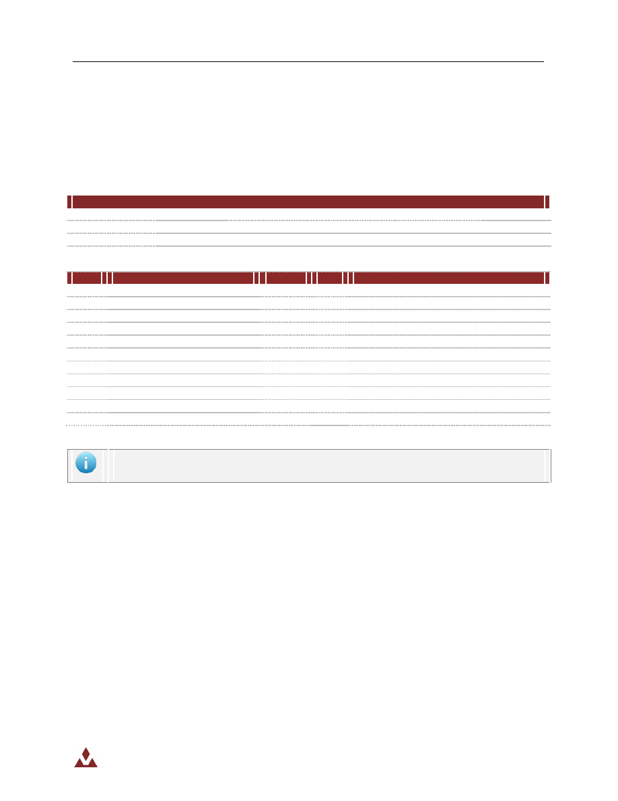{width="918"
height="1188"}

VN-200 User Manual

** **

** **

UM004

** **

 

VN-200 User Manual 

89/141 

**7**

** **

**IMU Subsystem **

 

**IMU Measurement Registers **

7.1

 

**IMU Measurements **

7.1.1

This  register  provides  direct  access  to  the  calibrated  magnetometer,  accelerometer,  gyro,  barometric \
pressure, and temperature measurements available from the onboard IMU. 

**IMU Measurements**

** **

**Register ID : **

54 

**Async Header : **

IMU 

**Access : **

Read Only 

**Comment : **

Provides the calibrated IMU measurements including barometric pressure. 

**Size (Bytes): **

44 

**Example Read **

**Response: **

\$VNRRG,54,-02.0841,+00.6045,+02.8911,+00.381,-00.154,-09.657,-00.005683, \
+00.000262,+00.001475,+21.6,+00099.761\*5B 

**Offset **

**Name **

**Format **

**Unit **

**Description **

0 

MagX 

float 

Gauss  Uncompensated Magnetic X-axis. 

4 

MagY 

float 

Gauss  Uncompensated Magnetic Y-axis. 

8 

MagZ 

float 

Gauss  Uncompensated Magnetic Z-axis. 

12 

AccelX 

float 

m/s

2

 

Uncompensated Acceleration X-axis. 

16 

AccelY 

float 

m/s

2

 

Uncompensated Acceleration Y-axis. 

20 

AccelZ 

float 

m/s

2

 

Uncompensated Acceleration Z-axis. 

24 

GyroX 

float 

rad/s 

Uncompensated Angular rate X-axis. 

28 

GyroY 

float 

rad/s 

Uncompensated Angular rate Y-axis. 

32 

GyroZ 

float 

rad/s 

Uncompensated Angular rate Z-axis. 

36 

Temp 

float 

C 

IMU Temperature. 

40 

Pressure 

float 

kPa 

Barometric pressure. 

 

 

You  can  configure  the  device  to  output  this  register  at  a  fixed  rate  using  the  Async  Data  Output  Type \
register (Register
6).  Once configured the data in this register will be sent out with the \$VNIMU
header. 

 

** **
:::

::: {#page90-div style="position:relative;width:918px;height:1188px;"}
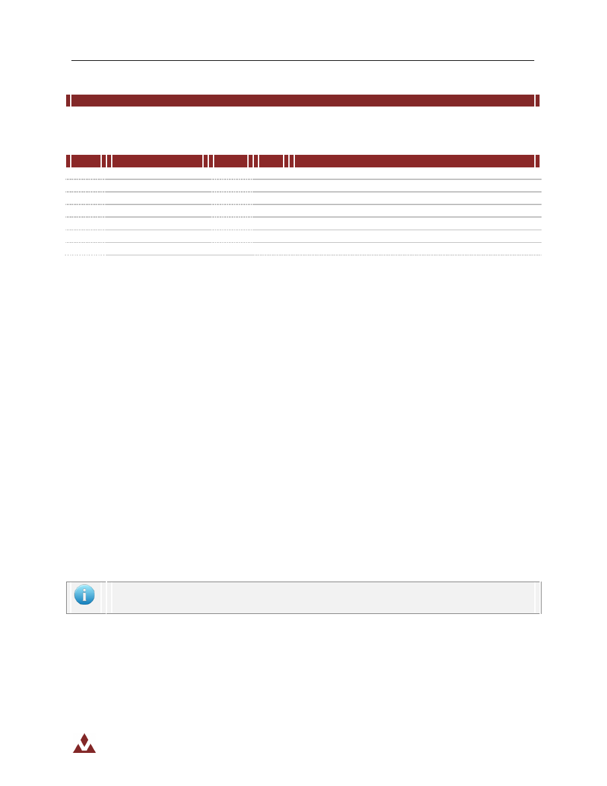{width="918"
height="1188"}

VN-200 User Manual

** **

** **

UM004

** **

 

VN-200 User Manual 

90/141 

 

**Delta Theta and Delta Velocity **

7.1.2

**Delta Theta and Delta Velocity**

** **

**Register ID : **

80 

**Async Header: **

DTV 

**Access : **

Read 

**Comment : **

This register contains the output values of the onboard coning
and sculling algorithm. 

**Size (Bytes): **

28 

**Example Response: **

\$VNRRG,80,+0.665016,-000.119,-000.409,-000.025,+000.011,-000.084,-006.702\*6A 

**Offset **

**Name **

**Format **

**Unit **

**Description **

0 

DeltaTime 

float 

sec 

Delta time for the integration interval 

4 

DeltaThetaX 

float 

deg 

Delta rotation vector component in the x-axis. 

8 

DeltaThetaY 

float 

deg 

Delta rotation vector component in the y-axis. 

12 

DeltaThetaZ 

float 

deg 

Delta rotation vector component in the z-axis. 

16 

DeltaVelocityX 

float 

m/s 

Delta velocity vector component in the x-axis. 

20 

DeltaVelocityY 

float 

m/s 

Delta velocity vector component in the y-axis. 

24 

DeltaVelocityZ 

float 

m/s 

Delta velocity vector component in the z-axis. 

 

The  Delta  Theta  and  Delta  Velocity  register  contains  the  computed  outputs  from  the  onboard  coning \
and  sculling  algorithm.    The  coning  and  sculling  integrations  are  performed  at  the  IMU  sample  rate \
(nominally at 800Hz) and reset when the register data is output.  If polling this register, the values will \
represent  the  delta  time,  angles,  and  velocity  since  the  register  was  last  polled.    If  the  Delta \
Theta/Velocity  data  is  selected  for  asynchronous  output  via  the  Async  Data  Output  Type  register \
(Register  6,  type  30),  the  integrals  will  be  reset  each  time  the  data  is  asynchronously  output  at  the \
configured rate. 

The delta  time  output  contains the length of the time  interval over  which the  deltas  were  calculated.  \
This can be used to check the interval time or to compute nonlinear "average" rates and accelerations \
from the integrated values. 

The delta theta is output as a principal rotation vector, defined as the product of the unit vector of the \
principal rotation axis and the principal rotation angle in degrees.  For small rotations, a typical use case \
for  delta  angles,  the  principal  rotation  vector  elements  may  be  treated  individually  as  rotations  in \
degrees about the individual sensor
axes (in any Euler rotation sequence) with little error. 

The delta velocity output provides the integration of the acceleration in the chosen frame, taking into \
account the coupling effects of any simultaneous rotation experienced. 

The coning and sculling algorithm can be configured to operate in multiple frames and with a variety of \
compensations applied.  See the Delta Theta and Delta Velocity Configuration register (Register 82) for \
further details. 

 

You  can  configure  the  device  to  output  this  register  at  a  fixed  rate  using  the  Async  Data  Output  Type \
register (Register
6).  Once configured the data in this register will be sent out with the \$VNDTV
header. 

 

 

** **
:::

::: {#page91-div style="position:relative;width:918px;height:1188px;"}
{width="918"
height="1188"}

VN-200 User Manual

** **

** **

UM004

** **

 

VN-200 User Manual 

91/141 

 

**IMU Configuration Registers **

7.2

 

**Magnetometer Compensation **

7.2.1

**Magnetometer Compensation**

** **

**Register ID : **

23 

**Firmware : **

1.0.0.0 

**Access: **

Read / Write 

**Comment : **

Allows the magnetometer to be compensated for hard/soft iron effects. 

**Size (Bytes): **

48 

**Example Command: **

\$VNRRG,23,1,0,0,0,1,0,0,0,1,0,0,0\*73 

**Offset  Name **

**Format **

**Unit **

**Description **

0 

C\[0,0\] 

float 

- 

 

4 

C\[0,1\] 

float 

- 

 

8 

C\[0,2\] 

float 

- 

 

12 

C\[1,0\] 

float 

- 

 

16 

C\[1,1\] 

float 

- 

 

20 

C\[1,2\] 

float 

- 

 

24 

C\[2,0\] 

float 

- 

 

28 

C\[2,1\] 

float 

- 

 

32 

C\[2,2\] 

float 

- 

 

36 

B\[0\] 

float 

- 

 

40 

B\[1\] 

float 

- 

 

44 

B\[2\] 

float 

- 

 

 

This register contains twelve values representing the hard and soft iron compensation parameters.  The \
magnetic measurements are compensated for both hard and soft iron using the following model.  Under \
normal  circumstances  this  register  can  be  left  in  its factory  default  state.   In  the  event that there  are \
disturbances in the magnetic field due to hard or soft iron effects, then these registers allow for further \
compensation.    These  registers  can  also  be  used  to  compensate  for  significant  changes  to  the \
magnetometer  bias,  gain,  and  axis  alignment  during  installation.    Note  that  this  magnetometer \
compensation  is  separate  from  the  compensation  that  occurs  during  the  calibration  process  at  the \
factory.  Setting this register to the default state of an identity matrix and zero offset will not eliminate \
the magnetometer gain, bias, and axis alignment that occur during factory calibration.  These registers \
only need to be changed from their default values in the event that hard/soft iron compensation needs \
to be performed, or changes in bias, gain, and axis alignment have occurred at some point between the \
times the chip was calibrated at the factory and when it is used
in the field. 

{

 

 \
 

}   \[

           

           \
           

\]   {

       \
       

       

}

 

The variables 

{          }

 are components of the measured magnetic field.  The {X, Y, Z} variables are 

the  new  magnetic  field  measurements  outputted  after  compensation  for  hard/soft  iron  effects.    All \
twelve numbers are represented by single-precision floating points. 

 

** **
:::

::: {#page92-div style="position:relative;width:918px;height:1188px;"}
{width="918"
height="1188"}

VN-200 User Manual

** **

** **

UM004

** **

 

VN-200 User Manual 

92/141 

 

**Acceleration Compensation **

7.2.2

**Accelerometer Compensation**

** **

**Register ID : **

25 

**Firmware : **

1.0.0.0 

**Access : **

Read / Write 

**Comment : **

Allows the accelerometer to be further compensated for scale
factor, misalignment, and \
bias errors. 

**Size (Bytes): **

48 

**Example Command: **

\$VNRRG,25,1,0,0,0,1,0,0,0,1,0,0,0\*75 

**Offset  Name **

**Format **

**Unit **

**Description **

0 

C\[0,0\] 

float 

- 

 

4 

C\[0,1\] 

float 

- 

 

8 

C\[0,2\] 

float 

- 

 

12 

C\[1,0\] 

float 

- 

 

16 

C\[1,1\] 

float 

- 

 

20 

C\[1,2\] 

float 

- 

 

24 

C\[2,0\] 

float 

- 

 

28 

C\[2,1\] 

float 

- 

 

32 

C\[2,2\] 

float 

- 

 

36 

B\[0\] 

float 

- 

 

40 

B\[1\] 

float 

- 

 

44 

B\[2\] 

float 

- 

 

 

This  register  contains  twelve  values  representing  the  accelerometer  compensation  parameters.    The \
accelerometer  measurements  are  compensated  for  changes  in  bias,  gain,  and  axis  alignment  that can \
occur  during  the  installation  of  the  chip  on  the  customer's  board  using  the  following  model.    Under \
normal  circumstances  this  register  can  be  left  in  its factory  default  state.   In  the  event that there  are \
significant  changes  to  the  accelerometer  bias,  gain,  and  axis  alignment  during  installation,  then  these \
registers allow for further compensation.  Note that this accelerometer compensation is separate from \
the compensation that occurs during the calibration process at the factory.  Setting this register to the \
default state of an identity matrix and zero offset will not eliminate the accelerometer gain, bias, and \
axis alignment that occur during factory calibration.  These registers only need to be changed from their \
default values in the event that changes in bias, gain, and axis alignment have occurred at some point \
between the times the chip was calibrated at the factory and when it is
used in the field.  

{

 

 \
 

}   \[

           

           \
           

\]   {

       \
       

       

}

 

The variables {AX,AY,AZ} are components of the measured acceleration.  The {X, Y, Z} variables are the \
new acceleration measurements outputted after compensation for changes during sensor mounting.
 All \
twelve numbers are represented by single-precision floating points. 

 

 
:::

::: {#page93-div style="position:relative;width:918px;height:1188px;"}
{width="918"
height="1188"}

VN-200 User Manual

** **

** **

UM004

** **

 

VN-200 User Manual 

93/141 

 

**Gyro Compensation **

7.2.3

**Gyro Compensation**

** **

**Register ID : **

84 

**Firmware : **

v1.0.0.0 

**Access : **

Read / Write 

**Comment : **

Allows the gyro to be further compensated for scale factor, misalignment, and bias errors. 

**Size (Bytes): **

48 

**Example Command: **

\$VNRRG,84,1,0,0,0,1,0,0,0,1,0,0,0\*7E 

**Offset  Name **

**Format **

**Unit **

**Description **

0 

C\[0,0\] 

float 

- 

 

4 

C\[0,1\] 

float 

- 

 

8 

C\[0,2\] 

float 

- 

 

12 

C\[1,0\] 

float 

- 

 

16 

C\[1,1\] 

float 

- 

 

20 

C\[1,2\] 

float 

- 

 

24 

C\[2,0\] 

float 

- 

 

28 

C\[2,1\] 

float 

- 

 

32 

C\[2,2\] 

float 

- 

 

36 

B\[0\] 

float 

- 

 

40 

B\[1\] 

float 

- 

 

44 

B\[2\] 

float 

- 

 

 

This  register  contains  twelve  values  representing  the  gyro  compensation  parameters.    The  gyro \
measurements are compensated for changes in bias, gain, and axis alignment that can occur during the \
installation of the chip on the customer's board using the
following model.  Under normal circumstances \
this register can be left in its factory default state.  In the event that there are significant changes to the \
gyro bias, gain, and axis alignment during installation or during the life of the part; these registers allow \
for  further compensation.   Note that  this  gyro  compensation  is separate  from the  compensation that \
occurs  during  the  calibration  process  at  the  factory.    Setting  this  register  to  the  default  state  of  an \
identity  matrix  and  zero  offset  will  not  eliminate  the  gyro  gain,  bias,  and  axis  alignment  that  occur \
during  factory  calibration.    These  registers  only  need  to  be  changed  from  their  default  values  in  the \
event that changes in bias, gain, and axis alignment have occurred at some point between the times the \
chip was calibrated at the factory and when it is used in the field.  

{

 

 \
 

}   \[

           

           \
           

\]   {

       

       \
       

}

 

The  variables  {GX,  GY,  GZ}

IMU

  are  components  of  the  measured  angular  rate.    The  {GX,  GY,  GZ}

Comp

 

variables  are  the  new  acceleration  measurements  outputted  after  compensation  for  changes  during \
sensor mounting.  All twelve numbers
are represented by single-precision floating points. 

 

 

 

 
:::

::: {#page94-div style="position:relative;width:918px;height:1188px;"}
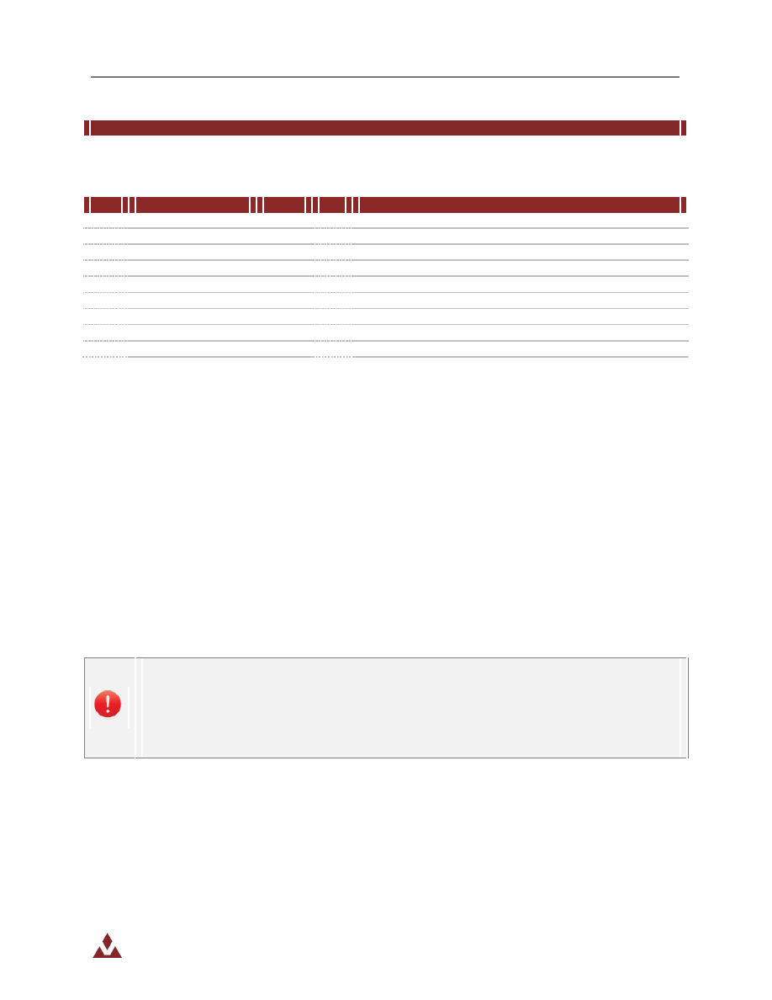{width="918"
height="1188"}

VN-200 User Manual

** **

** **

UM004

** **

 

VN-200 User Manual 

94/141 

 

**Reference Frame Rotation **

7.2.4

**Reference Frame Rotation**

** **

**Register ID : **

26 

**Firmware : **

1.0.0.0 

**Access : **

Read / Write 

**Comment : **

Allows the measurements of the VN-200 to be rotated into a different reference frame. 

**Size (Bytes): **

36 

**Example Response: **

\$VNRRG,26,1,0,0,0,1,0,0,0,1\*6A 

**Offset  Name **

**Format **

**Unit **

**Description **

0 

C\[0,0\] 

float 

- 

 

4 

C\[0,1\] 

float 

- 

 

8 

C\[0,2\] 

float 

- 

 

12 

C\[1,0\] 

float 

- 

 

16 

C\[1,1\] 

float 

- 

 

20 

C\[1,2\] 

float 

- 

 

24 

C\[2,0\] 

float 

- 

 

28 

C\[2,1\] 

float 

- 

 

32 

C\[2,2\] 

float 

- 

 

 

This  register  contains  a  transformation  matrix  that  allows  for  the  transformation  of  measured \
acceleration,  magnetic,  and  angular  rates  from  the  body  frame  of  the  VN-200  to  any  other  arbitrary \
frame  of  reference.    The  use  of  this  register  allows  for  the  sensor  to  be  placed  in  any  arbitrary \
orientation with respect to the user's desired body coordinate frame.  This register can also be used to \
correct for
any orientation errors due to mounting the VN-200 on the user's circuit board. 

{

 

 \
 

}

 

  \[

           

           \
           

\]   {

 

 \
 

}

 

 

The  variables 

{       }

 

  are  a  measured  parameter  such  as  acceleration  in  the  body  reference  frame 

with respect to the VN-200.  The variables 

{       }

 

 are a measured parameter such as acceleration in 

the user's frame of reference.  The reference frame rotation register thus needs to be loaded with the \
transformation matrix that will transform measurements from the body reference frame of the VN-200 \
to  the  desired  user  frame  of  reference.    It  is  crucial  that  these  two  frames  of  reference  be  rigidly \
attached to each other.
 All nine numbers are represented by single-precision floating points. 

 

The reference frame rotation is performed on all vector measurements prior to entering the INS filter.  \
As such, changing this register while the attitude filter is running will lead to unexpected behavior in the \
INS  output.    To  prevent  this,  the  register  is  cached  on  startup  and  changes  will  not  take  effect  during \
runtime.    After  setting  the  reference  frame  rotation  register  to  its  new  value,  send  a  write  settings \
command  and  then  reset  the  VN-200.    This  will  allow  the  INS  filter  to  startup  with  the  newly  set \
reference frame rotation. 

 

 
:::

::: {#page95-div style="position:relative;width:918px;height:1188px;"}
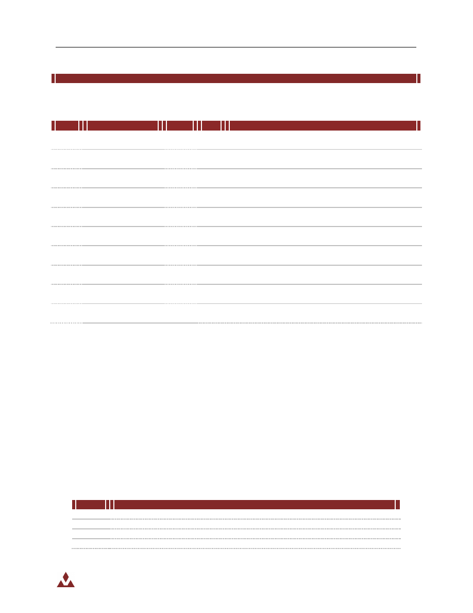{width="918"
height="1188"}

VN-200 User Manual

** **

** **

UM004

** **

 

VN-200 User Manual 

95/141 

 

**IMU Filtering Configuration **

7.2.5

**IMU Filtering Configuration**

** **

**Register ID : **

85 

**Firmware : **

v1.0.0.0 

**Access : **

Read / Write 

**Comment : **

Controls the level of filtering performed on the raw IMU measurements. 

**Size (Bytes): **

15 

**Example Response: **

\$VNRRG,85,0,5,5,5,0,0,3,3,3,0\*78 

**Offset **

**Name **

**Format **

**Unit **

**Description **

0 

MagWindowSize 

uint16 

- 

Number of previous measurements averaged for magnetic \
measurements. 

2 

AccelWindowSize 

uint16 

- 

Number of previous measurements averaged for \
acceleration measurements. 

4 

GyroWindowSize 

uint16 

- 

Number of previous measurements averaged for gyro \
measurements. 

6 

TempWindowSize 

uint16 

- 

Number of previous measurements averaged for \
temperature measurements. 

8 

PresWindowSize 

uint16 

- 

Number of previous measurements averaged for pressure \
measurements. 

10 

MagFilterMode 

uint8 

- 

Filtering mode for magnetic measurements.   \
See table below for options. 

11 

AccelFilterMode 

uint8 

- 

Filtering mode for acceleration measurements.   \
See table below for options. 

12 

GyroFilterMode 

uint8 

- 

Filtering mode for gyro measurements.   \
See table below for options. 

13 

TempFilterMode 

uint8 

- 

Filtering mode for temperature measurements.   \
See table below for options. 

14 

PresFilterMode 

uint8 

- 

Filtering mode for pressure measurements.   \
See table below for options. 

 

This register allows the user to configure the FIR filtering what is
applied to the IMU measurements.  The \
filter is a uniformly-weighted moving window (boxcar) filter of configurable size.  The filtering does not \
affect the values used by the internal
filter, but only the output values. 

**WindowSize **

The  WindowSize  parameters  for  each  sensor  define  the  number  of  samples  at  the  IMU  rate  (default \
800Hz) which will be averaged for each output measurement.  

**FilterMode **

The  FilterMode  parameters  for  each  sensor  select  which  output  quantities  the  filtering  should  be \
applied  to.    Filtering  can  be  applied  to  either  the  uncompensated  IMU  measurements,  compensated \
(HSI and biases compensated by onboard filters, if applicable), or
both. 

**Table 48 - IMU Filtering Modes **

**Value **

**Description **

0 

No Filtering 

1 

Filtering performed only on raw uncompensated IMU measurements. 

2 

Filtering performed only on compensated IMU measurements. 

3 

Filtering performed on both uncompensated and compensated IMU measurements. 
:::

::: {#page96-div style="position:relative;width:918px;height:1188px;"}
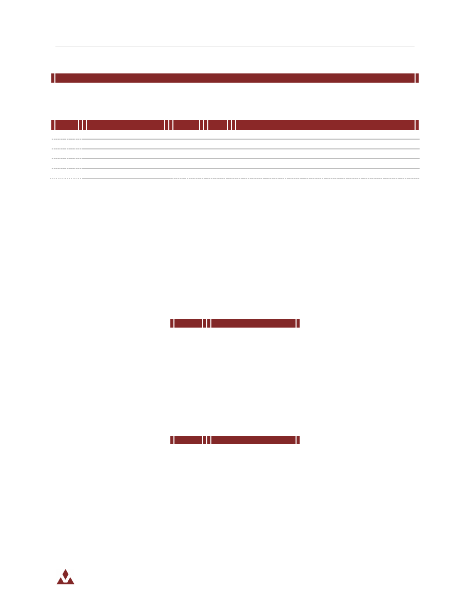{width="918"
height="1188"}

VN-200 User Manual

** **

** **

UM004

** **

 

VN-200 User Manual 

96/141 

 

**Delta Theta and Delta Velocity Configuration **

7.2.6

**Delta Theta and Delta Velocity Configuration**

** **

**Register ID : **

82 

**Firmware : **

v1.0.0.0 

**Access : **

Read / Write 

**Comment : **

This register contains configuration options for the internal coning/sculling
calculations 

**Size (Bytes): **

6 

**Example Response: **

\$VNRRG,82,0,0,0,0,0\*65 

**Offset **

**Name **

**Format **

**Unit **

**Description **

0 

IntegrationFrame 

uint8 

- 

Output frame for delta velocity quantities 

1 

GyroCompensation 

uint8 

- 

Compensation to apply to angular rate 

2 

AccelCompensation 

uint8 

- 

Compensation(s) to apply to accelerations 

3 

Reserved 

uint8 

- 

Reserved for future use.  Should be set to 0. 

4 

Reserved 

uint16 

- 

Reserved for future use.  Should be set to 0. 

 

The  Delta  Theta  and  Delta  Velocity  Configuration  register  allows  configuration  of  the  onboard  coning \
and  sculling  used  to  generate  integrated  motion  values  from  the  angular  rate  and  acceleration  IMU \
quantities.    The  fully-coupled  coning  and  sculling  integrals  are  computed  at  the  IMU  sample  rate \
(nominal 800 Hz). 

**IntegrationFrame **

The  IntegrationFrame  register  setting  selects  the  reference  frame  used  for  coning  and  sculling.    Note \
that  using  any  frame  other  than  the  body  frame  will  rely  on  the  onboard  Kalman  filter's  attitude \
estimate.   The factory default state is to integrate in the sensor
body frame. 

**Table 49 -- IntegrationFrame **

**Value **

**Description **

0 

Body frame 

1 

NED frame 

**GyroCompensation **

The  GyroCompensation  register  setting  selects  the  compensation  to  be  applied  to  the  angular  rate \
measurements  before  integration.    If  bias  compensation  is  selected,  the  onboard  Kalman  filter's  real-\
time estimate of the gyro biases will be used to compensate the IMU measurements before integration.  \
The factory default state is to integrate the uncompensated angular
rates from the IMU. 

**Table 50 -- GyroCompensation **

**Value **

**Description **

0 

None 

1 

Bias 

** **

 

** **
:::

::: {#page97-div style="position:relative;width:918px;height:1188px;"}
{width="918"
height="1188"}

VN-200 User Manual

** **

** **

UM004

** **

 

VN-200 User Manual 

97/141 

**AccelCompensation **

The  AccelCompensation  register  setting  selects  the  compensation  to  be  applied  to  the  acceleration \
measurements  before  integration.    If  bias  compensation  is  selected,  the  onboard  Kalman  filter's  real-\
time estimate of the accel biases will be used to compensate the IMU
measurements before integration.  \
The factory default state is to integrate the uncompensated acceleration from the IMU. 

**Table 51 -- AccelCompensation **

**Value **

**Description **

0 

None 

1 

Bias 

 

 

 
:::

::: {#page98-div style="position:relative;width:918px;height:1188px;"}
{width="918"
height="1188"}

VN-200 User Manual

** **

** **

UM004

** **

 

VN-200 User Manual 

98/141 

 

**Factory Defaults **

7.3

**Settings Name **

**Default Factory Value **

Magnetometer Compensation 

1,0,0,0,1,0,0,0,1,0,0,0 

Accelerometer Compensation 

1,0,0,0,1,0,0,0,1,0,0,0 

Gyro Compensation 

1,0,0,0,1,0,0,0,1,0,0,0 

Reference Frame Rotation 

1,0,0,0,1,0,0,0,1 

IMU Filtering Configuration 

0,4,4,4,0,0,3,3,3,0 

Delta Theta and Delta Velocity \
Configuration 

0,0,0,0,0 

 

 

** **
:::

::: {#page99-div style="position:relative;width:918px;height:1188px;"}
{width="918"
height="1188"}

VN-200 User Manual

** **

** **

UM004

** **

 

VN-200 User Manual 

99/141 

 

**Command Prompt **

7.4

The command prompt provides a fast and simple means of configuring and monitoring the status of the \
sensor by typing commands to the unit using the serial port. 

 

**List Available Commands **

7.4.1

Commands for the System subsystem can be accessed by typing in 'imu' at the command prompt.  To \
view all available commands, type 'imu ?'. Below is a view of a terminal window showing a list of the \
available commands. 

imu ? 

 \
Imu Module Commands: 

 

Command:    Description: \
\-\-\-\-\-\-\-- 
  \-\-\-\-\-\-\-\-\-\-\-\-\-\-\-\-\-\-\-\-\-\-\-\-\-\-\-\-\-\-\-\-\-\-\-\-\-\-\-\-\-\-\-\-\-\-\-\-\-\-\-\-\-\-\-\-\-\-\-\-\-\-\-\-\-\-\-- \
info        Imu specific information such as serial number and firmware
version. \
meas        Current Imu measurement, and run-time statistics. 

 

**IMU Info **

7.4.2

imu info \
 

\-\-\-\-\-\-\-\-\-\-\-\-\-\-\-\-\-\-\-\-\-\-\-\-\-\-\-\-\--  Imu
Information
 \-\-\-\-\-\-\-\-\-\-\-\-\-\-\-\-\-\-\-\-\-\-\-\-\-\-\-\-\-\-- 

 

Magnetometer - HSI Settings (Register 44) \
  Mode : Using Onboard 

 

Magnetometer - User HSI Calibration (Register 23) \
  +01.000  +00.000  +00.000  +00.000 \
  +00.000  +01.000  +00.000  +00.000 \
  +00.000  +00.000  +01.000  +00.000 

 

Magnetometer - Onboard HSI Calibration (Register 47) \
  +01.000  +00.000  +00.000  -00.000 \
  +00.000  +01.000  +00.000  -00.000 \
  +00.000  +00.000  +01.000  -00.000 

 

Accelerometer - User Calibration (Register 25) \
  +01.000  +00.000  +00.000  +00.000 \
  +00.000  +01.000  +00.000  +00.000 \
  +00.000  +00.000  +01.000  +00.000 

 

Sensor Self Test: (performed at startup) \
  Mag   : Passed \
  Accel : Passed \
  Gyro  : Passed \
  Pres  : Passed 

 

\-\-\-\-\-\-\-\-\-\-\-\-\-\-\-\-\-\-\-\-\-\-\-\-\-\-\-\-\-\-\-\-\-\-\-\-\-\-\-\-\-\-\-\-\-\-\-\-\-\-\-\-\-\-\-\-\-\-\-\-\-\-\-\-\-\-\-\-\-\-\-\-\-\-\-\-\-\-\--

 

 

 

** **
:::

::: {#page100-div style="position:relative;width:918px;height:1188px;"}
{width="918"
height="1188"}

VN-200 User Manual

** **

** **

UM004

** **

 

VN-200 User Manual 

100/141 

 

**IMU Meas **

7.4.3

imu meas \
 

\-\-\-\-\-\-\-\-\-\-\-\-\-\-\-\-\-\-\-\-\-\-\-\-\-\-\-\-\--  Imu
Measurement
 \-\-\-\-\-\-\-\-\-\-\-\-\-\-\-\-\-\-\-\-\-\-\-\-\-\-\-\-\-\-- \
Current Sensor Measurements: \
  Mag X    : -000.866 \[Gauss\] \
  Mag Y    : +001.016 \[Gauss\] \
  Mag Z    : +002.365 \[Gauss\] \
  Acel X   : +004.178 \[m/s\] \
  Acel Y   : -000.637 \[m/s\] \
  Acel Z   : -008.927 \[m/s\] \
  Gyro X   : -000.417 \[deg/s\] \
  Gyro Y   : +000.668 \[deg/s\] \
  Gyro Z   : -001.102 \[deg/s\] \
  Temp     : +027.94 \[C\] \
  Temp Rate: +0.04 \[C/min\] \
  Pres     : +101.36 \[kPa\] 

 

Current Sensor Noise: (measured over last 5 seconds) \
  Sensor    Units     X-Axis    Y-Axis    Z-Axis     \
  Mag       mGauss    +03.228   +02.934   +04.159    \
  Accel     mg        +01.854   +02.115   +02.872 \
  Gyro      deg/s     +0.0631   +0.0544   +0.0580 \
  Temp      C         +0.0026 \
  Pres      Pa        +007.36 

 

Minimum Sensor Noise: (since startup) \
  Sensor    Units     X-Axis    Y-Axis    Z-Axis     \
  Mag       mGauss    +02.877   +02.659   +03.673    \
  Accel     mg        +01.785   +01.966   +02.599 \
  Gyro      deg/s     +0.0587   +0.0487   +0.0537 \
  Temp      C         +0.0011 \
  Pres      Pa        +006.13 

 

Minimum Sensor Measurement: (since startup) \
  Sensor    Units     X-Axis    Y-Axis    Z-Axis     \
  Mag       Gauss     -00.236   +00.244   +00.577    \
  Accel     g         +00.414   -00.077   -00.949 \
  Gyro      deg/s     -002.92   -005.33   -002.03 \
  Temp      C         +27.83 \
  Pres      kPa       +101.30 

 

Maximum Sensor Measurement: (since startup) \
  Sensor    Units     X-Axis    Y-Axis    Z-Axis     \
  Mag       Gauss     +00.000   +00.271   +00.611    \
  Accel     g         +00.439   +00.000   +00.000 \
  Gyro      deg/s     +002.02   +006.44   +000.00 \
  Temp      C         +28.01 \
  Pres      kPa       +101.38 

 

Sensor Saturation Events: (since startup) \
  Sensor    X-Axis    Y-Axis    Z-Axis     \
  Mag       0         0         0          \
  Accel     0         0         0          \
  Gyro      0         0         0          \
  Pressure  0          \
  Temp      0          \
\-\-\-\-\-\-\-\-\-\-\-\-\-\-\-\-\-\-\-\-\-\-\-\-\-\-\-\-\-\-\-\-\-\-\-\-\-\-\-\-\-\-\-\-\-\-\-\-\-\-\-\-\-\-\-\-\-\-\-\-\-\-\-\-\-\-\-\-\-\-\-\-\-\-\-\-\-\-\--

 

 
:::

::: {#page101-div style="position:relative;width:918px;height:1188px;"}
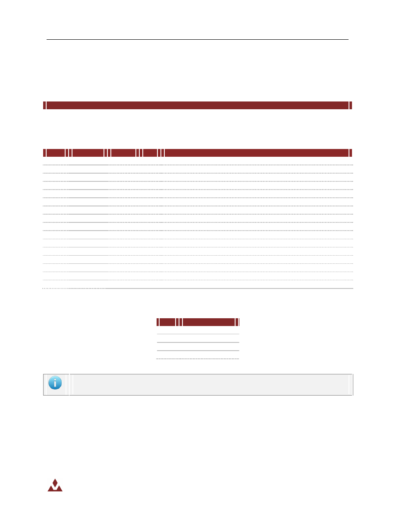{width="918"
height="1188"}

VN-200 User Manual

** **

** **

UM004

** **

 

VN-200 User Manual 

101/141 

**8**

** **

**GPS Subsystem **

 

**Measurement Registers **

8.1

 

**GPS Solution - LLA **

8.1.1

**GPS Solution - LLA**

** **

**Register ID : **

58 

**Async Header : **

GPS 

**Access : **

Read Only 

**Comment : **

 

**Size (Bytes): **

72 

**Example Read **

**Response: **

\$VNRRG,58,333733.000159,1694,3,05,+32.95622080,-096.71415970,+00169.457,-\
000.850,-000.580,-002.860,+005.573,+003.644,+009.760,+003.320,2.00E-08\*0E 

**Offset **

**Name **

**Format **

**Unit **

**Description **

0 

Time 

double 

sec 

GPS time of week in seconds. 

8 

Week 

uint16 

week  GPS week. 

10 

GpsFix 

uint8 

- 

GPS fix type. See table below. 

11 

NumSats 

uint8 

- 

Number of GPS satellites used in solution. 

12 

- 

- 

- 

\-\--  4 PADDING BYTES  \-\-- 

16 

Latitude 

double 

deg 

Latitude in degrees. 

24 

Longitude 

double 

deg 

Longitude in degrees. 

32 

Altitude 

double 

m 

Altitude above ellipsoid. (WGS84) 

40 

NedVelX 

float 

m/s 

Velocity measurement in north direction. 

44 

NedVelY 

float 

m/s 

Velocity measurement in east direction. 

48 

NedVelZ 

float 

m/s 

Velocity measurement in down direction. 

52 

NorthAcc 

float 

m 

North position accuracy estimate. (North) 

56 

EastAcc 

float 

m 

East position accuracy estimate. (East) 

60 

VertAcc 

float 

m 

Vertical position accuracy estimate. (Down) 

64 

SpeedAcc 

float 

m/s 

Speed accuracy estimate. 

68 

TimeAcc 

float 

sec 

Time accuracy estimate. 

 

**Table 52 - GPS Fix **

**Value **

**Description **

0 

No fix 

1 

Time only 

2 

2D 

3 

3D 

 

 

You  can  configure  the  device  to  output  this  register  at  a  fixed  rate  using  the  Async  Data  Output  Type \
register (Register
6).  Once configured the data in this register will be sent out with the \$VNGPS
header. 

 

** **
:::

::: {#page102-div style="position:relative;width:918px;height:1188px;"}
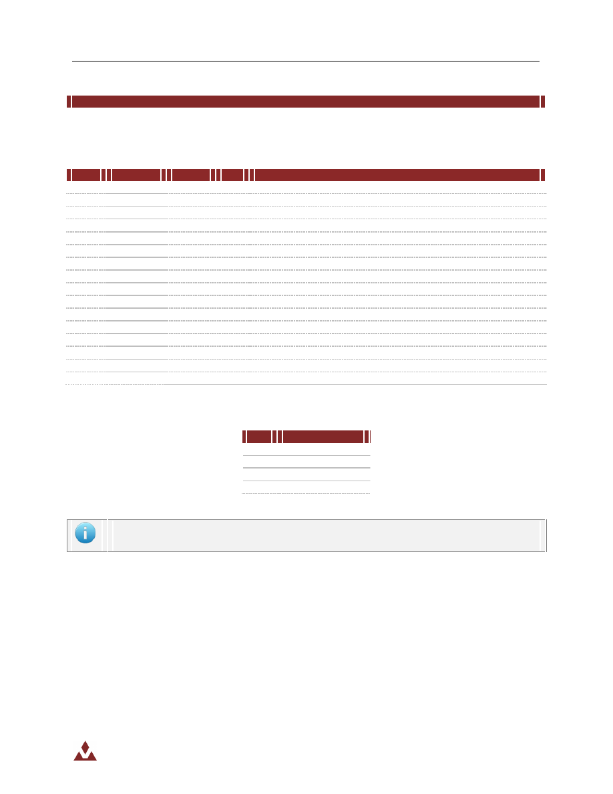{width="918"
height="1188"}

VN-200 User Manual

** **

** **

UM004

** **

 

VN-200 User Manual 

102/141 

 

**GPS Solution - ECEF **

8.1.2

**GPS Solution -- ECEF**

** **

**Register ID : **

59 

**Async Header : **

GPE 

**Access : **

Read Only 

**Comment : **

Available at 5Hz only. 

**Size (Bytes): **

72 

**Example Read **

**Response: **

\$VNRRG,59,333752.800322,1694,3,06,-0626351.600,-5320522.490,+3449975.910,-\
000.810,-002.970,+000.850,+010.170,+010.170,+010.170,+002.740,1.80E-08\*35 

**Offset **

**Name **

**Format **

**Unit **

**Description **

0 

Tow 

double 

sec 

GPS time of week. 

8 

Week 

uint16 

week  Current GPS week. 

10 

GpsFix 

uint8 

- 

GPS fix type. See table below. 

11 

NumSats 

uint8 

- 

Number of GPS satellites used in solution. 

12 

- 

- 

- 

\-\--  4 PADDING BYTES  \-\-- 

16 

PositionX 

double 

m 

ECEF X coordinate. 

24 

PositionY 

double 

m 

ECEF Y coordinate. 

32 

PositionZ 

double 

m 

ECEF Z coordinate. 

40 

VelocityX 

float 

m/s 

ECEF X velocity. 

44 

VelocityY 

float 

m/s 

ECEF Y velocity. 

48 

VelocityZ 

float 

m/s 

ECEF Z velocity. 

52 

PosAccX 

float 

m 

ECEF X position accuracy estimate. 

56 

PosAccY 

float 

m 

ECEF Y position accuracy estimate. 

60 

PosAccZ 

float 

m 

ECEF Z position accuracy estimate. 

64 

SpeedAcc 

float 

m/s 

Speed accuracy estimate. 

68 

TimeAcc 

float 

sec 

Time accuracy estimate. 

 

**Table 53 - GPS Fix **

**Value **

**Description **

0 

No fix 

1 

Time only 

2 

2D 

3 

3D 

 

 

You  can  configure  the  device  to  output  this  register  at  a  fixed  rate  using  the  Async  Data  Output  Type \
register (Register
6).  Once configured the data in this register will be sent out with the \$VNGPE header. 

 

 

 
:::

::: {#page103-div style="position:relative;width:918px;height:1188px;"}
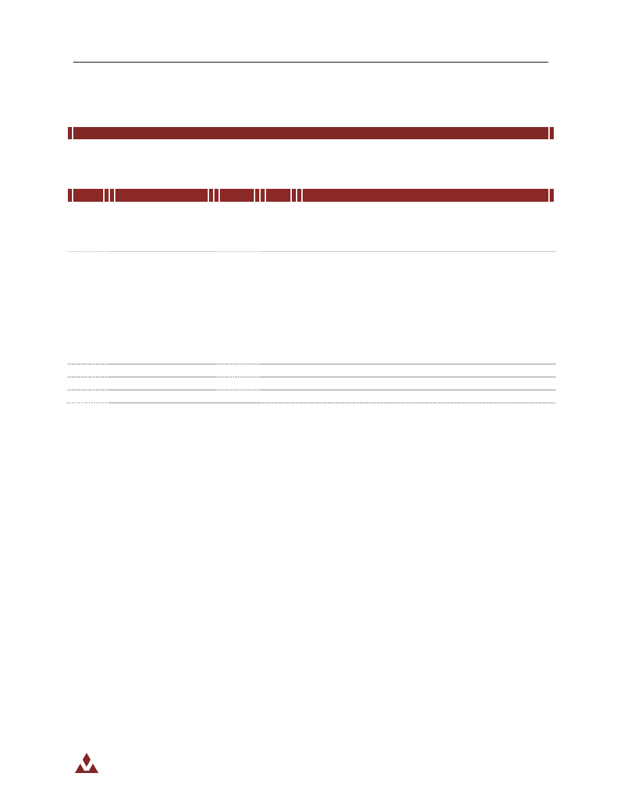{width="918"
height="1188"}

VN-200 User Manual

** **

** **

UM004

** **

 

VN-200 User Manual 

103/141 

 

**Configuration Registers **

8.2

 

**GPS Configuration **

8.2.1

**GPS Configuration**

** **

**Register ID : **

55 

**Firmware : **

1.0.0.0 

**Access : **

Read / Write 

**Comment : **

 

**Size (Bytes): **

5 

**Example Response: **

\$VNWRG,55,0,0,5,0,0\*6F 

**Offset **

**Name **

**Format **

**Unit **

**Description **

0 

Mode 

uint8 

- 

GPS mode. \
0 = Use onboard GPS. \
1 = Use external GPS. \
2 = Use external VN-200 as GPS. 

1 

PpsSource 

uint8 

- 

GPS PPS mode. \
0 = GPS PPS signal is present on the GPS_PPS pin (pin 24) \
and should trigger on a rising edge. \
1 = GPS PPS signal is present on the GPS_PPS pin (pin 24) \
and should trigger on a falling edge. \
2 = GPS PPS signal is present on the SyncIn pin (pin 22) and \
should trigger on a rising edge. \
3 = GPS PPS signal is present on the SyncIn pin (pin 22) and \
should trigger on a falling edge. 

2 

Reserved 

uint8 

- 

Reserved for internal use. Value must be set to 5. 

3 

Reserved 

uint8 

- 

Reserved for future use. Field should be set to zero. 

4 

Reserved 

uint8 

- 

Reserved for future use. Field should be set to zero. 

 

 

** **
:::

::: {#page104-div style="position:relative;width:918px;height:1188px;"}
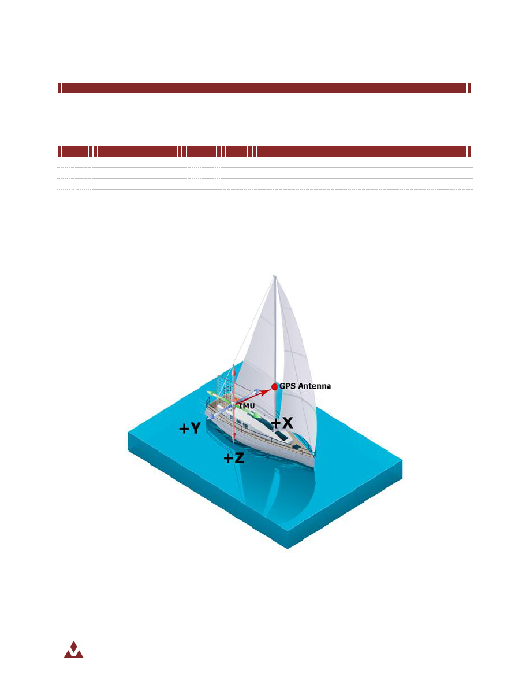{width="918"
height="1188"}

VN-200 User Manual

** **

** **

UM004

** **

 

VN-200 User Manual 

104/141 

 

**GPS Antenna Offset **

8.2.2

**GPS Antenna Offset**

** **

**Register ID : **

57 

**Firmware : **

1.0.0.0 

**Access : **

Read / Write 

**Comment : **

Configures the position offset of the GPS antenna from the VN-200 in the vehicle reference \
frame. 

**Size (Bytes): **

12 

**Example Response: **

\$VNRRG,57,0,0,0\*68 

**Offset **

**Name **

**Format **

**Unit **

**Description **

0 

PositionX 

float 

m 

Relative position of GPS antenna. (X-axis) 

4 

PositionY 

float 

m 

Relative position of GPS antenna. (Y-axis) 

8 

PositionZ 

float 

m 

Relative position of GPS antenna. (Z-axis) 

 

The position of the GPS antenna relative to the sensor in the vehicle coordinate frame also referred to \
as the GPS antenna lever arm.  In the example scenario shown in Figure 8 below, the GPS antenna offset \
is X= +2.5m, Y= +0.0m, Z= -2.0m. 

**Figure 8 - GPS Antenna Offset **

 

 

** **
:::

::: {#page105-div style="position:relative;width:918px;height:1188px;"}
{width="918"
height="1188"}

VN-200 User Manual

** **

** **

UM004

** **

 

VN-200 User Manual 

105/141 

 

**Factory Defaults **

8.3

**Settings Name **

**Default Factory Value **

GPS Configuration 

0,0,5,0,0 

GPS Antenna Offset 

0,0,0 

 

 

 

 

** **
:::

::: {#page106-div style="position:relative;width:918px;height:1188px;"}
{width="918"
height="1188"}

VN-200 User Manual

** **

** **

UM004

** **

 

VN-200 User Manual 

106/141 

 

**Command Prompt **

8.4

The command prompt provides a fast and simple means of configuring and monitoring the status of the \
sensor by typing commands to the unit using the serial port. 

 

**List Available Commands **

8.4.1

Commands for the System subsystem can be accessed by typing in 'gps' at the command prompt.  To \
view  all  available commands, type  'gps  ?'. Below  is  a view of a terminal window  showing a list of the \
available commands. 

gps ? 

 \
Gps Module Commands: 

 

Command:    Description: \
\-\-\-\-\-\-\-- 
  \-\-\-\-\-\-\-\-\-\-\-\-\-\-\-\-\-\-\-\-\-\-\-\-\-\-\-\-\-\-\-\-\-\-\-\-\-\-\-\-\-\-\-\-\-\-\-\-\-\-\-\-\-\-\-\-\-\-\-\-\-\-\-\-\-\-\-- \
meas        Current gps measurement, signal strength, and visible
satellites. 

 

**GPS Meas **

8.4.2

gps meas \
 

\-\-\-\-\-\-\-\-\-\-\-\-\-\-\-\-\-\-\-\-\-\-\-\-\-\-\-\-\--  Gps
Measurement
 \-\-\-\-\-\-\-\-\-\-\-\-\-\-\-\-\-\-\-\-\-\-\-\-\-\-\-\-\-\-- \
Gps Solution: \
  Sats visible : 18 \
  Sats used    : 14 \
  Latitude     : +32.89195060 deg \
  Longitude    : -096.70376560 deg \
  Altitude     : +00165.150 m \
  Pos Acc      : 05.94  07.83  05.26 m \
  Vel Acc      : 00.59 m/s \
  Time Acc     : 2 ns 

 

Space Vehicle Info: \
  Ch  SV 

CN0 

Residual 

Nav 

Qi 

El 

Az 

Orbit  Healthy 

DGPS 

  14   1   

40  

+0.11         Y 

7 

15 

142 

Eph 

Y 

 

Y 

  2    3   

43  

+0.46         Y 

7 

28 

44  

Eph 

Y 

 

Y 

  5    6   

37  

+0.00         Y 

7 

7  

40  

Eph 

Y 

 

Y 

  6    7   

50  

-0.53         Y 

7 

71 

6   

Eph 

Y 

 

Y 

  7    8   

47  

+0.29         Y 

7 

42 

322 

Eph 

Y 

 

Y 

  8    9   

47  

-0.58         Y 

7 

40 

320 

Eph 

Y 

 

Y 

  10   11  

43  

-0.32         Y 

7 

35 

125 

Eph 

Y 

 

Y 

  12   13  

47  

+0.40         Y 

7 

45 

186 

Eph 

Y 

 

Y 

  0    19  

47  

+0.15         Y 

7 

51 

57  

Eph 

Y 

 

Y 

  1    23  

42  

-1.36         Y 

7 

18 

170 

Eph 

Y 

 

Y 

  4    27  

41  

+0.19         Y 

7 

18 

41  

Eph 

Y 

 

Y 

  3    28  

48  

-0.33         Y 

7 

36 

273 

Eph 

Y 

 

Y 

  11   135 

47  

+0.68         Y 

7 

36 

233 

Eph 

Y 

 

N 

  13   138 

49  

+0.25         Y 

7 

50 

199 

Eph 

Y 

 

N 

  9    10  

30  

+0.00         N 

7 

3  

244 

Eph 

Y 

 

N 

  255  17  

0   

+0.00         N 

0 

4  

210 

\-\-- 

Y 

 

N 

  255  26  

0   

+0.00         N 

0 

5  

324 

\-\-- 

Y 

 

N 

  15   122 

0   

+0.00         N 

1 

29 

241 

none  N 

 

N 

\-\-\-\-\-\-\-\-\-\-\-\-\-\-\-\-\-\-\-\-\-\-\-\-\-\-\-\-\-\-\-\-\-\-\-\-\-\-\-\-\-\-\-\-\-\-\-\-\-\-\-\-\-\-\-\-\-\-\-\-\-\-\-\-\-\-\-\-\-\-\-\-\-\-\-\-\-\-\--

 

 
:::

::: {#page107-div style="position:relative;width:918px;height:1188px;"}
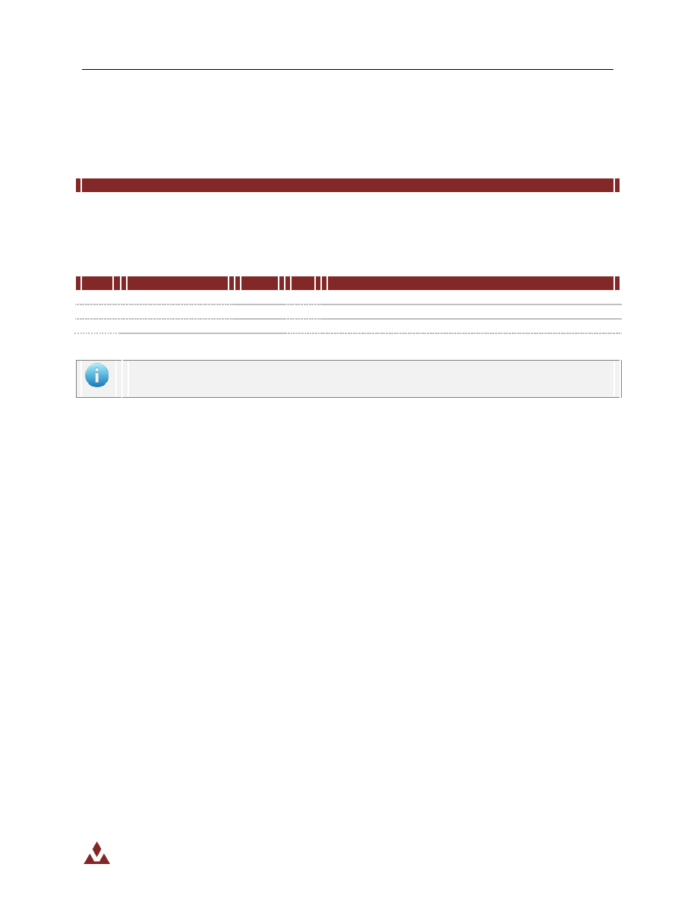{width="918"
height="1188"}

VN-200 User Manual

** **

** **

UM004

** **

 

VN-200 User Manual 

107/141 

**9**

** **

**Attitude Subsystem **

 

**Measurement Registers **

9.1

 

**Yaw Pitch Roll **

9.1.1

**Yaw, Pitch, and Roll**

** **

**Register ID : **

8 

**Async Header : **

YPR 

**Access : **

Read Only 

**Comment : **

Attitude solution as yaw, pitch, and roll
in degrees.  The yaw, pitch, and roll is \
given as a 3,2,1 Euler angle rotation sequence describing
the orientation of the \
sensor with respect to the inertial North East Down (NED) frame. 

**Size (Bytes): **

12 

**Example Response: **

\$VNRRG,8,+006.271,+000.031,-002.000\*66 

**Offset **

**Name **

**Format **

**Unit **

**Description **

0 

Yaw 

float 

deg 

Yaw angle. 

4 

Pitch 

float 

deg 

Pitch angle. 

8 

Roll 

float 

deg 

Roll angle. 

 

 

You  can  configure  the  device  to  output  this  register  at  a  fixed  rate  using  the  Async  Data  Output  Type \
register (Register
6).  Once configured the data in this register will be sent out with the \$VNYPR header. 

 

 

** **
:::

::: {#page108-div style="position:relative;width:918px;height:1188px;"}
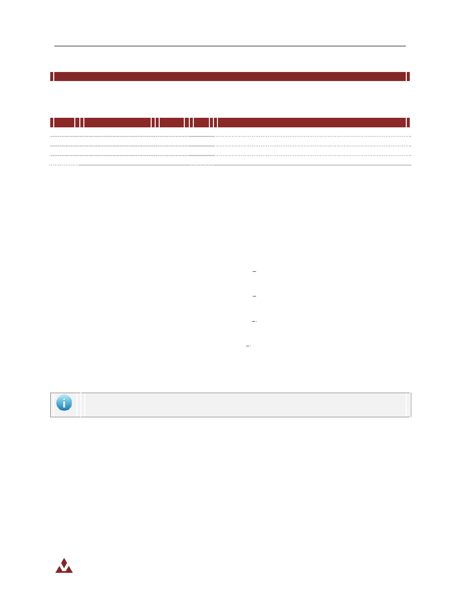{width="918"
height="1188"}

VN-200 User Manual

** **

** **

UM004

** **

 

VN-200 User Manual 

108/141 

 

**Attitude Quaternion **

9.1.2

**Quaternion**

** **

**Register ID : **

9 

**Async Header : **

QTN 

**Access : **

Read Only 

**Comment : **

Attitude solution as a quaternion. 

**Size (Bytes): **

16 

**Example Response: **

\$VNRRG,9,-0.017386,-0.000303,+0.055490,+0.998308\*4F 

**Offset **

**Name **

**Format **

**Unit **

**Description **

0 

Quat\[0\] 

float 

- 

Calculated attitude as quaternion. 

4 

Quat\[1\] 

float 

- 

Calculated attitude as quaternion. 

8 

Quat\[2\] 

float 

- 

Calculated attitude as quaternion. 

12 

Quat\[3\] 

float 

- 

Calculated attitude as quaternion. Scalar component. 

 

This  register  contains  four  values  representing  the  quaternion  vector.    The  quaternion  provides  a \
redundant,  nonsingular  attitude  representation  that  is  well  suited  for  describing  arbitrary,  large \
rotations.  The quaternion is a non-dimensional 4x1 unit vector with the fourth value as the scalar term.  \
The  fields of  this  register  are  represented with  fixed  point  precision  for  the  serial  protocol  and  32-bit \
floating  point  precision  for  the  SPI  protocol.    This  is  a  read-only  register.    All  filtering  and  other \
mathematical operations performed by the  VN-200 are performed using quaternions.  The quaternion \
used by the VN-200 has the following form. 

 \[ \]    

 

      (

 \
 

)

 

 \[ \]    

 

      (

 \
 

)

 

 \[ \]    

 

      (

 \
 

)

 

 \[ \]       (

 \
 

)

 

Where 

    {

 

 

 

 

 

 

}

 is the principal axis and 

 

 is the principal angle.  

 

You  can  configure  the  device  to  output  this  register  at  a  fixed  rate  using  the  Async  Data  Output  Type \
register (Register
6).  Once configured the data in this register will be sent out with the \$VNQTN header. 

 

** **
:::

::: {#page109-div style="position:relative;width:918px;height:1188px;"}
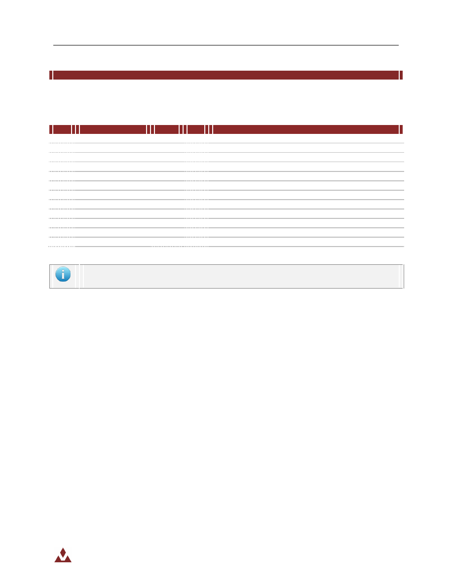{width="918"
height="1188"}

VN-200 User Manual

** **

** **

UM004

** **

 

VN-200 User Manual 

109/141 

 

**Yaw, Pitch, Roll, Magnetic, Acceleration, and Angular Rates **

9.1.3

**Yaw, Pitch, Roll, Magnetic, Acceleration, and Angular Rates**

** **

**Register ID : **

27 

**Async Header : **

YMR 

**Access : **

Read Only 

**Comment : **

Attitude solution, magnetic, acceleration, and compensated angular rates. 

**Size (Bytes): **

48 

**Example Response: **

\$VNRRG,27,+006.380,+000.023,-001.953,+1.0640,-\
0.2531,+3.0614,+00.005,+00.344,-09.758,-0.001222,-0.000450,-0.001218\*4F 

**Offset  Name **

**Format **

**Unit **

**Description **

0 

Yaw 

float 

deg 

Calculated attitude heading angle in degrees. 

4 

Pitch 

float 

deg 

Calculated attitude pitch angle in degrees. 

8 

Roll 

float 

deg 

Calculated attitude roll angle in degrees. 

12 

MagX 

float 

Gauss  Compensated magnetometer measurement in x-axis. 

16 

MagY 

float 

Gauss  Compensated magnetometer measurement in y-axis. 

20 

MagZ 

float 

Gauss  Compensated magnetometer measurement in z-axis. 

24 

AccelX 

float 

m/s

2

 

Compensated accelerometer measurement in x-axis. 

28 

AccelY 

float 

m/s

2

 

Compensated accelerometer measurement in y-axis. 

32 

AccelZ 

float 

m/s

2

 

Compensated accelerometer measurement in z-axis. 

36 

GyroX 

float 

rad/s 

Compensated angular rate in x-axis. 

40 

GyroY 

float 

rad/s 

Compensated angular rate in y-axis. 

44 

GyroZ 

float 

rad/s 

Compensated angular rate in z-axis. 

 

 

You  can  configure  the  device  to  output  this  register  at  a  fixed  rate  using  the  Async  Data  Output  Type \
register (Register
6).  Once configured the data in this register will be sent out with the \$VNYMR
header. 

 

** **
:::

::: {#page110-div style="position:relative;width:918px;height:1188px;"}
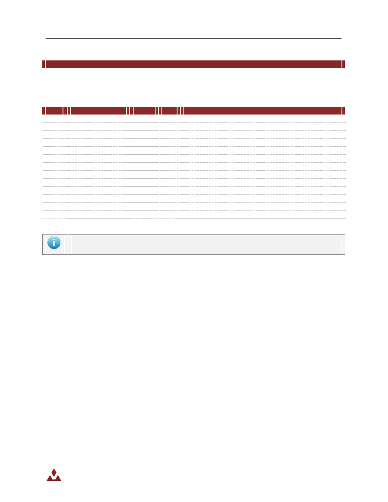{width="918"
height="1188"}

VN-200 User Manual

** **

** **

UM004

** **

 

VN-200 User Manual 

110/141 

 

**Quaternion, Magnetic, Acceleration and Angular Rates **

9.1.4

**Quaternion, Magnetic, Acceleration, and Angular Rates**

** **

**Register ID : **

15 

**Async Header : **

QMR 

**Access : **

Read Only 

**Comment : **

Attitude solution, magnetic, acceleration, and compensated angular rates. 

**Size (Bytes): **

52 

**Example Response: **

\$VNRRG,15,-0.017057,-0.000767,+0.056534,+0.998255,+1.0670,-0.2568,+3.0696,-\
00.019,+00.320,-09.802,-0.002801,-0.001186,-0.001582\*65 

**Offset **

**Name **

**Format **

**Unit **

**Description **

0 

Quat\[0\] 

float 

- 

Calculated attitude as quaternion. 

4 

Quat\[1\] 

float 

- 

Calculated attitude as quaternion. 

8 

Quat\[2\] 

float 

- 

Calculated attitude as quaternion. 

12 

Quat\[3\] 

float 

- 

Calculated attitude as quaternion. Scalar component. 

16 

MagX 

float 

Gauss  Compensated magnetometer measurement in x-axis. 

20 

MagY 

float 

Gauss  Compensated magnetometer measurement in y-axis. 

24 

MagZ 

float 

Gauss  Compensated magnetometer measurement in z-axis. 

28 

AccelX 

float 

m/s

2

 

Compensated accelerometer measurement in x-axis. 

32 

AccelY 

float 

m/s

2

 

Compensated accelerometer measurement in y-axis. 

36 

AccelZ 

float 

m/s

2

 

Compensated accelerometer measurement in z-axis. 

40 

GyroX 

float 

rad/s 

Compensated angular rate in x-axis. 

44 

GyroY 

float 

rad/s 

Compensated angular rate in y-axis. 

48 

GyroZ 

float 

rad/s 

Compensated angular rate in z-axis. 

 

 

You  can  configure  the  device  to  output  this  register  at  a  fixed  rate  using  the  Async  Data  Output  Type \
register (Register
6).  Once configured the data in this register will be sent out with the \$VNQMR header. 

 

 

** **
:::

::: {#page111-div style="position:relative;width:918px;height:1188px;"}
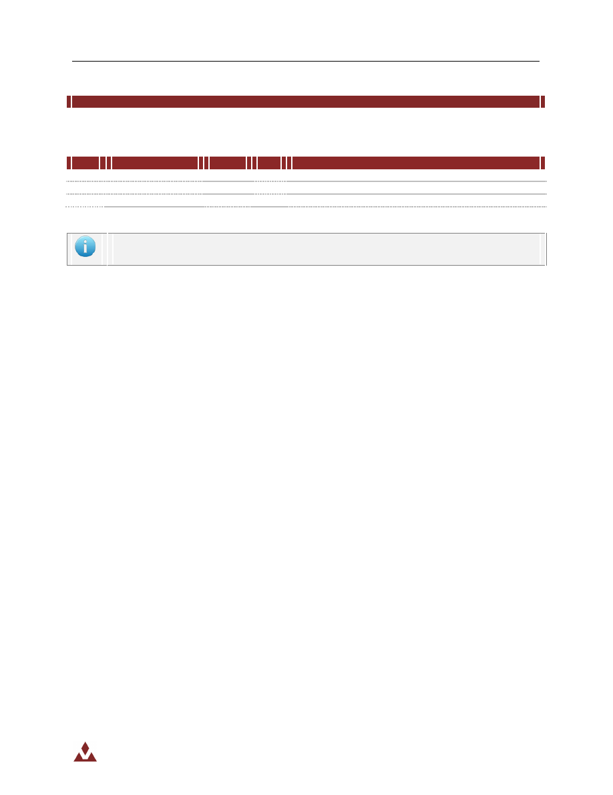{width="918"
height="1188"}

VN-200 User Manual

** **

** **

UM004

** **

 

VN-200 User Manual 

111/141 

 

**Magnetic Measurements **

9.1.5

**Magnetic Measurements**

** **

**Register ID : **

17 

**Async Header : **

MAG 

**Access : **

Read Only 

**Comment : **

Magnetometer measurements. 

**Size (Bytes): **

12 

**Example Response: **

\$VNRRG,17,+1.0647,-0.2498,+3.0628\*66 

**Offset **

**Name **

**Format **

**Unit **

**Description **

0 

MagX 

float 

Gauss  Compensated magnetometer measurement in x-axis. 

4 

MagY 

float 

Gauss  Compensated magnetometer measurement in y-axis. 

8 

MagZ 

float 

Gauss  Compensated magnetometer measurement in z-axis. 

 

 

You  can  configure  the  device  to  output  this  register  at  a  fixed  rate  using  the  Async  Data  Output  Type \
register (Register
6).  Once configured the data in this register will be sent out with the \$VNMAG header. 

 

** **
:::

::: {#page112-div style="position:relative;width:918px;height:1188px;"}
{width="918"
height="1188"}

VN-200 User Manual

** **

** **

UM004

** **

 

VN-200 User Manual 

112/141 

 

**Acceleration Measurements **

9.1.6

**Acceleration Measurements**

** **

**Register ID : **

18 

**Async Header : **

ACC 

**Access : **

Read Only 

**Comment : **

Acceleration measurements. 

**Size (Bytes): **

12 

**Example Response: **

\$VNRRG,18,+00.013,+00.354,-09.801\*65 

**Offset **

**Name **

**Format **

**Unit **

**Description **

0 

AccelX 

float 

m/s

2

 

Compensated accelerometer measurement in x-axis. 

4 

AccelY 

float 

m/s

2

 

Compensated accelerometer measurement in y-axis. 

8 

AccelZ 

float 

m/s

2

 

Compensated accelerometer measurement in z-axis. 

 

 

You  can  configure  the  device  to  output  this  register  at  a  fixed  rate  using  the  Async  Data  Output  Type \
register (Register
6).  Once configured the data in this register will be sent out with the \$VNACC
header. 

 

** **
:::

::: {#page113-div style="position:relative;width:918px;height:1188px;"}
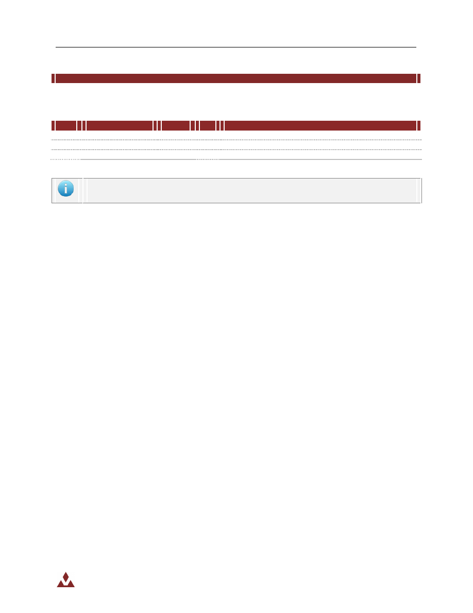{width="918"
height="1188"}

VN-200 User Manual

** **

** **

UM004

** **

 

VN-200 User Manual 

113/141 

 

**Angular Rate Measurements **

9.1.7

**Angular Rate Measurements **

**Register ID : **

19 

**Async Header : **

GYR 

**Access : **

Read Only 

**Comment : **

Compensated angular rates. 

**Size (Bytes): **

12 

**Example Response: **

\$VNRRG,19,+0.002112,-0.000362,-0.000876\*6C 

**Offset **

**Name **

**Format **

**Unit **

**Description **

0 

GyroX 

float 

rad/s  Compensated angular rate in x-axis. 

4 

GyroY 

float 

rad/s  Compensated angular rate in y-axis. 

8 

GyroZ 

float 

rad/s  Compensated angular rate in z-axis. 

 

 

You  can  configure  the  device  to  output  this  register  at  a  fixed  rate  using  the  Async  Data  Output  Type \
register (Register
6).  Once configured the data in this register will be sent out with the \$VNGYR
header. 

 

 
:::

::: {#page114-div style="position:relative;width:918px;height:1188px;"}
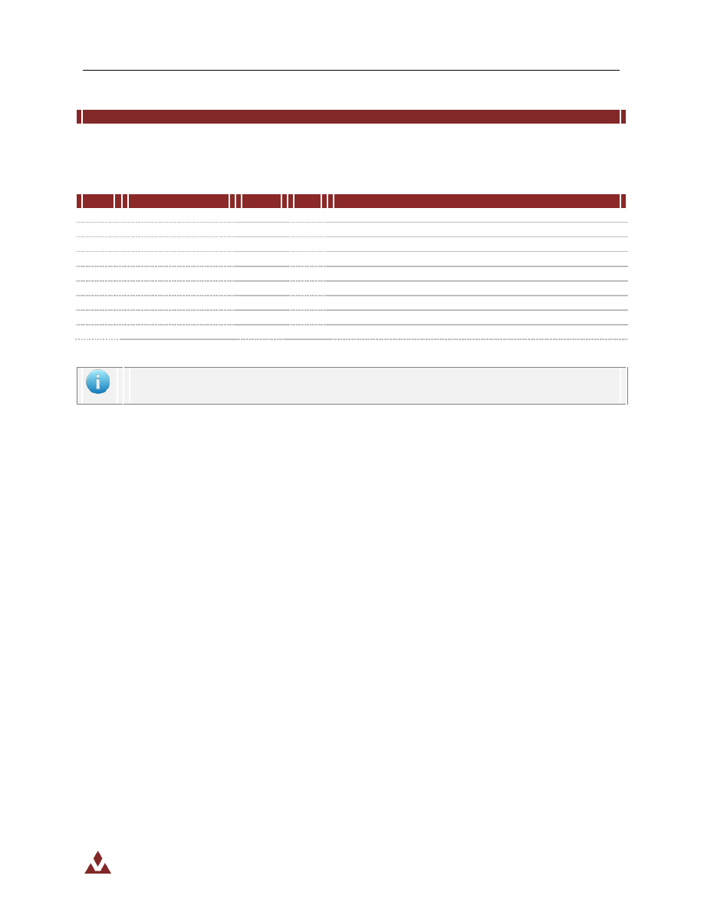{width="918"
height="1188"}

VN-200 User Manual

** **

** **

UM004

** **

 

VN-200 User Manual 

114/141 

 

**Magnetic, Acceleration and Angular Rates **

9.1.8

**Magnetic, Acceleration, and Angular Rates**

** **

**Register ID : **

20 

**Async Header : **

MAR 

**Access : **

Read Only 

**Comment : **

Magnetic, acceleration, and compensated angular rates. 

**Size (Bytes): **

36 

**Example Response: **

\$VNRRG,20,+1.0684,-0.2578,+3.0649,-00.005,+00.341,-09.780,-0.000963,+0.000840,-\
0.000466\*64 

**Offset **

**Name **

**Format **

**Unit **

**Description **

0 

MagX 

float 

Gauss  Compensated magnetometer measurement in x-axis. 

4 

MagY 

float 

Gauss  Compensated magnetometer measurement in y-axis. 

8 

MagZ 

float 

Gauss  Compensated magnetometer measurement in z-axis. 

12 

AccelX 

float 

m/s

2

 

Compensated accelerometer measurement in x-axis. 

16 

AccelY 

float 

m/s

2

 

Compensated accelerometer measurement in y-axis. 

20 

AccelZ 

float 

m/s

2

 

Compensated accelerometer measurement in z-axis. 

24 

GyroX 

float 

rad/s 

Compensated angular rate in x-axis. 

28 

GyroY 

float 

rad/s 

Compensated angular rate in y-axis. 

32 

GyroZ 

float 

rad/s 

Compensated angular rate in z-axis. 

 

 

You  can  configure  the  device  to  output  this  register  at  a  fixed  rate  using  the  Async  Data  Output  Type \
register (Register
6).  Once configured the data in this register will be sent out with the \$VNMAR
header. 

 

 
:::

::: {#page115-div style="position:relative;width:918px;height:1188px;"}
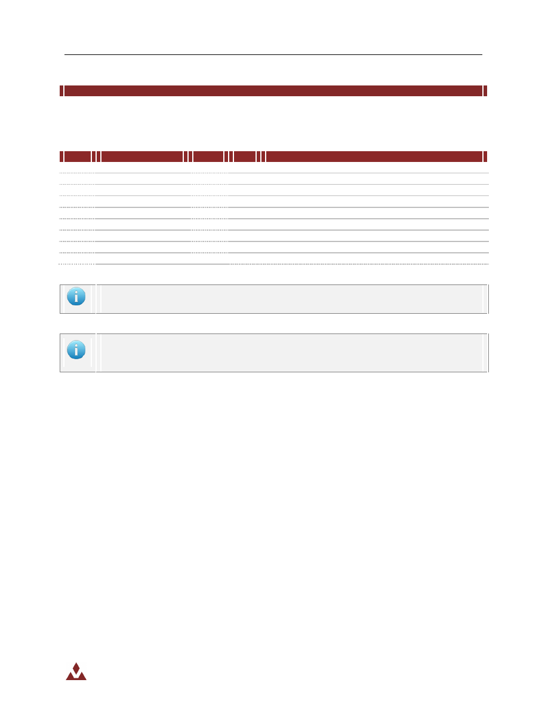{width="918"
height="1188"}

VN-200 User Manual

** **

** **

UM004

** **

 

VN-200 User Manual 

115/141 

 

**Yaw, Pitch, Roll, True Body Acceleration, and Angular Rates **

9.1.9

**Yaw, Pitch, Roll, True Body Acceleration, and Angular Rates**

** **

**Register ID : **

239 

**Async Header : **

YBA 

**Access : **

Read Only 

**Comment : **

Attitude solution as yaw, pitch, roll and the inertial acceleration. 

**Size (Bytes): **

36 

**Example Response: **

\$VNRRG,239,-124.743,+001.019,-000.203,+00.019,-00.001,+00.039,+00.001665,-\
00.000785,+00.000647\*55 

**Offset **

**Name **

**Format **

**Unit **

**Description **

0 

Yaw 

float 

deg 

Calculated attitude heading angle in degrees. 

4 

Pitch 

float 

deg 

Calculated attitude pitch angle in degrees. 

8 

Roll 

float 

deg 

Calculated attitude roll angle in degrees. 

12 

BodyAccelX 

float 

m/s

2

 

Linear acceleration estimate in the body X-axis. (no gravity) 

16 

BodyAccelY 

float 

m/s

2

 

Linear acceleration estimate in the body Y-axis. (no gravity) 

20 

BodyAccelZ 

float 

m/s

2

 

Linear acceleration estimate in the body Z-axis. (no gravity) 

24

 

GyroX 

float 

rad/s 

Compensated angular rate in the body X-axis. 

28

 

GyroY 

float 

rad/s 

Compensated angular rate in the body Y-axis. 

32

 

GyroZ 

float 

rad/s 

Compensated angular rate in the body Z-axis. 

 

 

You  can  configure  the  device  to  output  this  register  at  a  fixed  rate  using  the  Async  Data  Output  Type \
register (Register
6).  Once configured the data in this register will be sent out with the \$VNYBA
header. 

 

 

This register contains the true measured acceleration.  The accelerometer measures both acceleration \
and the effect of static gravity in the body frame.  This register
contains the true acceleration which does \
not contain gravity and should measure 0 when the device is stationary. 

 

** **
:::

::: {#page116-div style="position:relative;width:918px;height:1188px;"}
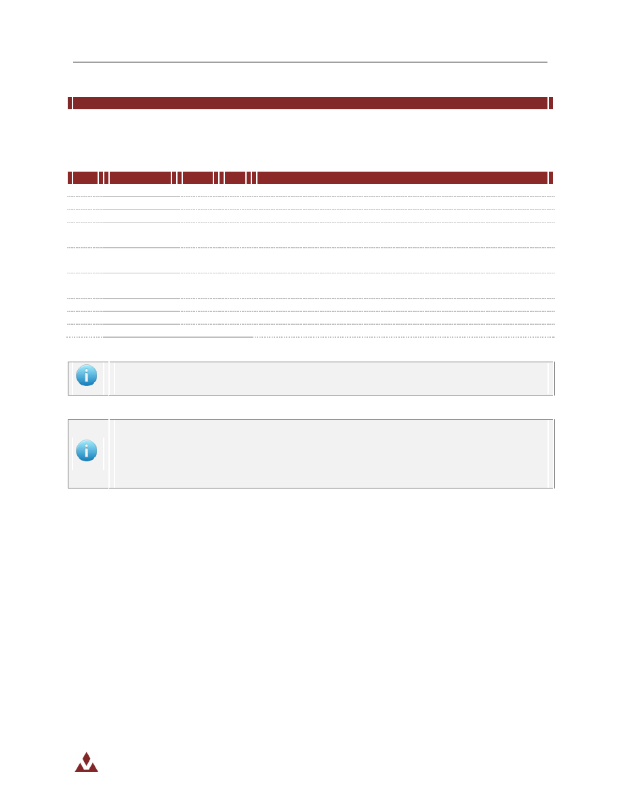{width="918"
height="1188"}

VN-200 User Manual

** **

** **

UM004

** **

 

VN-200 User Manual 

116/141 

 

**Yaw, Pitch, Roll, True Inertial Acceleration, and Angular Rates **

9.1.10

**Yaw, Pitch, Roll, True Inertial Acceleration and Angular Rates**

** **

**Register ID : **

240 

**Async Header : **

YIA 

**Access : **

Read Only 

**Comment : **

Attitude solution as yaw, pitch, roll and the inertial acceleration. 

**Size (Bytes): **

36 

**Example Response: **

\$VNRRG,240,-124.642,+000.993,-000.203,+00.009,-00.027,+00.084,-00.000479,-\
00.000522,+00.000076\*5F 

**Offset  Name **

**Format  Unit **

**Description **

0 

Yaw 

float 

deg 

Calculated attitude heading angle in degrees. 

4 

Pitch 

float 

deg 

Calculated attitude pitch angle in degrees. 

8 

Roll 

float 

deg 

Calculated attitude roll angle in degrees. 

12 

InertialAccelX 

float 

m/s

2

 

Compensated acceleration estimate in the inertial NED X-axis. (no \
gravity) 

16 

InertialAccelY 

float 

m/s

2

 

Compensated acceleration estimate in the inertial NED Y-axis. (no \
gravity) 

20 

InertialAccelZ 

float 

m/s

2

 

Compensated acceleration estimate in the inertial NED Z-axis. (no \
gravity) 

24 

GyroX 

float 

rad/s  Compensated angular rate in the body X-axis. 

28 

GyroY 

float 

rad/s  Compensated angular rate in the body Y-axis. 

32 

GyroZ 

float 

rad/s  Compensated angular rate in the body Z-axis. 

 

 

You  can  configure  the  device  to  output  this  register  at  a  fixed  rate  using  the  Async  Data  Output  Type \
register (Register
6).  Once configured the data in this register will be sent out with the \$VNYIA header. 

 

 

This register contains the true measured acceleration.  The accelerometer measures both acceleration \
and the effect of static gravity in the body frame.  This register
contains the true acceleration which does \
not contain gravity and should measure 0 when the device is stationary. The true acceleration provided \
in  this  register  is  measured  in  the  inertial  frame.    This  means  that  an  up/down  movement  will  always \
appear as an acceleration in the Z-axis on this register
regardless of the orientation of the VN-200. 

 

 
:::

::: {#page117-div style="position:relative;width:918px;height:1188px;"}
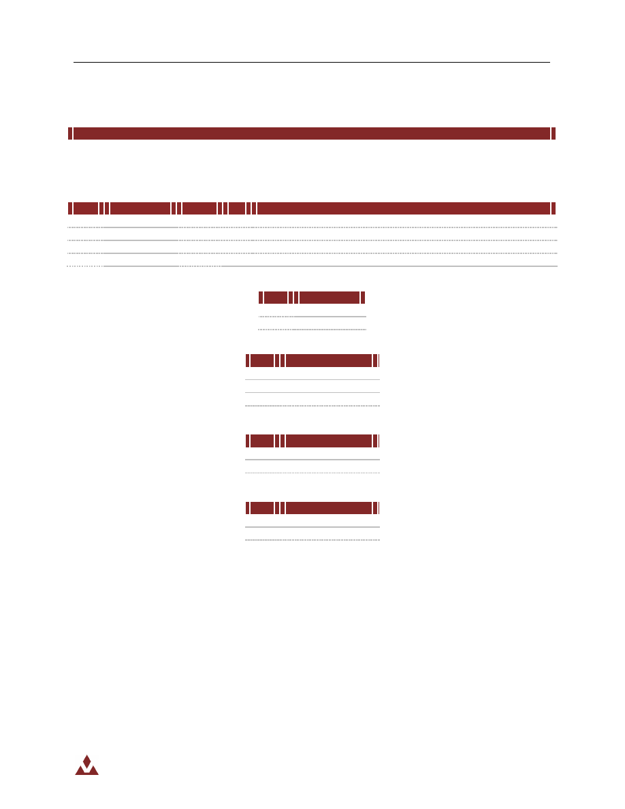{width="918"
height="1188"}

VN-200 User Manual

** **

** **

UM004

** **

 

VN-200 User Manual 

117/141 

 

**Configuration Registers **

9.2

 

**VPE Basic Control **

9.2.1

**VPE Basic Control**

** **

**Register ID : **

35 

**Firmware : **

v1.0.0.0 

**Access : **

Read / Write 

**Comment : **

Provides  control  over  various  features  relating  to  the  onboard  attitude  filtering \
algorithm.   

**Size (Bytes): **

4 

**Example Response: **

\$VNRRG,35,1,3,1,1\*77 

**Offset  Name **

**Format **

**Unit  Description **

0 

Enable 

uint8 

- 

Enable / Disable the Vector Processing Engine (VPE). 

1 

HeadingMode 

uint8 

- 

Heading mode used by the VPE. 

2 

FilteringMode 

uint8 

- 

Filtering Mode used by the VPE.  

3 

TuningMode 

uint8 

- 

Tuning Mode used by the VPE. 

**Table 54 -- Enable **

**Value  State **

0 

DISABLE 

1 

ENABLE 

**Table 55 -- HeadingMode **

**Value  Mode **

0 

Absolute Heading 

1 

Relative Heading 

2 

Indoor Heading 

**Table 56 - Filtering Mode **

**Value  Mode **

0 

OFF 

1 

MODE 1 

**Table 57 - Tuning Mode **

**Value  Mode **

0 

OFF 

1 

MODE 1 

 

 

 
:::

::: {#page118-div style="position:relative;width:918px;height:1188px;"}
{width="918"
height="1188"}

VN-200 User Manual

** **

** **

UM004

** **

 

VN-200 User Manual 

118/141 

 

**VPE Magnetometer Basic Tuning **

9.2.2

**VPE Magnetometer Basic Tuning**

** **

**Register ID : **

36 

**Firmware : **

v1.0.0.0 

**Access : **

Read / \
Write 

**Comment : **

Provides basic control of the adaptive filtering and tuning
for the magnetometer. 

**Size (Bytes): **

36 

**Example Response: **

\$VNRRG,36,5,5,5,3,3,3,4,4,4\*68 

**Offset **

**Name **

**Format  Unit **

**Description **

0 

BaseTuningX 

float 

0 / 10 

Base Magnetic Tuning X-Axis \[0 - 10\]. \
This sets the level of confidence placed in the magnetometer X-\
axis when no disturbances are present.  A larger number \
provides better heading accuracy, but with more sensitivity to \
magnetic interference. 

4 

BaseTuningY 

float 

0 / 10 

Base Magnetic Tuning Y-Axis \[0 - 10\]. \
This sets the level of confidence placed in the magnetometer Y-\
axis when no disturbances are present.  A larger number \
provides better heading accuracy, but with more sensitivity to \
magnetic interference. 

8 

BaseTuningZ 

float 

0 / 10 

Base Magnetic Tuning Z-Axis \[0 - 10\]. \
This sets the level of confidence placed in the magnetometer Z-\
axis when no disturbances are present.  A larger number \
provides better heading accuracy, but with more sensitivity to \
magnetic interference. 

12 

AdaptiveTuningX 

float 

0 / 10 

Level of adaptive tuning for X-Axis. 

16 

AdaptiveTuningY 

float 

0 / 10 

Level of adaptive tuning for Y-Axis. 

20 

AdaptiveTuningZ 

float 

0 / 10 

Level of adaptive tuning for Z-Axis. 

24 

AdaptiveFilteringX  float 

0 / 10 

Level of adaptive filtering for X-Axis. 

28 

AdaptiveFilteringY  float 

0 / 10 

Level of adaptive filtering for Y-Axis. 

32 

AdaptiveFilteringZ  float 

0 / 10 

Level of adaptive filtering for Z-Axis. 

 

 

** **
:::

::: {#page119-div style="position:relative;width:918px;height:1188px;"}
{width="918"
height="1188"}

VN-200 User Manual

** **

** **

UM004

** **

 

VN-200 User Manual 

119/141 

 

**VPE Accelerometer Basic Tuning **

9.2.3

**VPE Accelerometer Basic Tuning**

** **

**Register ID : **

38 

**Firmware : **

v1.0.0.0 

**Access : **

Read / \
Write 

**Comment : **

Provides basic control of the adaptive filtering and tuning
for the accelerometer. 

**Size (Bytes): **

36 

**Example Response: **

\$VNRRG,38,5,5,5,3,3,3,4,4,4\*66 

**Offset **

**Name **

**Format  Unit **

**Description **

0 

BaseTuningX 

float 

0 / 10 

Base Accelerometer Tuning X-Axis \[0 - 10\]. \
This sets the level of confidence placed in the accelerometer X-\
axis when no disturbances are present.  A larger number \
provides better pitch/roll heading accuracy, but with more \
sensitivity to acceleration interference. 

4 

BaseTuningY 

float 

0 / 10 

Base Accelerometer Tuning Y-Axis \[0 - 10\]. \
This sets the level of confidence placed in the accelerometer Y-\
axis when no disturbances are present.  A larger number \
provides better pitch/roll accuracy, but with more sensitivity to \
acceleration interference. 

8 

BaseTuningZ 

float 

0 / 10 

Base Accelerometer Tuning Z-Axis \[0 - 10\]. \
This sets the level of confidence placed in the accelerometer Z-\
axis when no disturbances are present.  A larger number \
provides better pitch/roll accuracy, but with more sensitivity to \
acceleration interference. 

12 

AdaptiveTuningX 

float 

0 / 10 

Level of adaptive tuning for X-Axis. 

16 

AdaptiveTuningY 

float 

0 / 10 

Level of adaptive tuning for Y-Axis. 

20 

AdaptiveTuningZ 

float 

0 / 10 

Level of adaptive tuning for Z-Axis. 

24 

AdaptiveFilteringX  float 

0 / 10 

Level of adaptive filtering for X-Axis. 

28 

AdaptiveFilteringY  float 

0 / 10 

Level of adaptive filtering for Y-Axis. 

32 

AdaptiveFilteringZ  float 

0 / 10 

Level of adaptive filtering for Z-Axis. 

 

 

** **
:::

::: {#page120-div style="position:relative;width:918px;height:1188px;"}
{width="918"
height="1188"}

VN-200 User Manual

** **

** **

UM004

** **

 

VN-200 User Manual 

120/141 

 

**Factory Defaults **

9.3

**Settings Name **

**Default Factory Value **

VPE Basic Control 

1,1,1,1 

VPE Magnetic Basic Tuning 

4,4,4,5,5,5,5.5,5.5,5.5 

VPE Accelerometer Basic Tuning 

6,6,6,3,3,3,5,5,5 

 

 

** **
:::

::: {#page121-div style="position:relative;width:918px;height:1188px;"}
{width="918"
height="1188"}

VN-200 User Manual

** **

** **

UM004

** **

 

VN-200 User Manual 

121/141 

**10**

** **

**INS Subsystem **

 

**Commands **

10.1

 

**Set Filter Bias Command **

10.1.1

This command will instruct the VN-200 to copy the current filter bias estimates into register 74.  After \
sending  this  command  you  will  need  to  issue  the  write  settings  command  (Section[  6.1.3)  ](vn200-64.html)to  save  the \
state of this register to flash memory.  Once saved the VN-200 will use these bias estimates as the initial \
state at startup. 

**Table 58 - Example Gyro Bias Command **

Example Command 

Message 

UART Command 

\$VNSFB\*4D 

UART Response 

\$VNSFB\*4D 

SPI Command (8 bytes) 

11 00 00 00 (shown as hex) 

SPI Response (8 bytes) 

00 11 00 00 (shown as hex) 

 

 
:::

::: {#page122-div style="position:relative;width:918px;height:1188px;"}
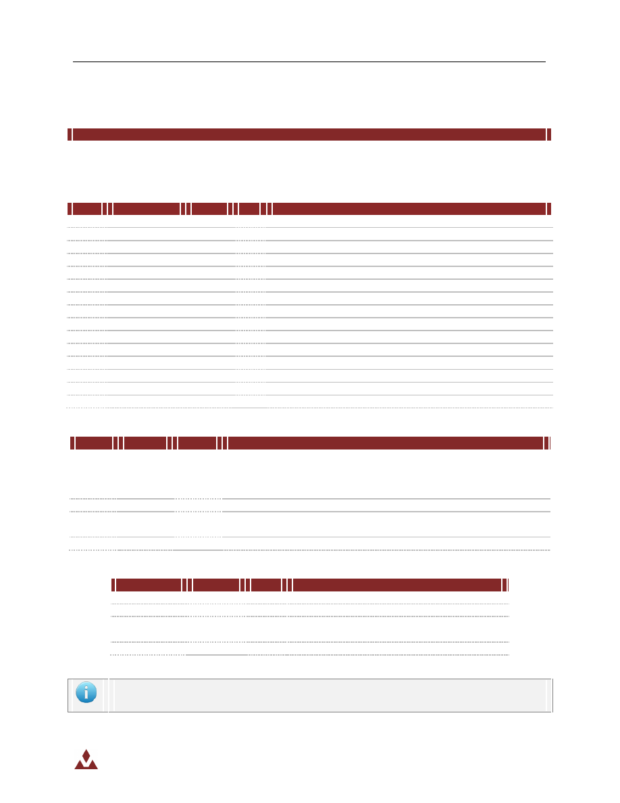{width="918"
height="1188"}

VN-200 User Manual

** **

** **

UM004

** **

 

VN-200 User Manual 

122/141 

 

**Measurement Registers **

10.2

 

**INS Solution -- LLA**

** **

10.2.1

**INS Solution - LLA**

** **

**Register ID : **

63 

**Async Header : **

INS 

**Access : **

Read Only 

**Comment : **

 

**Size (Bytes): **

72 

**Example Response: **

\$VNRRG,63,333811.902862,1694,0004,+009.500,-004.754,-000.225,+32.95602815,-\
096.71424297,+00171.195,-000.840,-000.396,-000.109,07.8,01.6,0.23\*5F 

**Offset **

**Name **

**Format **

**Unit **

**Description **

0 

Time 

double 

sec 

GPS time of week in seconds. 

8 

Week 

uint16 

week  GPS week. 

10 

Status 

uint16 

- 

Status flags for INS filter.  Hexadecimal format.  See table below. 

12 

Yaw 

float 

deg 

Yaw angle relative to true north. 

16 

Pitch 

float 

deg 

Pitch angle relative to horizon. 

20 

Roll 

float 

deg 

Roll angle relative to horizon. 

24 

Latitude 

double 

deg 

INS solution position in geodetic latitude. 

32 

Longitude 

double 

deg 

INS solution position in geodetic longitude. 

40 

Altitude 

double 

m 

Height above ellipsoid. (WGS84) 

48 

NedVelX 

float 

m/s 

INS solution velocity in NED frame. (North) 

52 

NedVelY 

float 

m/s 

INS solution velocity in NED frame. (East) 

56 

NedVelZ 

float 

m/s 

INS solution velocity in NED frame. (Down) 

60 

AttUncertainty 

float 

deg 

Uncertainty in attitude estimate. 

64 

PosUncertainty 

float 

m 

Uncertainty in position estimate. 

68 

VelUncertainty 

float 

m/s 

Uncertainty in velocity estimate. 

**Table 59 - INS Status **

**Name **

**Bit Offset **

**Format **

**Description **

Mode 

0 

2 bits 

Indicates the current mode of the INS filter. \
0 = Not tracking. Insufficient dynamic motion to estimate attitude. \
1 =
Sufficient dynamic motion, but solution not within performance specs. \
2 = INS is tracking and operating within specifications. 

GpsFix 

2 

1 bit 

Indicates whether the GPS has a proper fix. 

Error 

3 

4 bits 

Sensor measurement error code. See table below. \
0 = No errors detected.  

Reserved  7 

9 bits 

Reserved for future use. 

**Table 60 - Error Bitfield **

**Name **

**Bit Offset **

**Format  Description **

Time Error 

0 

1 bit 

High if INS filter loop exceeds 5 ms. 

IMU Error 

1 

1 bit 

High if IMU communication error is detected. 

Mag/Pres Error 

2 

1 bit 

High if Magnetometer or Pressure sensor error is \
detected. 

GPS Error 

3 

1 bit 

High if GPS communication error is detected. 

 

 

You  can  configure  the  device  to  output  this  register  at  a  fixed  rate  using  the  Async  Data  Output  Type \
register (Register
6).  Once configured the data in this register will be sent out with the \$VNINS
header. 
:::

::: {#page123-div style="position:relative;width:918px;height:1188px;"}
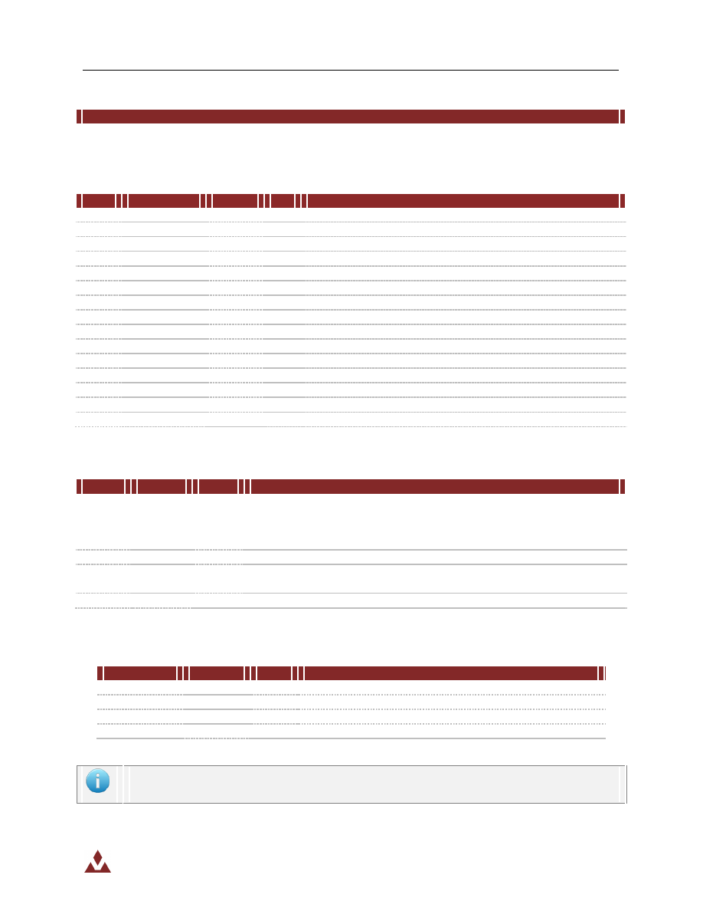{width="918"
height="1188"}

VN-200 User Manual

** **

** **

UM004

** **

 

VN-200 User Manual 

123/141 

 

**INS Solution - ECEF **

10.2.2

**INS Solution -- ECEF**

** **

**Register ID : **

64 

**Async Header : **

INE 

**Access : **

Read Only 

**Comment : **

 

**Size (Bytes): **

72 

**Example Response: **

\$VNRRG,64,333837.222917,1694,0004,+009.315,-004.767,-000.193,-0626356.433,-\
5320530.947,+3449961.679,-000.224,-000.476,-000.564,07.7,01.5,0.22\*65 

**Offset **

**Name **

**Format **

**Unit **

**Description **

0 

Time 

double 

sec 

GPS time of week in seconds. 

8 

Week 

uint16 

week  GPS week. 

10 

Status 

uint16 

- 

Status flags for INS filter.  See table below. 

12 

Yaw 

float 

deg 

Yaw angle relative to true north. 

16 

Pitch 

float 

deg 

Pitch angle relative to horizon. 

20 

Roll 

float 

deg 

Roll angle relative to horizon. 

24 

PositionX 

double 

m 

INS solution position in ECEF. (X-axis) 

32 

PositionY 

double 

m 

INS solution position in ECEF. (Y-axis) 

40 

PositionZ 

double 

m 

INS solution position in ECEF. (Z-axis) 

48 

VelocityX 

float 

m/s 

INS solution velocity in ECEF frame. (X-axis) 

52 

VelocityY 

float 

m/s 

INS solution velocity in ECEF frame. (Y-axis) 

56 

VelocityZ 

float 

m/s 

INS solution velocity in ECEF frame. (Z-axis) 

60 

AttUncertainty 

float 

deg 

Expected uncertainty in estimated attitude. 

64 

PosUncertainty  float 

m 

Expected uncertainty in estimated position. 

68 

VelUncertainty 

float 

m/s 

Expected uncertainty in estimated velocity. 

 

**Table 61 - INS Status **

**Name **

**Bit Offset **

**Format **

**Description **

Mode 

0 

2 bits 

Indicates the current mode of the INS filter. \
0 = Not tracking. Insufficient dynamic motion to estimate attitude. \
1 =
Sufficient dynamic motion, but solution not within performance specs. \
2 = INS is tracking and operating within specifications. 

GpsFix 

2 

1 bit 

Indicates whether the GPS has a proper fix. 

Error 

3 

4 bits 

Sensor measurement error code. See table below. \
0 = No errors detected.  

Reserved  7 

9 bits 

Reserved for future use. 

** **

**Table 62 - Error Bitfield **

**Name **

**Bit Offset **

**Format  Description **

Time Error 

0 

1 bit 

High if INS filter loop exceeds 5ms. 

IMU Error 

1 

1 bit 

High if IMU communication error is detected. 

Mag/Pres Error 

2 

1 bit 

High if Magnetometer or Pressure sensor error is detected. 

GPS Error 

3 

1 bit 

High if GPS communication error is detected. 

 

 

You  can  configure  the  device  to  output  this  register  at  a  fixed  rate  using  the  Async  Data  Output  Type \
register (Register
6).  Once configured the data in this register will be sent out with the \$VNINE header. 
:::

::: {#page124-div style="position:relative;width:918px;height:1188px;"}
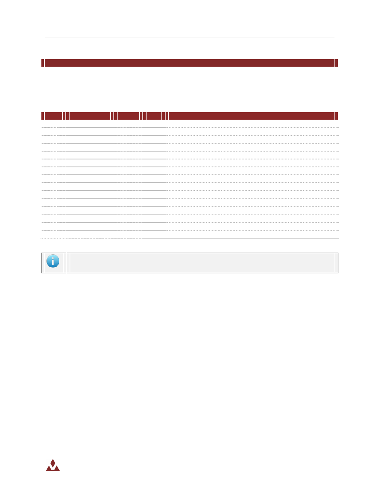{width="918"
height="1188"}

VN-200 User Manual

** **

** **

UM004

** **

 

VN-200 User Manual 

124/141 

 

**INS State - LLA **

10.2.3

**INS State -- LLA**

** **

**Register ID : **

72 

**Async Header : **

ISL 

**Access : **

Read Only 

**Comment : **

 

**Size (Bytes): **

72 

**Example Response: **

\$VNRRG,72,+170.420,+001.398,+001.806,+00.000295,-00.000911,-\
00.000905,+32.95680804,-096.71414860,+00179.592,+000.181,-000.073,-\
000.050,+00.209,-00.322,-10.040\*52 

**Offset **

**Name **

**Format **

**Unit **

**Description **

0 

Yaw 

float 

deg 

Yaw angle relative to true north. 

4 

Pitch 

float 

deg 

Pitch angle relative to horizon. 

8 

Roll 

float 

deg 

Roll angle relative to horizon. 

12 

Latitude 

double 

deg 

Estimated position in geodetic latitude. 

20 

Longitude 

double 

deg 

Estimated position in geodetic longitude. 

28 

Altitude 

double 

m 

Estimated height above ellipsoid. (WGS84) 

36 

VelocityX 

float 

m/s 

Estimated velocity in NED frame. (North) 

40 

VelocityY 

float 

m/s 

Estimated velocity in NED frame. (East) 

44 

VelocityZ 

float 

m/s 

Estimated velocity in NED frame. (Down) 

48 

AccelX 

float 

m/s

2

 

Estimated acceleration in body frame. (X-axis) 

52 

AccelY 

float 

m/s

2

 

Estimated acceleration in body frame. (Y-axis) 

56 

AccelZ 

float 

m/s

2

 

Estimated acceleration in body frame. (Z-axis) 

60 

AngularRateX 

float 

rad/s 

Estimated angular rate in body frame. (X-axis) 

64 

AngularRateY 

float 

rad/s 

Estimated angular rate in body frame. (Y-axis) 

68 

AngularRateZ 

float 

rad/s 

Estimated angular rate in body frame. (Z-axis) 

 

 

You  can  configure  the  device  to  output  this  register  at  a  fixed  rate  using  the  Async  Data  Output  Type \
register (Register
6).  Once configured the data in this register will be sent out with the \$VNISL header. 

 

 

** **
:::

::: {#page125-div style="position:relative;width:918px;height:1188px;"}
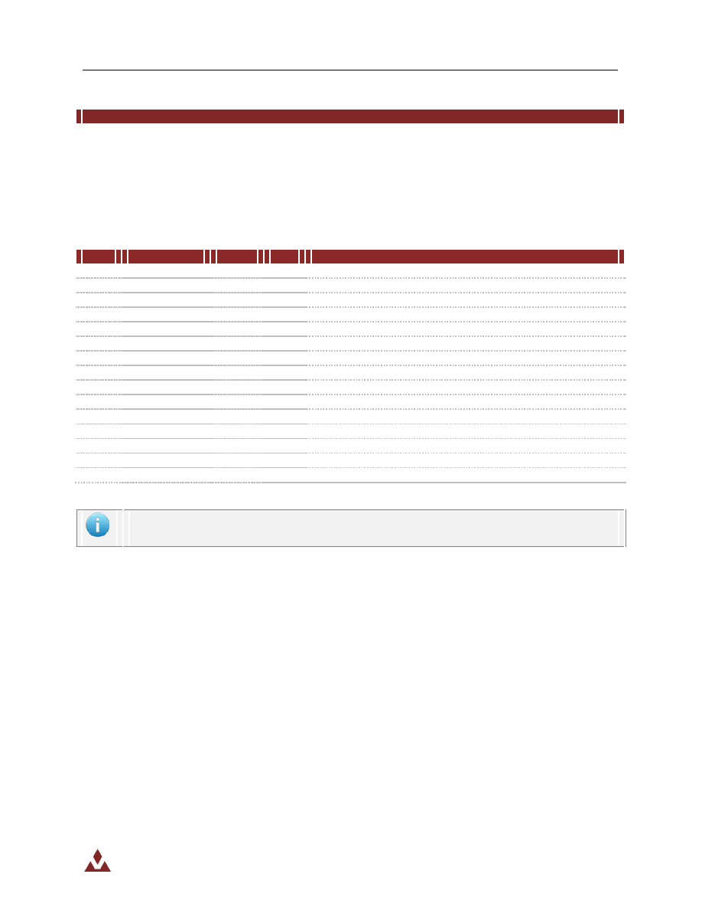{width="918"
height="1188"}

VN-200 User Manual

** **

** **

UM004

** **

 

VN-200 User Manual 

125/141 

 

**INS State - ECEF **

10.2.4

**INS State -- ECEF**

** **

**Register ID : **

73 

**Async Header : **

ISE 

**Access : **

Read Only 

**Comment : **

 

**Size (Bytes): **

72 

**Example Read **

**Response: **

\$VNRRG,73,+170.558,+001.267,+001.762,+00.001502,-00.000403,+00.000394,-\
626343.88590823,-5320499.92650050,+3450022.606,+000.001,-\
000.010,+000.094,+00.255,-00.308,-10.060\*50 

**Example Async **

**Message: **

\$VNISE,+170.558,+001.267,+001.762,+00.001502,-00.000403,+00.000394,-\
626343.88590823,-5320499.92650050,+3450022.606,+000.001,-\
000.010,+000.094,+00.255,-00.308,-10.060\*XX 

**Offset **

**Name **

** Format **

**Unit **

**Description **

0 

Yaw 

float 

deg 

Yaw angle relative to true north. 

4 

Pitch 

float 

deg 

Pitch angle relative to horizon. 

8 

Roll 

float 

deg 

Roll angle relative to horizon. 

12 

PositionX 

double 

m 

Estimated position in ECEF. (X-axis) 

20 

PositionY 

double 

m 

Estimated position in ECEF. (Y-axis) 

28 

PositionZ 

double 

m 

Estimated position in ECEF. (Z-axis) 

36 

VelocityX 

float 

m/s 

Estimated velocity in ECEF frame. (X-axis) 

40 

VelocityY 

float 

m/s 

Estimated velocity in ECEF frame. (Y-axis 

44 

VelocityZ 

float 

m/s 

Estimated velocity in ECEF frame. (Z-axis) 

48 

AccelX 

float 

m/s

2

 

Estimated acceleration in body frame. (X-axis) 

52 

AccelY 

float 

m/s

2

 

Estimated acceleration in body frame. (Y-axis) 

56 

AccelZ 

float 

m/s

2

 

Estimated acceleration in body frame. (Z-axis) 

60 

AngularRateX 

float 

rad/s 

Estimated angular rate in body frame. (X-axis) 

64 

AngularRateY 

float 

rad/s 

Estimated angular rate in body frame. (Y-axis) 

68 

AngularRateZ 

float 

rad/s 

Estimated angular rate in body frame. (Z-axis) 

 

 

You  can  configure  the  device  to  output  this  register  at  a  fixed  rate  using  the  Async  Data  Output  Type \
register (Register
6).  Once configured the data in this register will be sent out with the \$VNISE header. 

 

 
:::

::: {#page126-div style="position:relative;width:918px;height:1188px;"}
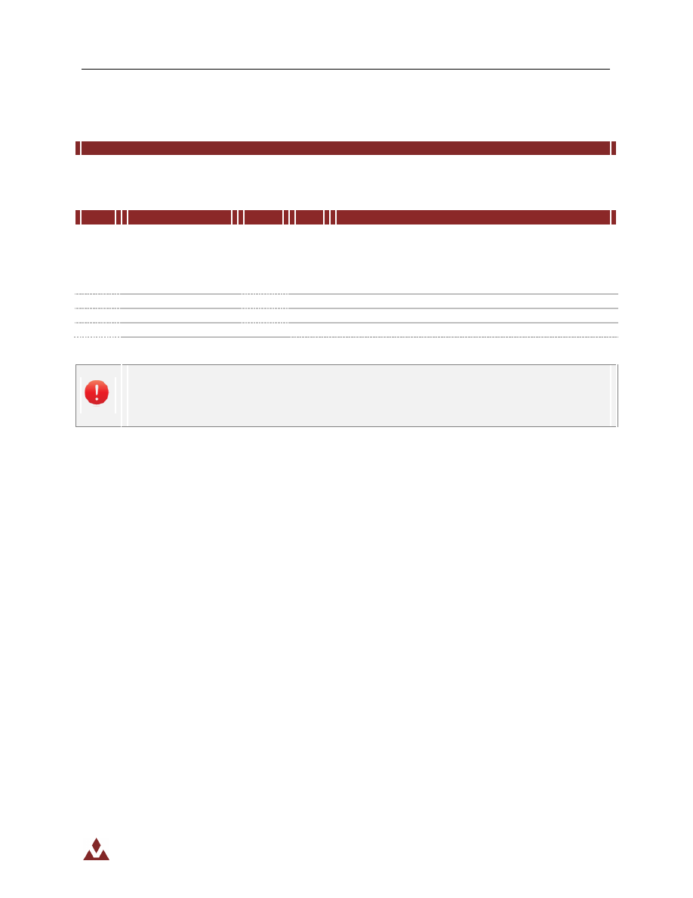{width="918"
height="1188"}

VN-200 User Manual

** **

** **

UM004

** **

 

VN-200 User Manual 

126/141 

 

**Configuration Registers **

10.3

 

**INS Basic Configuration **

10.3.1

**INS Basic Configuration**

** **

**Register ID : **

67 

**Firmware : **

1.0.0.0 

**Access : **

Read / Write 

**Comment : **

 

**Size (Bytes): **

4 

**Example Response: **

\$VNRRG,67,2,1,0,0\*71 

**Offset **

**Name **

**Format **

**Unit **

**Description **

0 

Scenario 

uint8 

- 

INS mode. \
0 = AHRS.  Attitude estimation only. (Legacy mode) \
1 = General purpose INS with barometric pressure sensor. \
2 = General purpose INS without barometric pressure \
sensor. 

1 

AhrsAiding 

uint8 

- 

Enables AHRS attitude aiding. 

2 

Resv1 

uint8 

- 

Reserved for future use. Field should be set to zero. 

3 

Resv2 

uint8 

- 

Reserved for future use. Field should be set to zero. 

 

 

The  estimated  attitude  (YprU)  field  in  group  5  of  the  user  configurable  binary  output  messages  is  not \
valid  when  the  Scenario  mode  is  set  to  AHRS  mode.    AHRS  mode  is  a  legacy  mode  that  is  present  for \
reverse compatibility with previous firmware versions.  It is not recommended for use in future designs \
and may not be supported on future firmware versions. 

 

** **
:::

::: {#page127-div style="position:relative;width:918px;height:1188px;"}
{width="918"
height="1188"}

VN-200 User Manual

** **

** **

UM004

** **

 

VN-200 User Manual 

127/141 

 

**Startup Filter Bias Estimate **

10.3.2

**Startup Filter Bias Estimate**

** **

**Register ID : **

74 

**Firmware : **

v0.2 and up 

**Access : **

Read / Write 

**Comment : **

Sets the initial estimate for the filter bias states. 

**Size (Bytes): **

28 

**Example Command: **

\$ VNWRG,74,0,0,0,0,0,0,0\*69 

**Offset **

**Name **

**Format **

**Unit **

**Description **

0 

GyroBiasX 

float 

rad/s 

X-axis gyro bias. 

4 

GyroBiasY 

float 

rad/s 

Y-axis gyro bias. 

8 

GyroBiasZ 

float 

rad/s 

Z-axis gyro bias. 

12 

AccelBiasX 

float 

m/s\^2 

X-axis accelerometer bias. 

16 

AccelBiasY 

float 

m/s\^2 

Y-axis accelerometer bias. 

20 

AccelBiasZ 

float 

m/s\^2 

Z-axis accelerometer bias. 

24 

PressureBias 

float 

m 

Pressure bias. 

** **

 

** **
:::

::: {#page128-div style="position:relative;width:918px;height:1188px;"}
{width="918"
height="1188"}

VN-200 User Manual

** **

** **

UM004

** **

 

VN-200 User Manual 

128/141 

 

**Factory Defaults **

10.4

**Settings Name **

**Default Factory Value **

INS Basic Configuration 

2,1,0,0 

Startup Filter Bias Estimate 

0,0,0,0,0,0,0 

 

 

 

 

** **
:::

::: {#page129-div style="position:relative;width:918px;height:1188px;"}
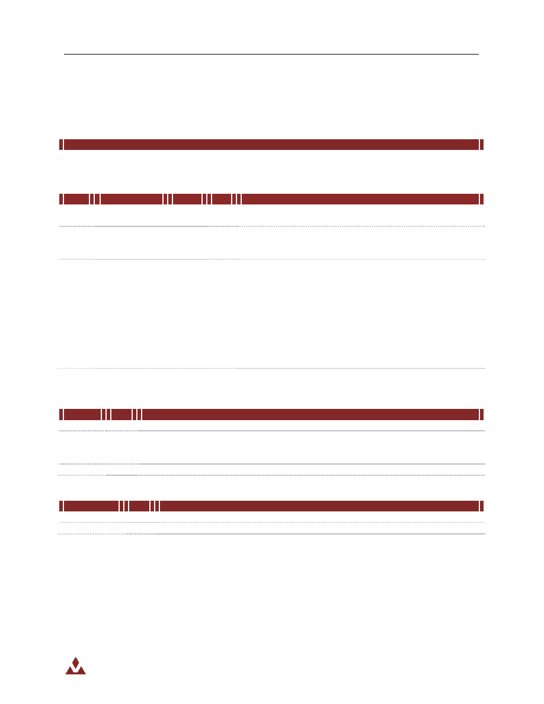{width="918"
height="1188"}

VN-200 User Manual

** **

** **

UM004

** **

 

VN-200 User Manual 

129/141 

**11**

** **

**Hard/Soft Iron Estimator Subsystem **

 

**Configuration Registers **

11.1

 

**Magnetometer Calibration Control **

11.1.1

**Magnetometer Calibration Control**

** **

**Register ID : **

44 

**Firmware : **

v1.0.0.0 

**Access : **

Read / Write 

**Comment : **

Controls the magnetometer real-time calibration algorithm. 

**Size (Bytes): **

4 

**Example Response: **

\$VNRRG,44,1,2,5\*69 

**Offset **

**Name **

**Format **

**Unit **

**Description **

0 

HSIMode 

uint8 

- 

Controls the mode of operation for the onboard real-time \
magnetometer hard/soft iron compensation algorithm. 

1 

HSIOutput 

uint8 

- 

Controls the type of measurements that are provided as outputs \
from the magnetometer sensor and also subsequently used in \
the attitude filter. 

2 

ConvergeRate 

uint8 

- 

Controls how quickly the hard/soft iron solution is allowed to \
converge onto a new solution.  The slower the convergence the \
more accurate the estimate of the hard/soft iron solution.  A \
quicker convergence will provide a less accurate estimate of the \
hard/soft iron parameters, but for applications where the \
hard/soft iron changes rapidly may provide a more accurate \
attitude estimate. \
Range: 1 to 5 \
1 = Solution converges slowly over approximately 60-90 seconds. \
5 = Solution converges rapidly over approximately 15-20 seconds. 

 

**Table 63 -- HSI_Mode Field **

**Mode **

**Value  Description **

HSI_OFF 

0 

Real-time hard/soft iron calibration algorithm is turned off. 

HSI_RUN 

1 

Runs the real-time hard/soft iron calibration.  The algorithm will
continue using its existing \
solution.  The
algorithm can be started and stopped at any time by switching
between the \
HSI_OFF and HSI_RUN state.   

HSI_RESET  2 

Resets the real-time hard/soft iron solution.  

**Table 64 -- HSI_Output Field **

**Mode **

**Value  Description **

NO_ONBOARD 

1 

Onboard HSI is not applied to the magnetic measurements. 

USE_ONBOARD  3 

Onboard HSI is applied to the magnetic measurements. 

 

 

 
:::

::: {#page130-div style="position:relative;width:918px;height:1188px;"}
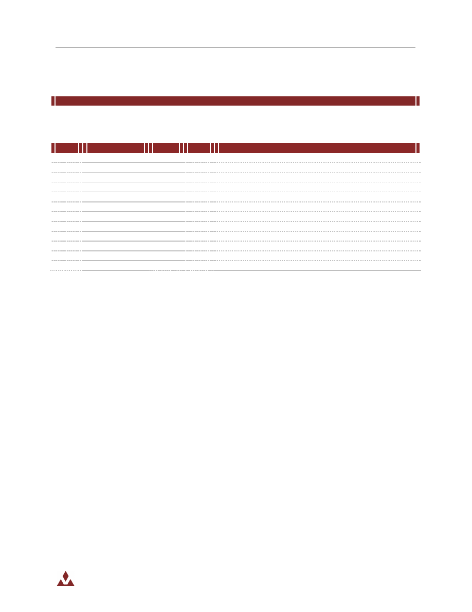{width="918"
height="1188"}

VN-200 User Manual

** **

** **

UM004

** **

 

VN-200 User Manual 

130/141 

 

**Status Registers **

11.2

 

**Calculated Magnetometer Calibration **

11.2.1

**Calculated Magnetometer Calibration**

** **

**Register ID : **

47 

**Firmware : **

v1.0.0.0 

**Access : **

Read Only 

**Comment : **

Calculated magnetometer calibration values. 

**Size (Bytes): **

48 

**Example Response: **

\$VNRRG,46,1,0,0,0,1,0,0,0,1,0,0,0\*70 

**Offset **

**Name **

**Format **

**Unit **

**Description **

0 

C\[0,0\] 

float 

- 

 

4 

C\[0,1\] 

float 

- 

 

8 

C\[0,2\] 

float 

- 

 

12 

C\[1,0\] 

float 

- 

 

16 

C\[1,1\] 

float 

- 

 

20 

C\[1,2\] 

float 

- 

 

24 

C\[2,0\] 

float 

- 

 

28 

C\[2,1\] 

float 

- 

 

32 

C\[2,2\] 

float 

- 

 

36 

B\[0\] 

float 

- 

 

40 

B\[1\] 

float 

- 

 

44 

B\[2\] 

float 

- 

 

 

This  register  contains  twelve  values  representing  the  calculated  hard  and  soft  iron  compensation \
parameters.    The  magnetic  measurements  are  compensated  for  both  hard  and  soft  iron  using  the \
following model. 

{

 

 \
 

}   \[

           

           \
           

\]   {

       \
       

       

}

 

The variables 

{          }

 are components of the measured magnetic field.  The {X, Y, Z} variables are 

the new magnetic field measurements outputted after compensation for
hard/soft iron effects. 

 

** **
:::

::: {#page131-div style="position:relative;width:918px;height:1188px;"}
{width="918"
height="1188"}

VN-200 User Manual

** **

** **

UM004

** **

 

VN-200 User Manual 

131/141 

 

**Factory Defaults **

11.3

**Settings Name **

**Default Factory Value **

Magnetometer Calibration Control 

1,3,5 

 

 

 

 

** **
:::

::: {#page132-div style="position:relative;width:918px;height:1188px;"}
{width="918"
height="1188"}

VN-200 User Manual

** **

** **

UM004

** **

 

VN-200 User Manual 

132/141 

 

**Command Prompt **

11.4

The command prompt provides a fast and simple means of configuring and monitoring the status of the \
sensor by typing commands to the unit using the serial port. 

 

**List Available Commands **

11.4.1

Commands for the  System subsystem  can be  accessed by typing in 'hsi' at the  command prompt.  To \
view  all  available  commands,  type  'hsi  ?'.  Below  is  a  view  of  a  terminal  window  showing  a  list  of  the \
available commands. 

hsi ? 

 \
Hard/Soft Iron Estimator Module Commands: 

 

Command:    Description: \
\-\-\-\-\-\-\-- 
  \-\-\-\-\-\-\-\-\-\-\-\-\-\-\-\-\-\-\-\-\-\-\-\-\-\-\-\-\-\-\-\-\-\-\-\-\-\-\-\-\-\-\-\-\-\-\-\-\-\-\-\-\-\-\-\-\-\-\-\-\-\-\-\-\-\-\-- \
info        Estimator state information and configuration settings. \
plotInput   Plot onboard HSI Input. \
plotOutput  Plot onboard HSI Output. 

 

 

** **
:::

::: {#page133-div style="position:relative;width:918px;height:1188px;"}
{width="918"
height="1188"}

VN-200 User Manual

** **

** **

UM004

** **

 

VN-200 User Manual 

133/141 

 

**Info**

** **

11.4.2

hsi info 

\-\-\-\-\-\-\-\-\-\-\-\-\-\-\-\--  Hard/Soft Iron Estimator State
Information  \-\-\-\-\-\-\-\-\-\-\-\-\-\-\-\-- \
Magnetometer Calibration Control (Register 44): 

 

  HsiMode: Run \
  OutMode: Use Onboard \
  ConvergeRate: 5 

 

Magnetometer Calibration Status (Register 46): 

 

  LastBin: 0 \
  NumMeas: 102 \
  AvgResidual: 0.014 \
  LastMeas: +0.599  +0.538  +2.910 \
  Bins\[0\]: 215 \
  Bins\[1\]: 188 \
  Bins\[2\]: 135 \
  Bins\[3\]: 47 \
  Bins\[4\]: 198 \
  Bins\[5\]: 231 \
  Bins\[6\]: 202 

 

Calculated Magnetometer Calibration (Register 47): 

 

  +00.966  +00.000  +00.000  -00.215 \
  +00.000  +00.966  +00.000  -00.179 \
  +00.000  +00.000  +00.966  -00.077 

 \
 

Num Measurements: 358 \
Filter Run Count: 358 \
Mag Uncertainty : 0.00 \
\-\-\-\-\-\-\-\-\-\-\-\-\-\-\-\-\-\-\-\-\-\-\-\-\-\-\-\-\-\-\-\-\-\-\-\-\-\-\-\-\-\-\-\-\-\-\-\-\-\-\-\-\-\-\-\-\-\-\-\-\-\-\-\-\-\-\-\-\-\-\-\-\-\-\-\-\-\-\--

 

 

 

** **
:::

::: {#page134-div style="position:relative;width:918px;height:1188px;"}
{width="918"
height="1188"}

VN-200 User Manual

** **

** **

UM004

** **

 

VN-200 User Manual 

134/141 

 

**PlotInput**

** **

11.4.3

hsi plotinput 

 

\-\-\-\-\-\-\-\-\-\-\-\-\-\-\-\-\-\-\-\--  HSI Estimator Magnetic Input
Plot  \-\-\-\-\-\-\-\-\-\-\-\-\-\-\-\-\-\-\-\-\-- \
 \
                                 Uncalibrated XY                        
          

 

+\-\-\-\-\-\-\-\-\-\-\-\-\-\-\-\-\-\--+\-\-\-\-\-\-\-\-\-\-\-\-\-\-\-\-\-\--+\-\-\-\-\-\-\-\-\-\-\-\-\-\-\-\-\-\--+\-\-\-\-\-\-\-\-\-\-\-\-\-\-\-\-\-\--+ \
\|                   \|          \*  \*  \*  \| \*   \*             \|  
                \| \
\|                   \|      \*\*\*\* \*  \*  \* \*      \*\*\*        
 \|                   \| \
\|                   \| \*  \*   \*   \*      \|               \*\*  \|
                  \| \
\|                   \*  \* \*  \*    \*      \|\* \*      \*         \|
                  \| \
\|                  \*\*\* \*\* \*      \*   \*  \*\*     \*          
 \|                   \| \
\|              \*\*\*  \|   \*     \* \* \*   \* \|                  
\*\*   \*              \| \
\|               \*   \|\*  \*   \*\* \* \*      \|    \*   \*  \*      
\|\*   \*              \| \
\|             \*     \|     \*            \*\|    \*              \|  
                \| \
\|           \*      \*\|      \*  \*       \* \|    \*             \*\*
      \*           \| \
+\-\-\-\-\-\-\-\--\*\*\*\-\-\-\-\-\--+\-\-\-\-\-\-\-\-\-\--\*\-\-\-\-\-\--\*\-\-\--\*\--\*\-\-\-\--\*\-\-\-\--+\-\-\-\-\-\-\-\-\--\*\-\-\-\-\-\-\--+ \
\|        \*          \| \*            \*    \*     \*             \|  
       \*\*       \| \
\|       \* \*         \*                   \| \*                 \*    
     \*\*\*      \| \
\|     \* \*\*   \*      \|                \*  \|           \*  \*  
 \|                   \| \
\|      \*\*           \|        \*   \*\*     \|                   \|
 \*          \*     \| \
\|    \*            \* \|      \* \* \*        \|               \*   \|
                  \| \
\|    \*\*\*            \|                  \*\|      \*   \* \* \*  
 \|              \*    \| \
\|     \*             \|      \*     \*      \|            \*      \|  
 \*     \*  \*     \| \
\|    \*              \|   \*               \|    \*              \| \*
            \*   \| \
\|     \*     \*\*      \|                   \| \*             \*   \|  
            \*   \| \
+\-\--\*-\*-\*\-\-\-\-\-\-\-\-\-\--+\-\--\*\-\-\-\-\-\-\-\-\-\-\-\-\-\--+\-\-\-\-\-\-\--\*\-\-\-\--\*\-\-\--+\*\-\-\-\-\--\*\-\-\-\-\-\--\*\-\--+ \
\|   \*               \| \*                 \|         \*         \| \*
           \*    \| \
\|  \*   \*         \*  \|                   \|                \*\* \|
 \*                \| \
\|                   \|   \* \*   \*\* \*     \*\|      \*            \|
       \*          \| \
\|   \*   \*\* \*        \|     \*   \*        \*\* \*    \*  \*   \*  
  \*\*    \*\*   \*        \| \
\|     \*  \*          \|        \*        \* \|                   \|  
         \*\*     \| \
\|     \*\*            \|           \*       \|         \*         \|  
 \*              \| \
\|         \*     \*   \*       \*           \|                 \* \|  
        \*       \| \
\|     \*\*            \|                   \|   \*             \* \|  
       \*\*       \| \
\|      \*\*\*   \* \*    \|                   \|        \*          \|
        \*\*\*       \| \
+\-\-\-\-\-\-\--\*\*\-\-\-\-\-\-\--\*+\-\-\-\-\-\-\-\-\-\-\-\-\-\-\-\-\-\--+\-\-\-\-\-\-\-\-\-\-\-\-\-\-\-\-\-\--+\-\-\-\--\*\*\*\-\-\-\-\-\-\-\-\-\--+ \
\|        \*\*\*\*  \*    \|          \*    \*   \* \*   \*            
\|\*      \*\*          \| \
\|           \*  \* \*  \|                   \*                   \|    
\*\*            \| \
\|            \*\*\*    \|                   \|                   \|  
\* \*             \| \
\|                \*  \|   \*               \|                   \* \*  
              \| \
\|                   \|            \*      \|  \*       \*        \|    
              \| \
\|                   \|                   \|                   \|      
            \| \
\|                   \|  \*                \|                   \|      
            \| \
\|                   \|                   \|                   \|      
            \| \
\|                   \|                   \|                   \|      
            \| \
+\-\-\-\-\-\-\-\-\-\-\-\-\-\-\-\-\-\--+\-\-\-\-\-\-\-\-\-\-\-\-\-\-\-\-\-\--+\-\-\-\-\-\-\-\-\-\-\-\-\-\-\-\-\-\--+\-\-\-\-\-\-\-\-\-\-\-\-\-\-\-\-\-\--+ \
 \
  Plot Center :    +0.000,     +0.000 \
  Plot Scale  :    +1.042,     +1.042 \
 \
\-\-\-\-\-\-\-\-\-\-\-\-\-\-\-\-\-\-\-\-\-\-\-\-\-\-\-\-\-\-\-\-\-\-\-\-\-\-\-\-\-\-\-\-\-\-\-\-\-\-\-\-\-\-\-\-\-\-\-\-\-\-\-\-\-\-\-\-\-\-\-\-\-\-\-\-\-\-\--

 

 

 

** **
:::

::: {#page135-div style="position:relative;width:918px;height:1188px;"}
{width="918"
height="1188"}

VN-200 User Manual

** **

** **

UM004

** **

 

VN-200 User Manual 

135/141 

 

**PlotOutput**

** **

11.4.4

hsi plotoutput \
 

\-\-\-\-\-\-\-\-\-\-\-\-\-\-\-\-\-\-\-\--  HSI Estimator Magnetic Output
Plot  \-\-\-\-\-\-\-\-\-\-\-\-\-\-\-\-\-\-\-\-- 

 

                                  Calibrated XY                        
           

 

+\-\-\-\-\-\-\-\-\-\-\-\-\-\-\-\-\-\--+\-\-\-\-\-\-\-\-\-\-\-\-\-\-\-\-\-\--+\-\-\-\-\-\-\-\-\-\-\-\-\-\-\-\-\-\--+\-\-\-\-\-\-\-\-\-\-\-\-\-\-\-\-\-\--+ \
\|                   \|                   \|                   \|      
            \| \
\|                   \|                   \|                   \|      
            \| \
\|                   \|             \*\*  \* \*   \*    \*          \|  
                \| \
\|                   \|          \*\*\* \*  \* \* \*       \*\*      
 \|                   \| \
\|                   \|     \* \*    \*  \*   \|                \* \*\|
                  \| \
\|                   \|   \*  \* \* \*    \*   \|  \* \*      \*      
\|                   \| \
\|                   \|  \*\*\* \*\*\*      \*   \* \*\*\*    \*        
 \|                   \| \
\|                  \*\*\*      \*    \*\* \*\*  \|\*                
 \|\*\*    \*            \| \
\|                   \*    \* \*   \*\*  \* \*  \| \*    \*\*  \*  \*  
  \| \*    \*            \| \
+\-\-\-\-\-\-\-\-\-\-\-\-\-\-\-\--\*-+\--\*\-\-\-\-\--\*\-\-\-\-\-\-\-\--+\-\-\-\-\-\-\-\-\-\-\-\-\-\-\-\-\-\--+\-\-\-\-\-\-\-\-\-\-\-\-\-\-\-\-\-\--+ \
\|               \*   \|         \*  \*      \*      \*  \*         \|\*
      \*          \| \
\|             \*\*    \|              \*  \* \| \*\*    \*       \*  
\|           \*\*      \| \
\|           \* \*     \|     \*             \| \*  \*   \*        
 \|\*          \*\*      \| \
\|           \* \*  \*  \|  \*                \*             \*  \*  \|
            \*     \| \
\|          \*\*       \|            \*  \*   \|                   \|  
\*               \| \
\|                   \|         \*   \*  \*  \|                 \* \|  
           \*    \| \
\|        \*\*\*        \| \*         \*       \|            \* \* \*\*
\|                   \| \
\|         \*\*        \|                   \|\*        \*         \|  
  \*     \*   \*   \| \
\|         \*         \|      \*  \*     \*   \|              \*    \|  
\*         \*     \| \
+\-\-\-\-\-\-\-\-\--\*\-\-\--\*\*\--+\-\-\-\-\-\-\-\-\-\-\-\-\-\-\-\-\-\--+\-\--\*\-\--\*\-\-\-\-\-\-\-\--\*-+\-\-\-\-\-\-\-\-\-\-\-\-\-\--\*\*\--+ \
\|       \*\*\*  \*      \|       \*           \|          \*     \*  \|
\*      \*      \*   \| \
\|       \*\*          \|     \*             \|           \*       \|
 \*            \*   \| \
\|       \*   \*       \|\*                  \|                  \*\*  
\*               \| \
\|        \*          \|       \* \*  \*\*\* \*  \| \*       \*        
\|         \*         \| \
\|         \* \*\*\*\*    \|        \*          \|\* \*\*    \*  \*  \*
   \|\*\*     \*\*  \*       \| \
\|             \*     \|            \*      \*                   \|    
        \*\*    \| \
\|         \*\*        \|          \*    \*   \|           \*       \|  
   \*            \| \
\|          \*   \*    \*  \*                \|                   \*    
       \*      \| \
\|          \*       \*\|                   \|     \*             \*    
      \*\*      \| \
+\-\-\-\-\-\-\-\-\-\--\*\*\*\--\*\--+\--\*\-\-\-\-\-\-\-\-\-\-\-\-\-\-\--+\-\-\-\-\-\-\-\-\--\*\-\-\-\-\-\-\--+\-\-\-\-\-\-\-\-\-\-\-\-\-\-\-\-\-\--+ \
\|             \*\*\*   \|             \*     \|   \*               \|
 \*    \*\*\*         \| \
\|              \*   \*\|\*                 \*\| \*     \*           \|
      \*\*          \| \
\|               \*\*\*\*\|                   \|                   \|  
   \*\*           \| \
\|                \*  \|                   \|                   \| \*\*
 \*             \| \
\|                   \|\*      \*           \|                   \|    
              \| \
\|                   \|                \*  \|     \*      \*      \|    
              \| \
\|                   \|      \*            \|                   \|      
            \| \
\|                   \|                   \|                   \|      
            \| \
\|                   \|                   \|                   \|      
            \| \
+\-\-\-\-\-\-\-\-\-\-\-\-\-\-\-\-\-\--+\-\-\-\-\-\-\-\-\-\-\-\-\-\-\-\-\-\--+\-\-\-\-\-\-\-\-\-\-\-\-\-\-\-\-\-\--+\-\-\-\-\-\-\-\-\-\-\-\-\-\-\-\-\-\--+ \
 \
  Plot Center :    +0.000,     +0.000 \
  Plot Scale  :    +0.946,     +0.946 \
 \
\-\-\-\-\-\-\-\-\-\-\-\-\-\-\-\-\-\-\-\-\-\-\-\-\-\-\-\-\-\-\-\-\-\-\-\-\-\-\-\-\-\-\-\-\-\-\-\-\-\-\-\-\-\-\-\-\-\-\-\-\-\-\-\-\-\-\-\-\-\-\-\-\-\-\-\-\-\-\--

 

 

 
:::

::: {#page136-div style="position:relative;width:918px;height:1188px;"}
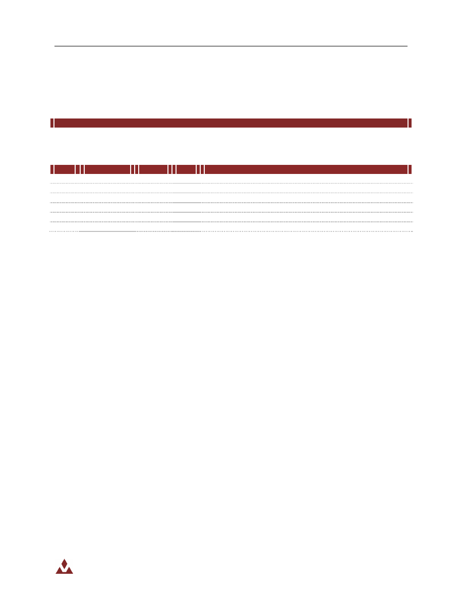{width="918"
height="1188"}

VN-200 User Manual

** **

** **

UM004

** **

 

VN-200 User Manual 

136/141 

**12**

** **

**World Magnetic & Gravity Module **

 

**Configuration Registers **

12.1

 

**Magnetic and Gravity Reference Vectors **

12.1.1

**Magnetic and Gravity Reference Vectors**

** **

**Register ID : **

21 

**Firmware : **

1.0.0.0 

**Access: **

Read / Write 

**Comment : **

Magnetic and gravity reference vectors. 

**Size (Bytes): **

24 

**Example Command: **

\$VNWRG,21,1,0,1.8,0,0,-9.79375\*56 

**Offset **

**Name **

**Format **

**Unit **

**Description **

0 

MagRefX 

float 

Gauss 

X-Axis Magnetic Reference 

4 

MagRefY 

float 

Gauss 

Y-Axis Magnetic Reference 

8 

MagRefZ 

float 

Gauss 

Z-Axis Magnetic Reference 

12 

AccRefX 

float 

m/s

2

 

X-Axis Gravity Reference 

16 

AccRefY 

float 

m/s

2

 

Y-Axis Gravity Reference 

20 

AccRefZ 

float 

m/s

2

 

Z-Axis Gravity Reference 

 

This register contains the reference vectors for the magnetic
and gravitational fields as used by the \
onboard filter.  The values map to either the user-set values or the
results of calculations of the onboard \
reference models (see the Reference Vector
Configuration register).  When the reference values come \
from the onboard model(s), those values are read-only.  When
the reference models are disabled, the \
values reflect the user reference vectors and will be writable.  For
example, if the onboard World \
Magnetic Model is enabled and the onboard Gravitational
Model is disabled, only the gravity reference \
values will be modified on a register write.  Note that the
user reference vectors will not be overwritten \
by the onboard models, but will retain their previous values for when
the onboard models are disabled. 

** **
:::

::: {#page137-div style="position:relative;width:918px;height:1188px;"}
{width="918"
height="1188"}

VN-200 User Manual

** **

** **

UM004

** **

 

VN-200 User Manual 

137/141 

 

**Reference Vector Configuration **

12.1.2

**Reference Vector Configuration**

** **

**Register ID : **

83 

**Firmware : **

v1.0.0.0 

**Access : **

Read / Write 

**Comment : **

Control register for both the onboard world magnetic and gravity model
corrections. 

**Size (Bytes): **

32 

**Example Response: **

\$VNRRG,83,0,0,0,0,1000,0.000,+00.00000000,+000.00000000,+00000.000\*4E 

**Offset **

**Name **

**Format **

**Unit **

**Description **

0 

UseMagModel 

uint8 

- 

Set to 1 to use the world magnetic model. 

1 

UseGravityModel 

uint8 

- 

Set to 1 to use the world gravity model. 

2 

Resv1 

uint8 

- 

Reserved for future use.  Must be set to zero. 

3 

Resv2 

uint8 

- 

Reserved for future use.  Must be set to zero. 

4 

RecalcThreshold 

uint32 

- 

Maximum distance traveled before magnetic and gravity \
models are recalculated for the new position. 

8 

Year 

float 

year 

The reference date expressed as a decimal year.  Used for \
both the magnetic and gravity models. 

12 

 

 

 

\*\*\*\*  4 byte padding \*\*\* 

16 

Latitude 

double 

deg 

The reference latitude position in degrees. 

24 

Longitude 

double 

deg 

The reference longitude position in degrees. 

32 

Altitude 

double 

m 

The reference altitude above the reference ellipsoid in \
meters. 

 

This register allows configuration of the onboard spherical harmonic models used to calculate the local \
magnetic and gravitational reference values.  Having accurate magnetic reference values improves the \
accuracy  of  heading  when  using  the  magnetometer  and  accounts  for  magnetic  declination.    Having \
accurate gravitational reference values improves accuracy by allowing the INS filter to more accurately \
estimate the accelerometer biases.  The VN-200 currently includes the EGM96 gravitational model and \
the WMM2010 magnetic model.  The models are upgradable to allow updating to future models when \
available. 

The magnetic and gravity models can be individually enabled or disabled using the UseMagModel and \
UseGravityModel parameters, respectively.  When disabled, the corresponding values set by the user in \
the  Reference  Vector  register  (see  Section[  12.1.1)  ](vn200-136.html)will  be  used  instead  of  values  calculated  by  the \
onboard model. 

The VN-200 starts up with the user configured reference vector values.  Shortly after startup (and if the \
models  are  enabled),  the  location  and  time  set  in  this  register  will  be  used  to  update  the  reference \
vectors.    When  a  3D  GPS  fix  is  available,  the  location  and  time  reported  by  the  GPS  will  be  used  to \
update the model.  If GPS is lost, the reference vectors will hold their last valid values.  The model
values \
will be recalculated whenever the current position has changed by the RecaclThreshold or the date has \
changed by more than approximately 8 hours, whichever comes first. 

 

** **
:::

::: {#page138-div style="position:relative;width:918px;height:1188px;"}
{width="918"
height="1188"}

VN-200 User Manual

** **

** **

UM004

** **

 

VN-200 User Manual 

138/141 

 

**Factory Defaults **

12.2

**Settings Name **

**Default Factory Value **

Magnetic and Gravity Reference Vectors 

1,0,1.8,0,0,-9.793746 

Reference Vector Configuration 

1,1,0,0,1000,0,0,0,0 

 

 

** **
:::

::: {#page139-div style="position:relative;width:918px;height:1188px;"}
{width="918"
height="1188"}

VN-200 User Manual

** **

** **

UM004

** **

 

VN-200 User Manual 

139/141 

 

**Command Prompt **

12.3

The command prompt provides a fast and simple means of configuring and monitoring the status of the \
sensor by typing commands to the unit using the serial port. 

 

**List Available Commands **

12.3.1

Commands for the System subsystem can be accessed by typing in 'refmodel' at the command prompt.  \
To view all available commands, type 'refmodel ?'. Below is a view of a terminal window showing a list \
of the available commands. 

refmodel ? 

 \
World Magnetic & Gravity Reference Model Commands: \
 \
Command:    Description: \
\-\-\-\-\-\-\--    \-\-\-\-\-\-\-\-\-\-\-\-\-\-\-\-\-\-\-\-\-\-\-\-\-\-\-\-\-\-\-\-\-\-\-\-\-\-\-\-\-\-\-\-\-\-\-\-\-\-\-\-\-\-\-\-\-\-\-\-\-\-\-\-\-\-\-- \
info        Information on the current available reference models. \
calc        Calculate the magnetic and gravity reference for a given
position & time. 

 

**Info **

12.3.2

refmodel info \
 

\-\-\-\-\-\-\-\-\-\-\--  World Magnetic & Gravity Reference Model
Information  \-\-\-\-\-\-\-\-\-\-\-- 

 

World Magnetic Model \
  Status                : Present \
  Name                  : WMM2010 \
  Order                 : 12 \
  Model Start Date      : 01/01/2010 \
  Model Expiration Date : 01/01/2015 

 

World Gravity Model \
  Status                : Present \
  Name                  : EGM96 \
  Order                 : 12 \
  Model Start Date      : 01/01/1986 \
  Model Expiration Date : 01/01/2100 \
 \
Magnetic and Gravity Reference Vectors (Register 21) \
  MagRefX     : +001.000 \
  MagRefY     : +000.000 \
  MagRefZ     : +001.800 \
  GravityRefX : +000.000 \
  GravityRefY : +000.000 \
  GravityRefZ : -009.794 

 

Reference Vector Configuration (Register 83) \
  UseMagneticModel  : 0 \
  UseGravityModel   : 0 \
  RecalcThreshold   : 1000 meters \
  Year              : 0 \
  Latitude          : +00.00000000 deg \
  Longitude         : +00.000000000 deg \
  Altitude          : +00000.000 m \
\-\-\-\-\-\-\-\-\-\-\-\-\-\-\-\-\-\-\-\-\-\-\-\-\-\-\-\-\-\-\-\-\-\-\-\-\-\-\-\-\-\-\-\-\-\-\-\-\-\-\-\-\-\-\-\-\-\-\-\-\-\-\-\-\-\-\-\-\-\-\-\-\-\-\-\-\-\-\--

 
:::

::: {#page140-div style="position:relative;width:918px;height:1188px;"}
{width="918"
height="1188"}

VN-200 User Manual

** **

** **

UM004

** **

 

VN-200 User Manual 

140/141 

 

**Calc **

12.3.3

refmodel calc \
 

\-\-\-\-\-\-\-\-\-\-\--  World Magnetic & Gravity Reference Model
Calculator  \-\-\-\-\-\-\-\-\-\-\-\-- \
 \
Enter latitude :  

30 

 \
Enter longitude :  

-94 

 \
Enter altitude :  

100 

 \
Enter decimal year :  

2014.5 

 \
 \
Calculation Results \
\-\-\-\-\-\-\-\-\-\-\-\-\-\-\-\-\-\-\-\-\-\-\-\-\-\-\-\-\-\-\-\-\-\-\-\-\-\-\-\-\-- \
Latitude  : +30.00000000 deg \
Longitude : -094.00000000 deg \
Altitude  : +00100.000 m 

 

Magnetic Reference Vector : +000.243, +000.008, +000.409 Gauss \
Gravity Reference  Vector : +000.000, +000.000, -009.793 m/s\^2 \
\-\-\-\-\-\-\-\-\-\-\-\-\-\-\-\-\-\-\-\-\-\-\-\-\-\-\-\-\-\-\-\-\-\-\-\-\-\-\-\-\-\-\-\-\-\-\-\-\-\-\-\-\-\-\-\-\-\-\-\-\-\-\-\-\-\-\-\-\-\-\-\-\-\-\-\-\-\-\--

 

 

 
:::

::: {#page141-div style="position:relative;width:918px;height:1188px;"}
{width="918"
height="1188"}

VN-200 User Manual

** **

** **

UM004

** **

 

VN-200 User Manual 

141/141 

 

 

 

 

 

 

 

 

Please Read Carefully: 

 

Information  in  this  document  is  provided  solely  in  connection  with  VectorNav  Technologies,  LLC  ("VectorNav") \
products.    VectorNav  reserves  the  right  to  make  changes,  corrections,  modifications,  or  improvements  to  this \
document, and the products and services described herein at any time, without notice. 

 

All
VectorNav products are sold pursuant of VectorNav's terms and conditions of sale. 

 

No license to any intellectual property, expressed or implied, is granted under this document.  If any part of this \
document refers to any third party products or services it shall not be deemed a license grant by VectorNav for the \
use  of  such  third  party  products  or  services,  or  any  intellectual  property  contained  therein  or  considered  as  a \
warranty covering the use in any manner whatsoever of such third party products or services or any intellectual \
property contained therein. 

 

Information in this document supersedes and replaces all
information previously supplied. 

 

The VectorNav logo is a registered trademark of VectorNav Technologies, LLC.  All
other names are the property of 

their respective owners. 

 

© 2014 VectorNav Technologies, LLC -- All rights reserved 

 

 
:::
